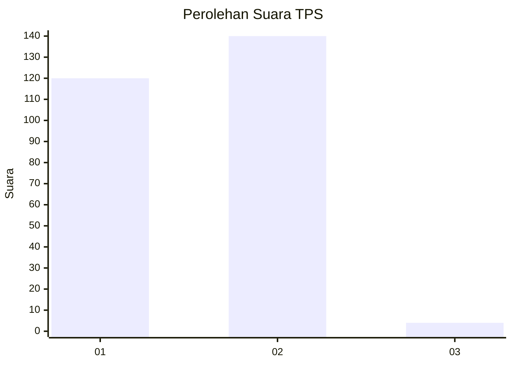
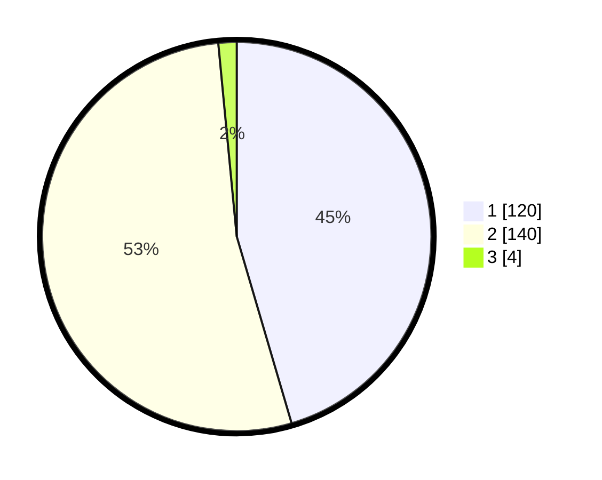

# Hasil

## Grafik

## Tabel

| No. | Nama Paslon    | Suara | Suara (raw) | Persentase |
|:--- |:-------------- | -----:| -----------:| ----------:|
| 1   | ANIES MUHAIMIN | 120   | [120][p-1]  | 45,45      |
| 2   | PRABOWO GIBRAN | 140   | [140][p-2]  | 53,03      |
| 3   | GANJAR MAHFUD  | 4     | [4][p-3]    | 1,52       |

[p-1]: https://github.com/gigit-pemilu/pemilu-2024-12-sumatera-utara/blob/main/pilpres/hitung-suara/sub/12-sumatera-utara/sub/20-padang-lawas-utara/sub/08-simangambat/sub/2014-ulak-tano/sub/003-tps/sub/paslon-1.txt
[p-2]: https://github.com/gigit-pemilu/pemilu-2024-12-sumatera-utara/blob/main/pilpres/hitung-suara/sub/12-sumatera-utara/sub/20-padang-lawas-utara/sub/08-simangambat/sub/2014-ulak-tano/sub/003-tps/sub/paslon-2.txt
[p-3]: https://github.com/gigit-pemilu/pemilu-2024-12-sumatera-utara/blob/main/pilpres/hitung-suara/sub/12-sumatera-utara/sub/20-padang-lawas-utara/sub/08-simangambat/sub/2014-ulak-tano/sub/003-tps/sub/paslon-3.txt

## Foto C Plano

https://sirekap-obj-formc.kpu.go.id/39a8/pemilu/ppwp/12/20/08/20/14/1220082014003-20240215-005434--c4c81bb5-6cef-46f3-881b-e65ef6b5ac14.jpg

https://sirekap-obj-formc.kpu.go.id/39a8/pemilu/ppwp/12/20/08/20/14/1220082014003-20240215-005450--73a26184-e4c7-4731-a120-ebbb12a01255.jpg

https://sirekap-obj-formc.kpu.go.id/39a8/pemilu/ppwp/12/20/08/20/14/1220082014003-20240215-005558--2dbb0612-bee2-4688-b630-9612891bf86e.jpg

## Metadata

| Key        | Value               |
| ---------- | ------------------- |
| Time Stamp | 2024-02-16 10:30:29 |

