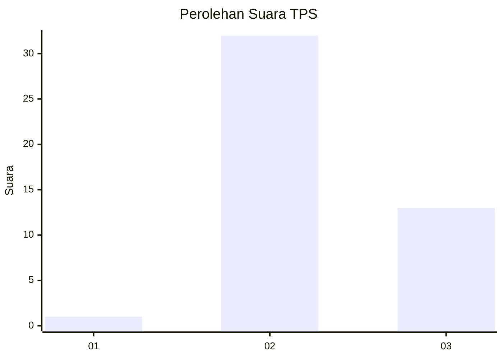
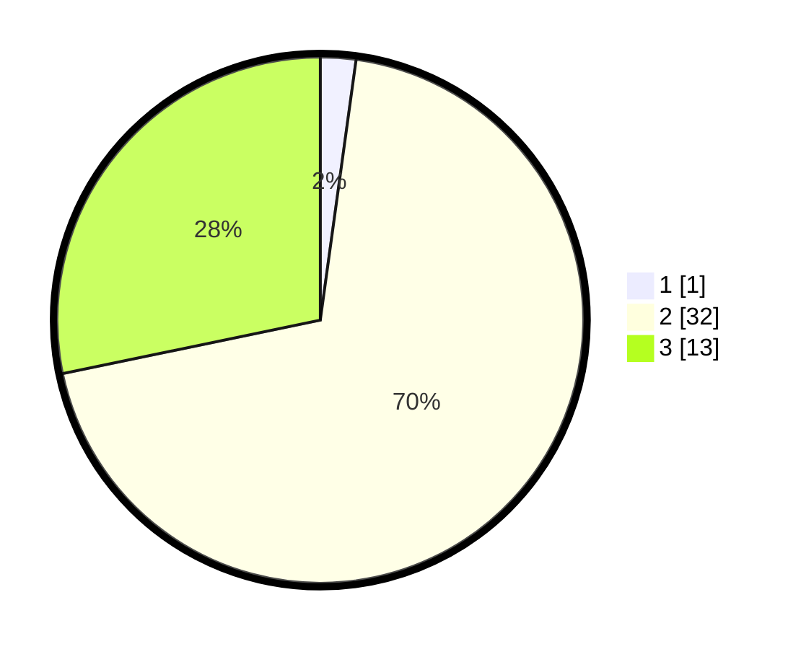

# Hasil

## Grafik

## Tabel

| No. | Nama Paslon    | Suara | Suara (raw) | Persentase |
|:--- |:-------------- | -----:| -----------:| ----------:|
| 1   | ANIES MUHAIMIN | 1     | [1][p-1]    | 2,17       |
| 2   | PRABOWO GIBRAN | 32    | [32][p-2]   | 69,57      |
| 3   | GANJAR MAHFUD  | 13    | [13][p-3]   | 28,26      |

[p-1]: https://github.com/gigit-pemilu/pemilu-2024/blob/main/pilpres/hitung-suara/sub/12-sumatera-utara/sub/20-padang-lawas-utara/sub/08-simangambat/sub/2015-aekraru/sub/006-tps/sub/paslon-1.txt
[p-2]: https://github.com/gigit-pemilu/pemilu-2024/blob/main/pilpres/hitung-suara/sub/12-sumatera-utara/sub/20-padang-lawas-utara/sub/08-simangambat/sub/2015-aekraru/sub/006-tps/sub/paslon-2.txt
[p-3]: https://github.com/gigit-pemilu/pemilu-2024/blob/main/pilpres/hitung-suara/sub/12-sumatera-utara/sub/20-padang-lawas-utara/sub/08-simangambat/sub/2015-aekraru/sub/006-tps/sub/paslon-3.txt

## Foto C Plano

https://sirekap-obj-formc.kpu.go.id/d86c/pemilu/ppwp/12/20/08/20/15/1220082015006-20240214-201316--8779ace6-51e4-42cb-93c8-e6903f99992b.jpg

https://sirekap-obj-formc.kpu.go.id/d86c/pemilu/ppwp/12/20/08/20/15/1220082015006-20240214-212834--32add8d8-2e43-44a3-b692-352e1e111775.jpg

https://sirekap-obj-formc.kpu.go.id/d86c/pemilu/ppwp/12/20/08/20/15/1220082015006-20240214-213025--e7022a77-6958-4d6c-881e-85f3bd641049.jpg

## Metadata

| Key        | Value               |
| ---------- | ------------------- |
| Time Stamp | 2024-02-19 06:16:00 |

