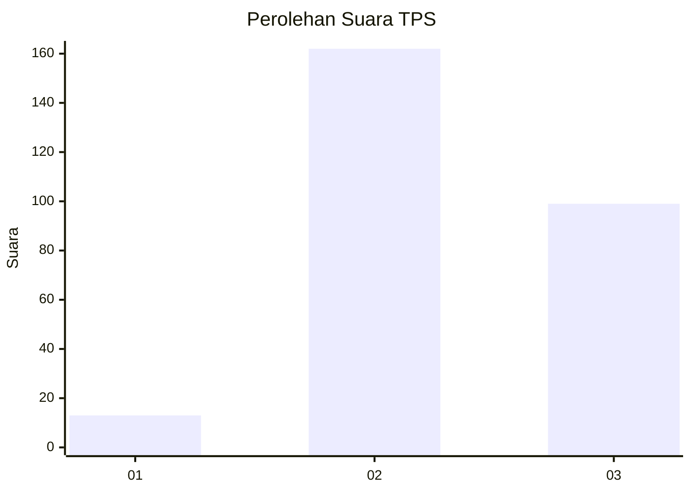
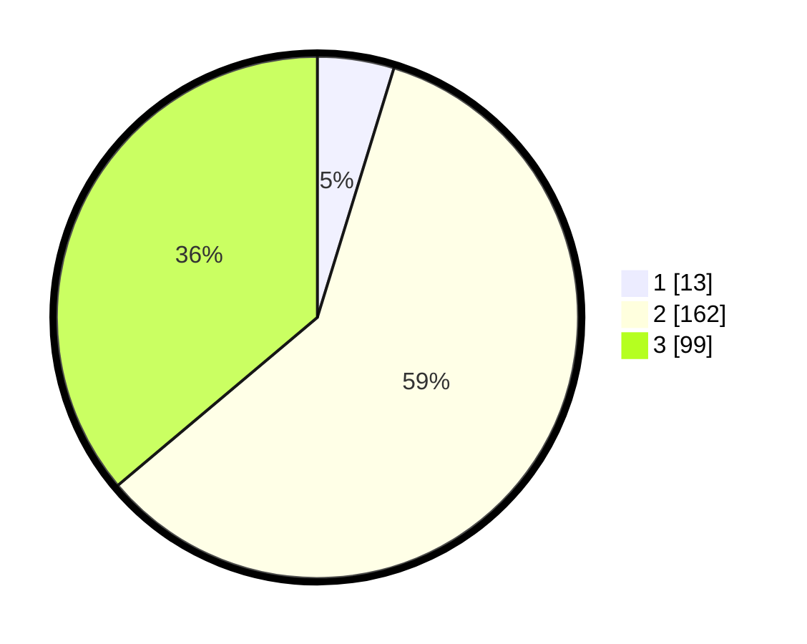

# Hasil

## Grafik

## Tabel

| No. | Nama Paslon    | Suara | Suara (raw) | Persentase |
|:--- |:-------------- | -----:| -----------:| ----------:|
| 1   | ANIES MUHAIMIN | 13    | [13][p-1]   | 4,74       |
| 2   | PRABOWO GIBRAN | 162   | [162][p-2]  | 59,12      |
| 3   | GANJAR MAHFUD  | 99    | [99][p-3]   | 36,13      |

[p-1]: https://github.com/gigit-pemilu/pemilu-2024/blob/main/pilpres/hitung-suara/sub/12-sumatera-utara/sub/20-padang-lawas-utara/sub/08-simangambat/sub/2015-aekraru/sub/027-tps/sub/paslon-1.txt
[p-2]: https://github.com/gigit-pemilu/pemilu-2024/blob/main/pilpres/hitung-suara/sub/12-sumatera-utara/sub/20-padang-lawas-utara/sub/08-simangambat/sub/2015-aekraru/sub/027-tps/sub/paslon-2.txt
[p-3]: https://github.com/gigit-pemilu/pemilu-2024/blob/main/pilpres/hitung-suara/sub/12-sumatera-utara/sub/20-padang-lawas-utara/sub/08-simangambat/sub/2015-aekraru/sub/027-tps/sub/paslon-3.txt

## Foto C Plano

https://sirekap-obj-formc.kpu.go.id/3122/pemilu/ppwp/12/20/08/20/15/1220082015027-20240214-224719--f6078bf6-2538-45f4-b04d-6f46dcc093f4.jpg

https://sirekap-obj-formc.kpu.go.id/3122/pemilu/ppwp/12/20/08/20/15/1220082015027-20240214-224840--44361290-c44c-4faf-93f0-bba2f6d3d937.jpg

https://sirekap-obj-formc.kpu.go.id/3122/pemilu/ppwp/12/20/08/20/15/1220082015027-20240214-225247--8308b9b6-9161-49ee-a658-421dce1e6029.jpg

## Metadata

| Key        | Value               |
| ---------- | ------------------- |
| Time Stamp | 2024-02-15 23:29:50 |

