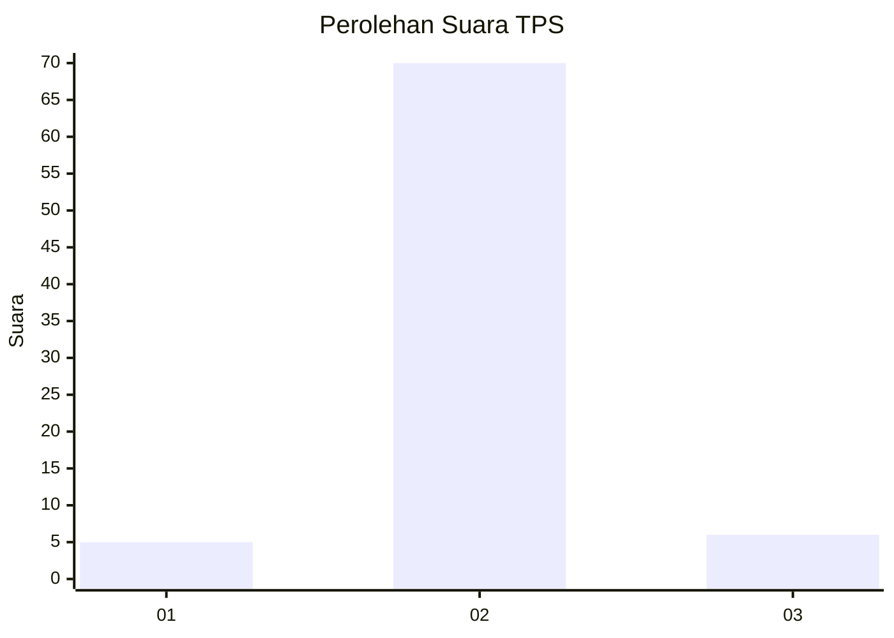
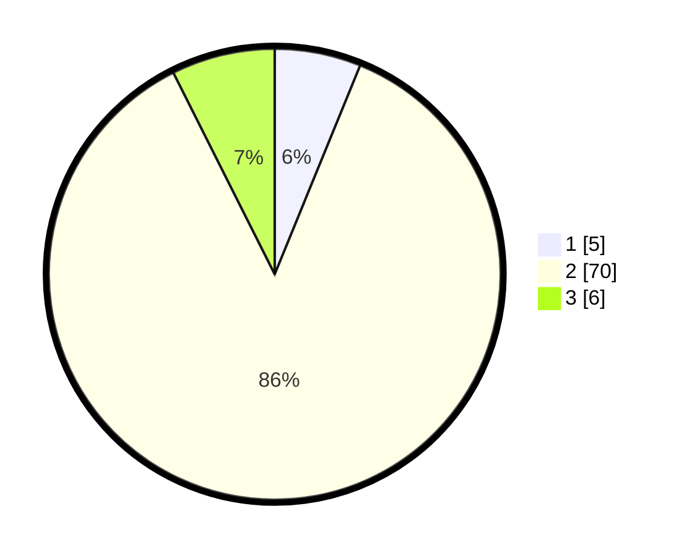

# Hasil

## Grafik

## Tabel

| No. | Nama Paslon    | Suara | Suara (raw) | Persentase |
|:--- |:-------------- | -----:| -----------:| ----------:|
| 1   | ANIES MUHAIMIN | 5     | [5][p-1]    | 6,17       |
| 2   | PRABOWO GIBRAN | 70    | [70][p-2]   | 86,42      |
| 3   | GANJAR MAHFUD  | 6     | [6][p-3]    | 7,41       |

[p-1]: https://github.com/gigit-pemilu/pemilu-2024-12-sumatera-utara/blob/main/pilpres/hitung-suara/sub/12-sumatera-utara/sub/20-padang-lawas-utara/sub/08-simangambat/sub/2022-huta-pasir/sub/004-tps/sub/paslon-1.txt
[p-2]: https://github.com/gigit-pemilu/pemilu-2024-12-sumatera-utara/blob/main/pilpres/hitung-suara/sub/12-sumatera-utara/sub/20-padang-lawas-utara/sub/08-simangambat/sub/2022-huta-pasir/sub/004-tps/sub/paslon-2.txt
[p-3]: https://github.com/gigit-pemilu/pemilu-2024-12-sumatera-utara/blob/main/pilpres/hitung-suara/sub/12-sumatera-utara/sub/20-padang-lawas-utara/sub/08-simangambat/sub/2022-huta-pasir/sub/004-tps/sub/paslon-3.txt

## Foto C Plano

https://sirekap-obj-formc.kpu.go.id/352c/pemilu/ppwp/12/20/08/20/22/1220082022004-20240215-101748--f94a8cd9-ed3f-49bc-91c9-cb58b7ac81cb.jpg

https://sirekap-obj-formc.kpu.go.id/352c/pemilu/ppwp/12/20/08/20/22/1220082022004-20240215-101907--45397432-25e3-44a5-ace7-7d1038c8640c.jpg

https://sirekap-obj-formc.kpu.go.id/352c/pemilu/ppwp/12/20/08/20/22/1220082022004-20240215-102001--04abc5c2-8fb3-41a2-bb14-243c7ebe5307.jpg

## Metadata

| Key        | Value               |
| ---------- | ------------------- |
| Time Stamp | 2024-02-15 15:00:29 |

