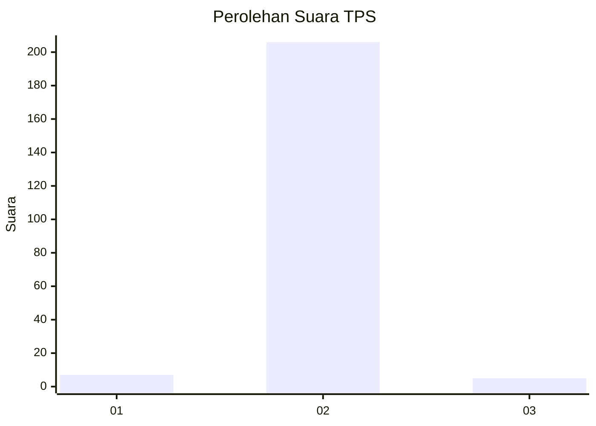
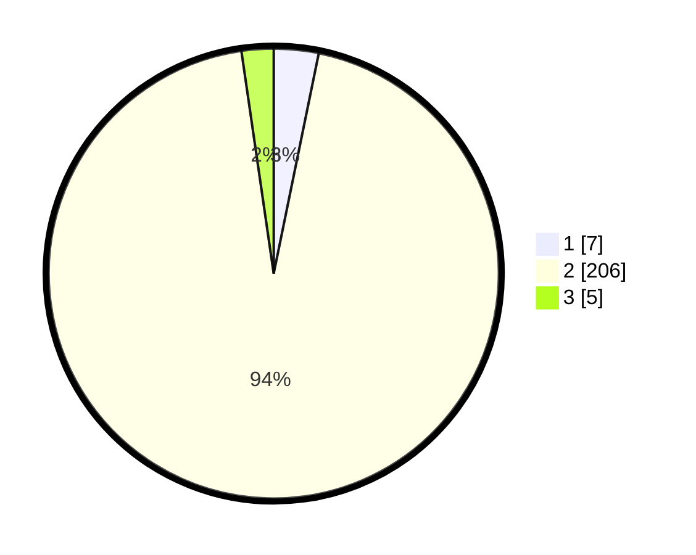

# Hasil

## Grafik

## Tabel

| No. | Nama Paslon    | Suara | Suara (raw) | Persentase |
|:--- |:-------------- | -----:| -----------:| ----------:|
| 1   | ANIES MUHAIMIN | 7     | [7][p-1]    | 3,21       |
| 2   | PRABOWO GIBRAN | 206   | [206][p-2]  | 94,50      |
| 3   | GANJAR MAHFUD  | 5     | [5][p-3]    | 2,29       |

[p-1]: https://github.com/gigit-pemilu/pemilu-2024/blob/main/pilpres/hitung-suara/sub/12-sumatera-utara/sub/20-padang-lawas-utara/sub/08-simangambat/sub/2026-ujung-gading-jae/sub/003-tps/sub/paslon-1.txt
[p-2]: https://github.com/gigit-pemilu/pemilu-2024/blob/main/pilpres/hitung-suara/sub/12-sumatera-utara/sub/20-padang-lawas-utara/sub/08-simangambat/sub/2026-ujung-gading-jae/sub/003-tps/sub/paslon-2.txt
[p-3]: https://github.com/gigit-pemilu/pemilu-2024/blob/main/pilpres/hitung-suara/sub/12-sumatera-utara/sub/20-padang-lawas-utara/sub/08-simangambat/sub/2026-ujung-gading-jae/sub/003-tps/sub/paslon-3.txt

## Foto C Plano

https://sirekap-obj-formc.kpu.go.id/c454/pemilu/ppwp/12/20/08/20/26/1220082026003-20240215-092912--0ac1ab0b-6083-46cc-9b1f-aa270c9a9c7e.jpg

https://sirekap-obj-formc.kpu.go.id/c454/pemilu/ppwp/12/20/08/20/26/1220082026003-20240215-093049--185e861a-cca4-4f3e-a534-03c59e80b704.jpg

https://sirekap-obj-formc.kpu.go.id/c454/pemilu/ppwp/12/20/08/20/26/1220082026003-20240215-093153--6db342dd-fa49-4e6e-9c42-64dce6cb6a11.jpg

## Metadata

| Key        | Value               |
| ---------- | ------------------- |
| Time Stamp | 2024-02-16 11:00:29 |

