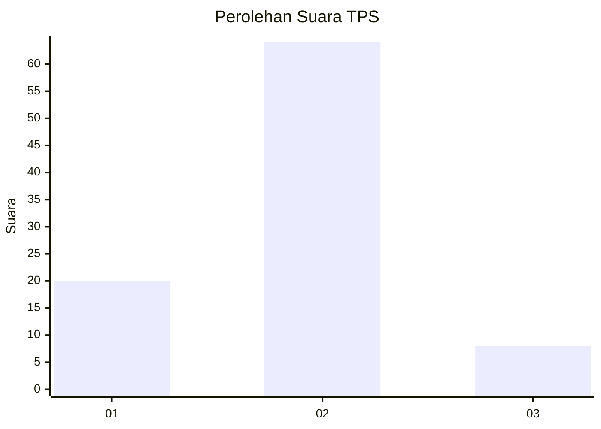
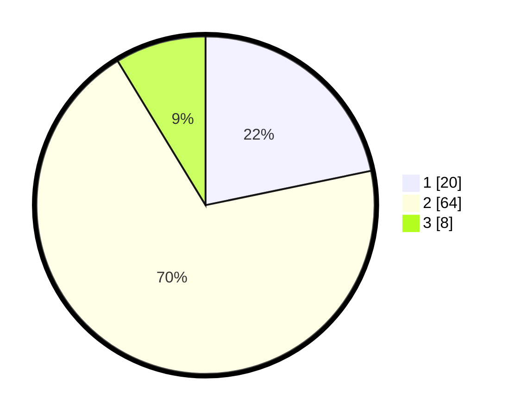

# Hasil

## Grafik

## Tabel

| No. | Nama Paslon    | Suara | Suara (raw) | Persentase |
|:--- |:-------------- | -----:| -----------:| ----------:|
| 1   | ANIES MUHAIMIN | 20    | [20][p-1]   | 21,74      |
| 2   | PRABOWO GIBRAN | 64    | [64][p-2]   | 69,57      |
| 3   | GANJAR MAHFUD  | 8     | [8][p-3]    | 8,70       |

[p-1]: https://github.com/gigit-pemilu/pemilu-2024-12-sumatera-utara/blob/main/pilpres/hitung-suara/sub/12-sumatera-utara/sub/20-padang-lawas-utara/sub/08-simangambat/sub/2032-simangambat-julu/sub/005-tps/sub/paslon-1.txt
[p-2]: https://github.com/gigit-pemilu/pemilu-2024-12-sumatera-utara/blob/main/pilpres/hitung-suara/sub/12-sumatera-utara/sub/20-padang-lawas-utara/sub/08-simangambat/sub/2032-simangambat-julu/sub/005-tps/sub/paslon-2.txt
[p-3]: https://github.com/gigit-pemilu/pemilu-2024-12-sumatera-utara/blob/main/pilpres/hitung-suara/sub/12-sumatera-utara/sub/20-padang-lawas-utara/sub/08-simangambat/sub/2032-simangambat-julu/sub/005-tps/sub/paslon-3.txt

## Foto C Plano

https://sirekap-obj-formc.kpu.go.id/a230/pemilu/ppwp/12/20/08/20/32/1220082032005-20240215-163027--3e4c51ea-9a28-4ba7-84e1-cccea4031346.jpg

https://sirekap-obj-formc.kpu.go.id/a230/pemilu/ppwp/12/20/08/20/32/1220082032005-20240215-163145--6719ac7a-779c-4d87-bf49-2bcf3968890a.jpg

https://sirekap-obj-formc.kpu.go.id/a230/pemilu/ppwp/12/20/08/20/32/1220082032005-20240215-163445--985e664d-a784-4f2d-ae57-f57089070141.jpg

## Metadata

| Key        | Value               |
| ---------- | ------------------- |
| Time Stamp | 2024-02-16 00:00:26 |

