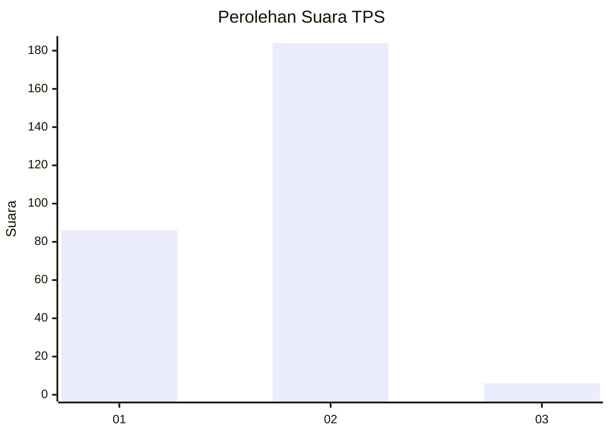
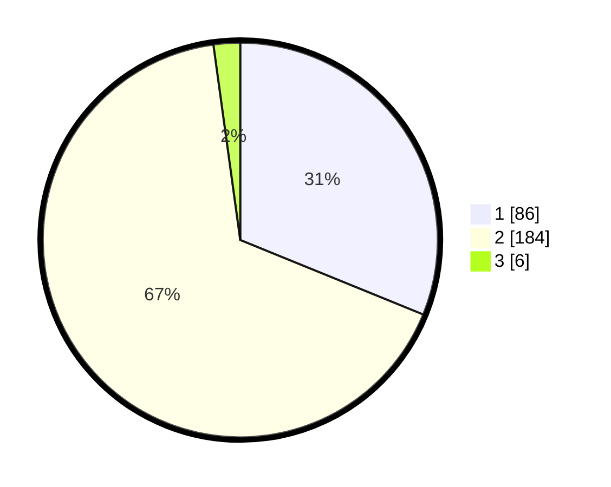

# Hasil

## Grafik

## Tabel

| No. | Nama Paslon    | Suara | Suara (raw) | Persentase |
|:--- |:-------------- | -----:| -----------:| ----------:|
| 1   | ANIES MUHAIMIN | 86    | [86][p-1]   | 31,16      |
| 2   | PRABOWO GIBRAN | 184   | [184][p-2]  | 66,67      |
| 3   | GANJAR MAHFUD  | 6     | [6][p-3]    | 2,17       |

[p-1]: https://github.com/gigit-pemilu/pemilu-2024-12-sumatera-utara/blob/main/pilpres/hitung-suara/sub/12-sumatera-utara/sub/20-padang-lawas-utara/sub/11-halongonan-timur/sub/2001-siancimun/sub/002-tps/sub/paslon-1.txt
[p-2]: https://github.com/gigit-pemilu/pemilu-2024-12-sumatera-utara/blob/main/pilpres/hitung-suara/sub/12-sumatera-utara/sub/20-padang-lawas-utara/sub/11-halongonan-timur/sub/2001-siancimun/sub/002-tps/sub/paslon-2.txt
[p-3]: https://github.com/gigit-pemilu/pemilu-2024-12-sumatera-utara/blob/main/pilpres/hitung-suara/sub/12-sumatera-utara/sub/20-padang-lawas-utara/sub/11-halongonan-timur/sub/2001-siancimun/sub/002-tps/sub/paslon-3.txt

## Foto C Plano

https://sirekap-obj-formc.kpu.go.id/8031/pemilu/ppwp/12/20/11/20/01/1220112001002-20240214-230402--543d3135-2e3b-4a6f-af9d-b3f9869136ba.jpg

https://sirekap-obj-formc.kpu.go.id/8031/pemilu/ppwp/12/20/11/20/01/1220112001002-20240214-232015--e073da81-0d34-4bf6-ab70-c87f1d444d93.jpg

https://sirekap-obj-formc.kpu.go.id/8031/pemilu/ppwp/12/20/11/20/01/1220112001002-20240214-232732--83aa1244-18f7-4304-bfb3-5dda518b950d.jpg

## Metadata

| Key        | Value               |
| ---------- | ------------------- |
| Time Stamp | 2024-02-15 21:30:27 |

