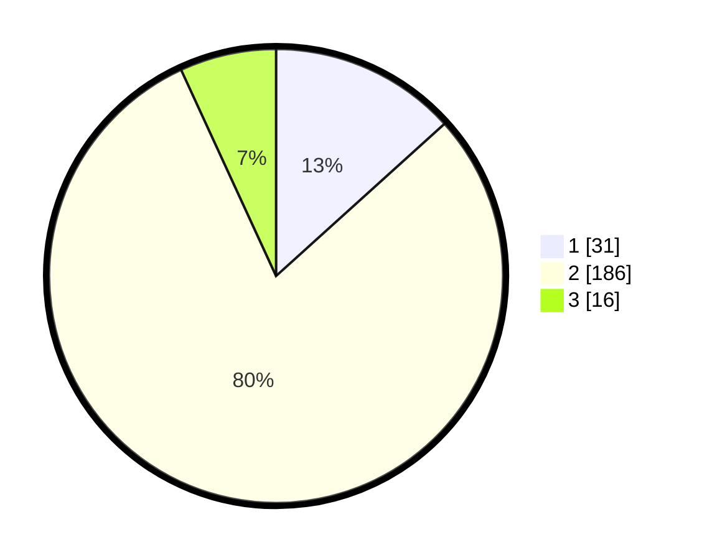

# Hasil

## Grafik

## Tabel

| No. | Nama Paslon    | Suara | Suara (raw) | Persentase |
|:--- |:-------------- | -----:| -----------:| ----------:|
| 1   | ANIES MUHAIMIN | 31    | [31][p-1]   | 13,30      |
| 2   | PRABOWO GIBRAN | 186   | [186][p-2]  | 79,83      |
| 3   | GANJAR MAHFUD  | 16    | [16][p-3]   | 6,87       |

[p-1]: https://github.com/gigit-pemilu/pemilu-2024-12-sumatera-utara/blob/main/pilpres/hitung-suara/sub/12-sumatera-utara/sub/20-padang-lawas-utara/sub/11-halongonan-timur/sub/2001-siancimun/sub/005-tps/sub/paslon-1.txt
[p-2]: https://github.com/gigit-pemilu/pemilu-2024-12-sumatera-utara/blob/main/pilpres/hitung-suara/sub/12-sumatera-utara/sub/20-padang-lawas-utara/sub/11-halongonan-timur/sub/2001-siancimun/sub/005-tps/sub/paslon-2.txt
[p-3]: https://github.com/gigit-pemilu/pemilu-2024-12-sumatera-utara/blob/main/pilpres/hitung-suara/sub/12-sumatera-utara/sub/20-padang-lawas-utara/sub/11-halongonan-timur/sub/2001-siancimun/sub/005-tps/sub/paslon-3.txt

## Foto C Plano

https://sirekap-obj-formc.kpu.go.id/97ad/pemilu/ppwp/12/20/11/20/01/1220112001005-20240215-133300--6c9232bf-1c08-4a4e-8c92-051b03e63a8f.jpg

https://sirekap-obj-formc.kpu.go.id/97ad/pemilu/ppwp/12/20/11/20/01/1220112001005-20240215-135217--74e015d1-1957-48bd-b2cb-a78bc332bb14.jpg

https://sirekap-obj-formc.kpu.go.id/97ad/pemilu/ppwp/12/20/11/20/01/1220112001005-20240215-133632--d2036913-e071-4af0-8d7f-e90cef427c41.jpg

## Metadata

| Key        | Value               |
| ---------- | ------------------- |
| Time Stamp | 2024-02-15 21:30:27 |

