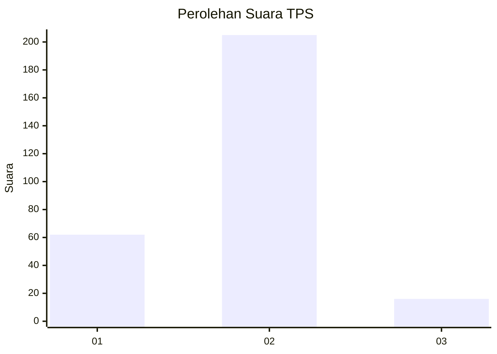
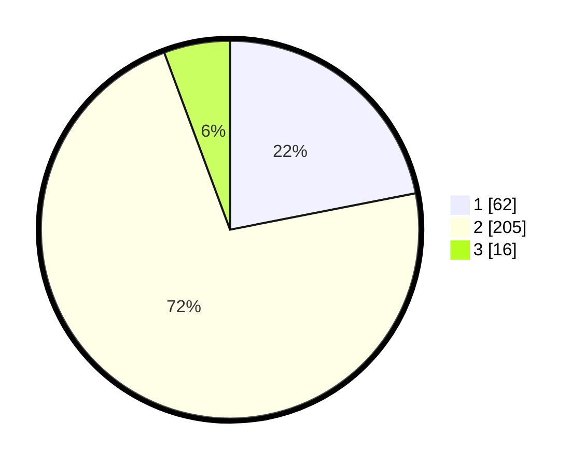

# Hasil

## Grafik

## Tabel

| No. | Nama Paslon    | Suara | Suara (raw) | Persentase |
|:--- |:-------------- | -----:| -----------:| ----------:|
| 1   | ANIES MUHAIMIN | 62    | [62][p-1]   | 21,91      |
| 2   | PRABOWO GIBRAN | 205   | [205][p-2]  | 72,44      |
| 3   | GANJAR MAHFUD  | 16    | [16][p-3]   | 5,65       |

[p-1]: https://github.com/gigit-pemilu/pemilu-2024/blob/main/pilpres/hitung-suara/sub/12-sumatera-utara/sub/20-padang-lawas-utara/sub/11-halongonan-timur/sub/2005-mompang-i/sub/003-tps/sub/paslon-1.txt
[p-2]: https://github.com/gigit-pemilu/pemilu-2024/blob/main/pilpres/hitung-suara/sub/12-sumatera-utara/sub/20-padang-lawas-utara/sub/11-halongonan-timur/sub/2005-mompang-i/sub/003-tps/sub/paslon-2.txt
[p-3]: https://github.com/gigit-pemilu/pemilu-2024/blob/main/pilpres/hitung-suara/sub/12-sumatera-utara/sub/20-padang-lawas-utara/sub/11-halongonan-timur/sub/2005-mompang-i/sub/003-tps/sub/paslon-3.txt

## Foto C Plano

https://sirekap-obj-formc.kpu.go.id/f63d/pemilu/ppwp/12/20/11/20/05/1220112005003-20240215-083303--541e3f58-f603-450a-878c-72f9641badae.jpg

https://sirekap-obj-formc.kpu.go.id/f63d/pemilu/ppwp/12/20/11/20/05/1220112005003-20240215-023029--ecf1641b-4897-43b8-83af-95dad498fd41.jpg

https://sirekap-obj-formc.kpu.go.id/f63d/pemilu/ppwp/12/20/11/20/05/1220112005003-20240215-083443--535ace0f-760c-4e36-8ffd-7b1cddfb70d5.jpg

## Metadata

| Key        | Value               |
| ---------- | ------------------- |
| Time Stamp | 2024-02-15 17:30:25 |

