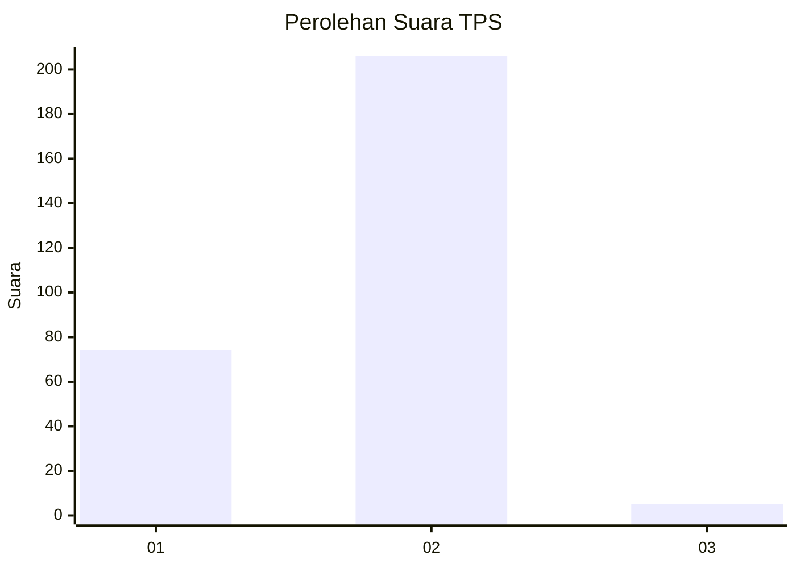
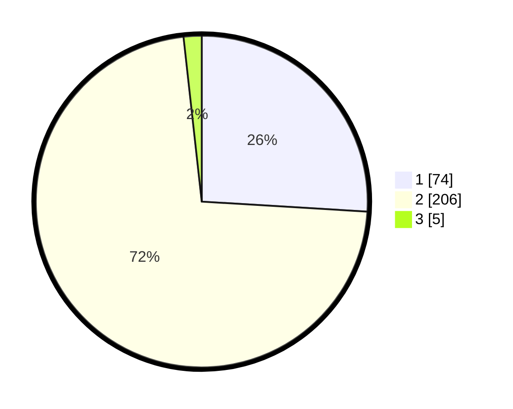

# Hasil

## Grafik

## Tabel

| No. | Nama Paslon    | Suara | Suara (raw) | Persentase |
|:--- |:-------------- | -----:| -----------:| ----------:|
| 1   | ANIES MUHAIMIN | 74    | [74][p-1]   | 25,96      |
| 2   | PRABOWO GIBRAN | 206   | [206][p-2]  | 72,28      |
| 3   | GANJAR MAHFUD  | 5     | [5][p-3]    | 1,75       |

[p-1]: https://github.com/gigit-pemilu/pemilu-2024-12-sumatera-utara/blob/main/pilpres/hitung-suara/sub/12-sumatera-utara/sub/20-padang-lawas-utara/sub/11-halongonan-timur/sub/2007-sihopuk-baru/sub/002-tps/sub/paslon-1.txt
[p-2]: https://github.com/gigit-pemilu/pemilu-2024-12-sumatera-utara/blob/main/pilpres/hitung-suara/sub/12-sumatera-utara/sub/20-padang-lawas-utara/sub/11-halongonan-timur/sub/2007-sihopuk-baru/sub/002-tps/sub/paslon-2.txt
[p-3]: https://github.com/gigit-pemilu/pemilu-2024-12-sumatera-utara/blob/main/pilpres/hitung-suara/sub/12-sumatera-utara/sub/20-padang-lawas-utara/sub/11-halongonan-timur/sub/2007-sihopuk-baru/sub/002-tps/sub/paslon-3.txt

## Foto C Plano

https://sirekap-obj-formc.kpu.go.id/c90a/pemilu/ppwp/12/20/11/20/07/1220112007002-20240215-110333--62882da6-a5c6-45e6-8c3f-1565df94e15a.jpg

https://sirekap-obj-formc.kpu.go.id/c90a/pemilu/ppwp/12/20/11/20/07/1220112007002-20240215-150616--f5d26841-ea6b-40d9-aa09-a69b09bb9604.jpg

https://sirekap-obj-formc.kpu.go.id/c90a/pemilu/ppwp/12/20/11/20/07/1220112007002-20240215-115857--da99ae59-1a6e-4dbb-996a-d9c3b966e046.jpg

## Metadata

| Key        | Value               |
| ---------- | ------------------- |
| Time Stamp | 2024-02-15 22:00:27 |

