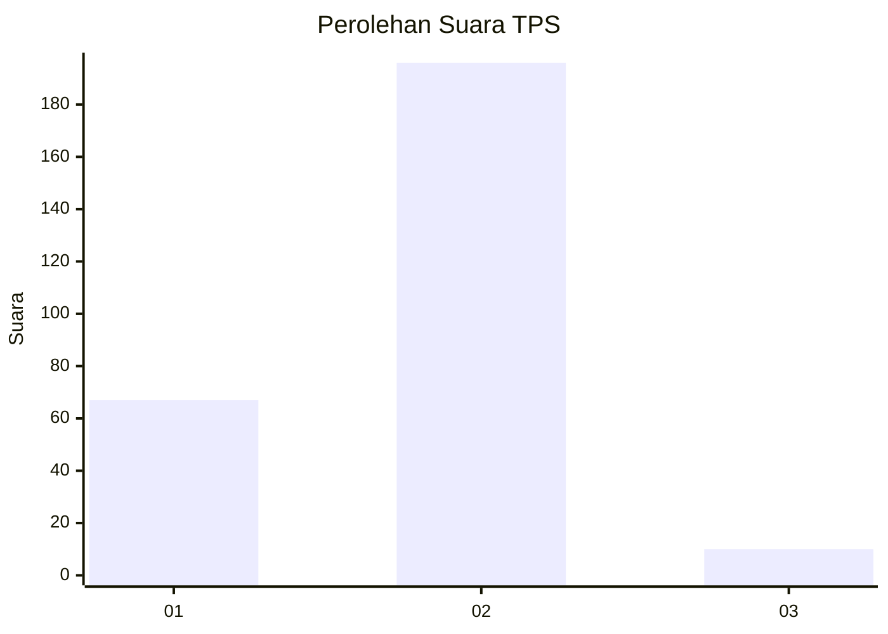

# Hasil

## Grafik

## Tabel

| No. | Nama Paslon    | Suara | Suara (raw) | Persentase |
|:--- |:-------------- | -----:| -----------:| ----------:|
| 1   | ANIES MUHAIMIN | 67    | [67][p-1]   | 24,54      |
| 2   | PRABOWO GIBRAN | 196   | [196][p-2]  | 71,79      |
| 3   | GANJAR MAHFUD  | 10    | [10][p-3]   | 3,66       |

[p-1]: https://github.com/gigit-pemilu/pemilu-2024-12-sumatera-utara/blob/main/pilpres/hitung-suara/sub/12-sumatera-utara/sub/20-padang-lawas-utara/sub/11-halongonan-timur/sub/2007-sihopuk-baru/sub/005-tps/sub/paslon-1.txt
[p-2]: https://github.com/gigit-pemilu/pemilu-2024-12-sumatera-utara/blob/main/pilpres/hitung-suara/sub/12-sumatera-utara/sub/20-padang-lawas-utara/sub/11-halongonan-timur/sub/2007-sihopuk-baru/sub/005-tps/sub/paslon-2.txt
[p-3]: https://github.com/gigit-pemilu/pemilu-2024-12-sumatera-utara/blob/main/pilpres/hitung-suara/sub/12-sumatera-utara/sub/20-padang-lawas-utara/sub/11-halongonan-timur/sub/2007-sihopuk-baru/sub/005-tps/sub/paslon-3.txt

## Foto C Plano

https://sirekap-obj-formc.kpu.go.id/bb46/pemilu/ppwp/12/20/11/20/07/1220112007005-20240215-151244--fd10a51b-10c6-4574-82fd-47176a037e8f.jpg

https://sirekap-obj-formc.kpu.go.id/bb46/pemilu/ppwp/12/20/11/20/07/1220112007005-20240215-151435--95fba1ba-f4e5-4367-a285-730ced1a0290.jpg

https://sirekap-obj-formc.kpu.go.id/bb46/pemilu/ppwp/12/20/11/20/07/1220112007005-20240215-151609--e3e5633a-8c43-4d13-bd5e-43b66a64e601.jpg

## Metadata

| Key        | Value               |
| ---------- | ------------------- |
| Time Stamp | 2024-02-15 21:30:27 |

