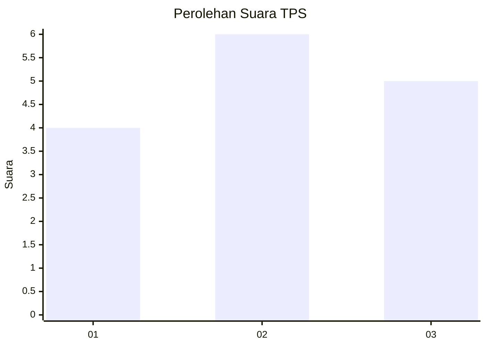
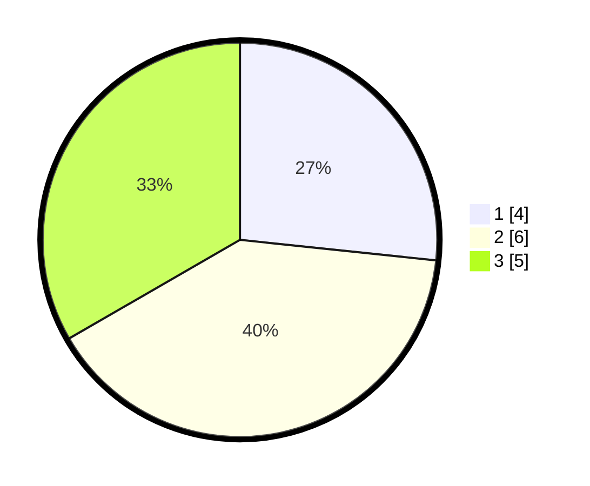

# Hasil

## Grafik

## Tabel

| No. | Nama Paslon    | Suara | Suara (raw) | Persentase |
|:--- |:-------------- | -----:| -----------:| ----------:|
| 1   | ANIES MUHAIMIN | 4     | [4][p-1]    | 26,67      |
| 2   | PRABOWO GIBRAN | 6     | [6][p-2]    | 40,00      |
| 3   | GANJAR MAHFUD  | 5     | [5][p-3]    | 33,33      |

[p-1]: https://github.com/gigit-pemilu/pemilu-2024/blob/main/pilpres/hitung-suara/sub/12-sumatera-utara/sub/20-padang-lawas-utara/sub/12-ujung-batu/sub/2012-manare-tua/sub/002-tps/sub/paslon-1.txt
[p-2]: https://github.com/gigit-pemilu/pemilu-2024/blob/main/pilpres/hitung-suara/sub/12-sumatera-utara/sub/20-padang-lawas-utara/sub/12-ujung-batu/sub/2012-manare-tua/sub/002-tps/sub/paslon-2.txt
[p-3]: https://github.com/gigit-pemilu/pemilu-2024/blob/main/pilpres/hitung-suara/sub/12-sumatera-utara/sub/20-padang-lawas-utara/sub/12-ujung-batu/sub/2012-manare-tua/sub/002-tps/sub/paslon-3.txt

## Foto C Plano

https://sirekap-obj-formc.kpu.go.id/b65c/pemilu/ppwp/12/20/12/20/12/1220122012002-20240216-142517--713e5d6d-ad9d-4b2a-be2e-9ffe1e27e608.jpg

https://sirekap-obj-formc.kpu.go.id/b65c/pemilu/ppwp/12/20/12/20/12/1220122012002-20240216-142518--98e92adf-793c-49b1-87d5-6288630b11d7.jpg

https://sirekap-obj-formc.kpu.go.id/b65c/pemilu/ppwp/12/20/12/20/12/1220122012002-20240216-142517--869cc3c5-bfc4-4ec3-99f2-7e7c8b76535a.jpg

## Metadata

| Key        | Value               |
| ---------- | ------------------- |
| Time Stamp | 2024-02-16 16:25:10 |

## DATA PEMILIH TETAP

Jumlah pemilih dalam DPT: **107**.
 * L: **60**.
 * P: **47**.

## DATA PENGGUNA HAK PILIH

Jumlah pengguna hak pilih dalam DPT: **16**.
 * L: **9**.
 * P: **7**.

Jumlah pengguna hak pilih dalam DPTb: **0**.
 * L: **0**.
 * P: **0**.

Jumlah pengguna hak pilih dalam DPK: **0**.
 * L: **0**.
 * P: **0**.

Jumlah pengguna hak pilih: **16**.
 * L: **9**.
 * P: **7**.

## JUMLAH SUARA SAH DAN TIDAK SAH

JUMLAH SELURUH SUARA SAH: **15**.

JUMLAH SUARA TIDAK SAH: **1**.

JUMLAH SELURUH SUARA SAH DAN SUARA TIDAK SAH: **16**.

