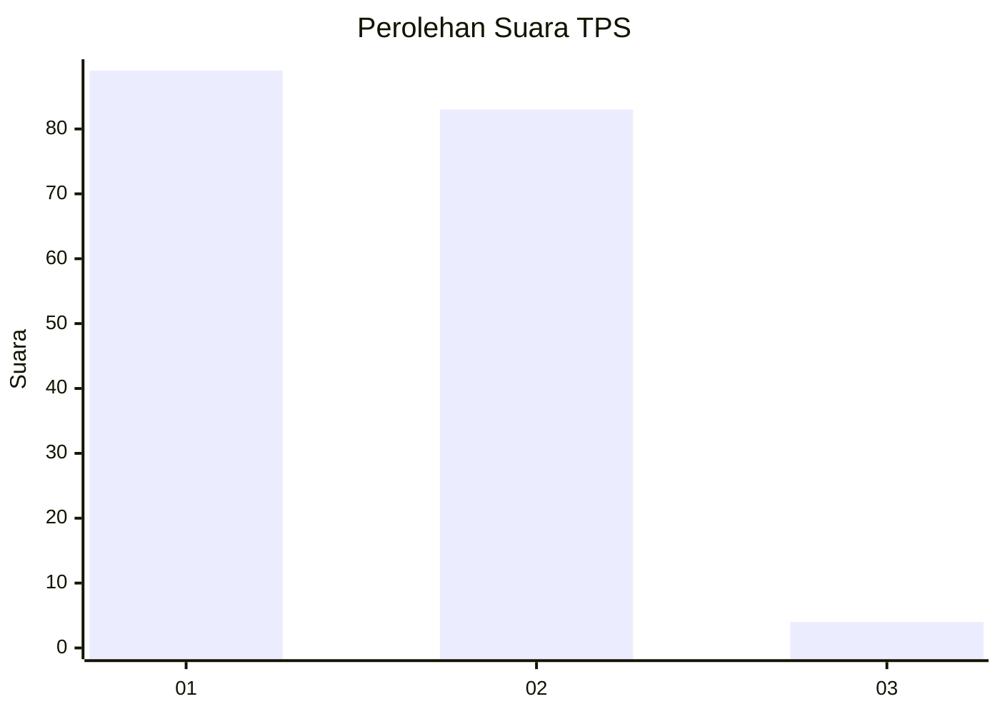
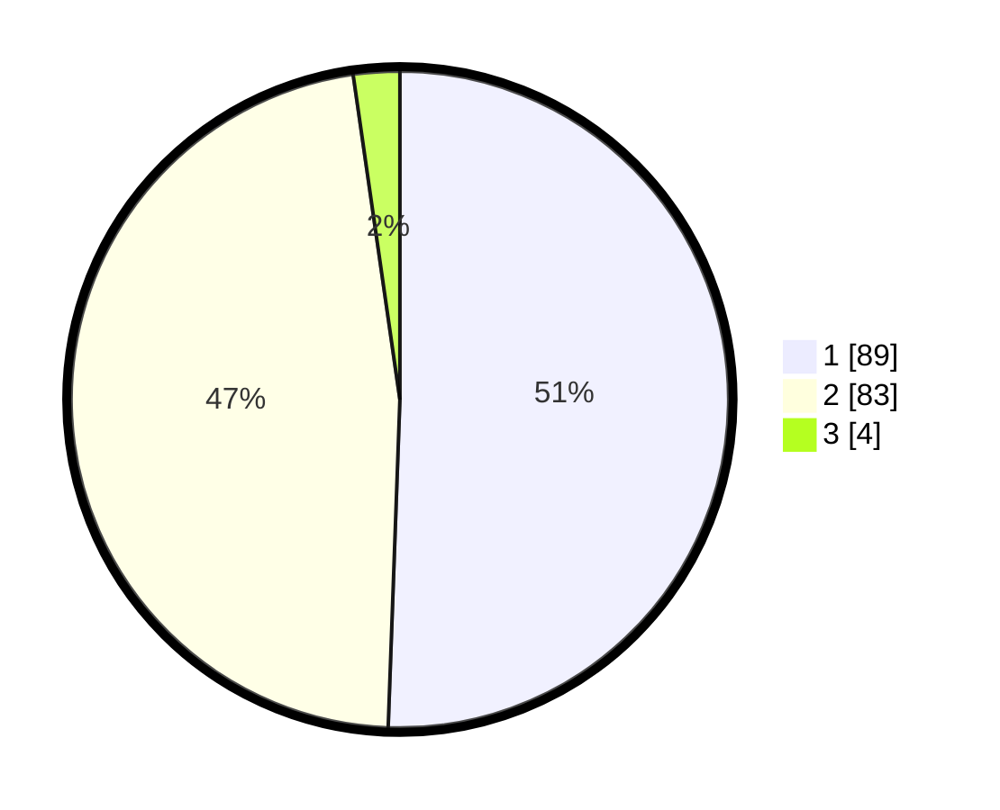

# Hasil

## Grafik

## Tabel

| No. | Nama Paslon    | Suara | Suara (raw) | Persentase |
|:--- |:-------------- | -----:| -----------:| ----------:|
| 1   | ANIES MUHAIMIN | 89    | [89][p-1]   | 50,57      |
| 2   | PRABOWO GIBRAN | 83    | [83][p-2]   | 47,16      |
| 3   | GANJAR MAHFUD  | 4     | [4][p-3]    | 2,27       |

[p-1]: https://github.com/gigit-pemilu/pemilu-2024-12-sumatera-utara/blob/main/pilpres/hitung-suara/sub/12-sumatera-utara/sub/21-padang-lawas/sub/03-huristak/sub/2003-huristak/sub/004-tps/sub/paslon-1.txt
[p-2]: https://github.com/gigit-pemilu/pemilu-2024-12-sumatera-utara/blob/main/pilpres/hitung-suara/sub/12-sumatera-utara/sub/21-padang-lawas/sub/03-huristak/sub/2003-huristak/sub/004-tps/sub/paslon-2.txt
[p-3]: https://github.com/gigit-pemilu/pemilu-2024-12-sumatera-utara/blob/main/pilpres/hitung-suara/sub/12-sumatera-utara/sub/21-padang-lawas/sub/03-huristak/sub/2003-huristak/sub/004-tps/sub/paslon-3.txt

## Foto C Plano

https://sirekap-obj-formc.kpu.go.id/c735/pemilu/ppwp/12/21/03/20/03/1221032003004-20240216-111003--d142eae5-6c33-414b-afa1-dd162f049fb4.jpg

https://sirekap-obj-formc.kpu.go.id/c735/pemilu/ppwp/12/21/03/20/03/1221032003004-20240216-125214--c17a650d-fc15-4056-aef7-39547fcc2b7e.jpg

https://sirekap-obj-formc.kpu.go.id/c735/pemilu/ppwp/12/21/03/20/03/1221032003004-20240216-122320--998f50bb-6946-47ea-b5a3-9ec55cda5f81.jpg

## Metadata

| Key        | Value               |
| ---------- | ------------------- |
| Time Stamp | 2024-02-25 12:00:00 |

