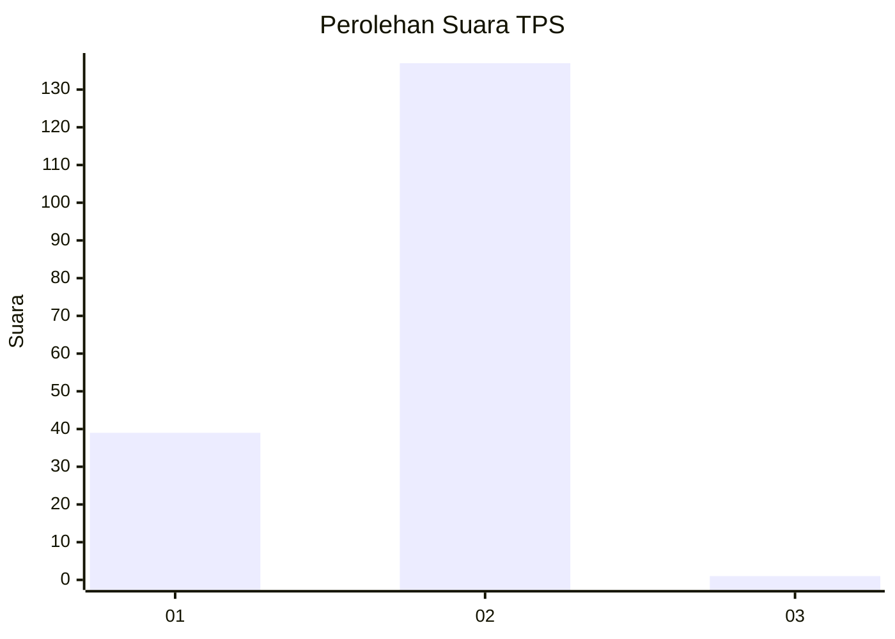
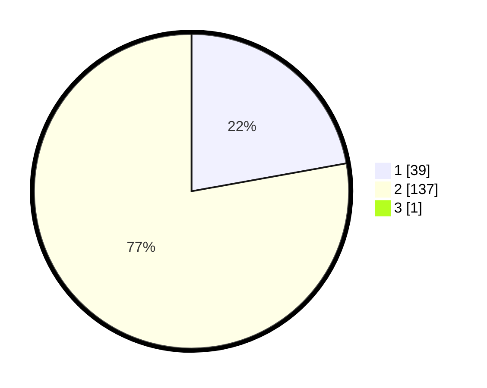

# Hasil

## Grafik

## Tabel

| No. | Nama Paslon    | Suara | Suara (raw) | Persentase |
|:--- |:-------------- | -----:| -----------:| ----------:|
| 1   | ANIES MUHAIMIN | 39    | [39][p-1]   | 22,03      |
| 2   | PRABOWO GIBRAN | 137   | [137][p-2]  | 77,40      |
| 3   | GANJAR MAHFUD  | 1     | [1][p-3]    | 0,56       |

[p-1]: https://github.com/gigit-pemilu/pemilu-2024/blob/main/pilpres/hitung-suara/sub/12-sumatera-utara/sub/21-padang-lawas/sub/03-huristak/sub/2008-pasir-lancat-lama/sub/001-tps/sub/paslon-1.txt
[p-2]: https://github.com/gigit-pemilu/pemilu-2024/blob/main/pilpres/hitung-suara/sub/12-sumatera-utara/sub/21-padang-lawas/sub/03-huristak/sub/2008-pasir-lancat-lama/sub/001-tps/sub/paslon-2.txt
[p-3]: https://github.com/gigit-pemilu/pemilu-2024/blob/main/pilpres/hitung-suara/sub/12-sumatera-utara/sub/21-padang-lawas/sub/03-huristak/sub/2008-pasir-lancat-lama/sub/001-tps/sub/paslon-3.txt

## Foto C Plano

https://sirekap-obj-formc.kpu.go.id/ea99/pemilu/ppwp/12/21/03/20/08/1221032008001-20240215-135024--288a835a-0c10-48d8-9464-33843614830c.jpg

https://sirekap-obj-formc.kpu.go.id/ea99/pemilu/ppwp/12/21/03/20/08/1221032008001-20240215-135244--992e6fc3-df2a-4d7c-afc5-dd23271810ae.jpg

https://sirekap-obj-formc.kpu.go.id/ea99/pemilu/ppwp/12/21/03/20/08/1221032008001-20240215-135332--45278e4a-f34d-4ac2-bc4f-62088c0ced0a.jpg

## Metadata

| Key        | Value               |
| ---------- | ------------------- |
| Time Stamp | 2024-02-15 22:00:27 |

