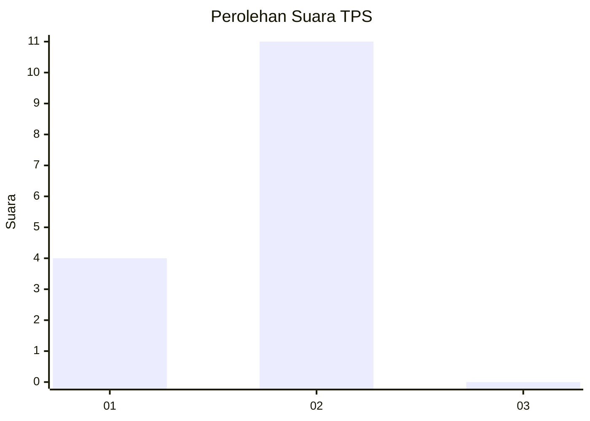
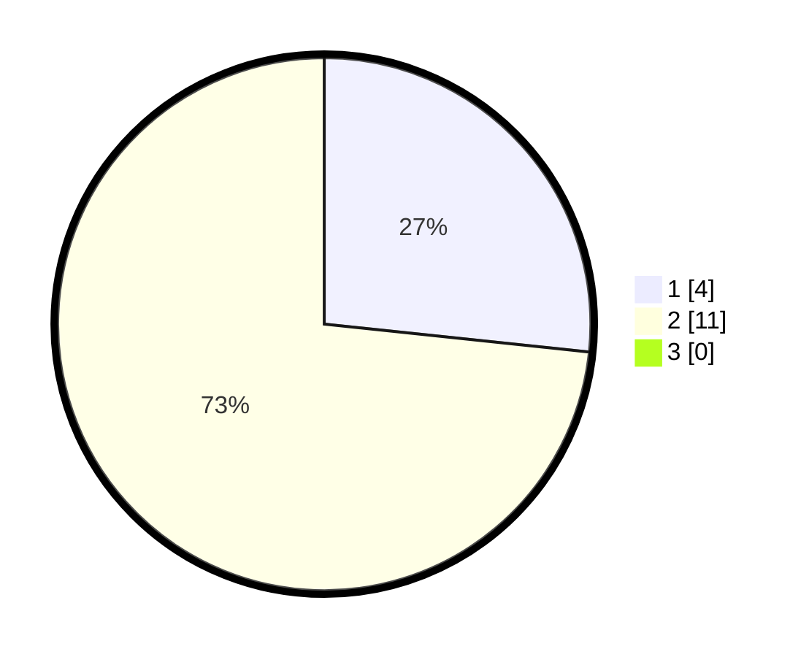

# Hasil

## Grafik

## Tabel

| No. | Nama Paslon    | Suara | Suara (raw) | Persentase |
|:--- |:-------------- | -----:| -----------:| ----------:|
| 1   | ANIES MUHAIMIN | 4     | [4][p-1]    | 26,67      |
| 2   | PRABOWO GIBRAN | 11    | [11][p-2]   | 73,33      |
| 3   | GANJAR MAHFUD  | 0     | [0][p-3]    | 0,00       |

[p-1]: https://github.com/gigit-pemilu/pemilu-2024/blob/main/pilpres/hitung-suara/sub/12-sumatera-utara/sub/21-padang-lawas/sub/09-batang-lubu-sutam/sub/2005-pagaran-tayas/sub/001-tps/sub/paslon-1.txt
[p-2]: https://github.com/gigit-pemilu/pemilu-2024/blob/main/pilpres/hitung-suara/sub/12-sumatera-utara/sub/21-padang-lawas/sub/09-batang-lubu-sutam/sub/2005-pagaran-tayas/sub/001-tps/sub/paslon-2.txt
[p-3]: https://github.com/gigit-pemilu/pemilu-2024/blob/main/pilpres/hitung-suara/sub/12-sumatera-utara/sub/21-padang-lawas/sub/09-batang-lubu-sutam/sub/2005-pagaran-tayas/sub/001-tps/sub/paslon-3.txt

## Foto C Plano

https://sirekap-obj-formc.kpu.go.id/d53a/pemilu/ppwp/12/21/09/20/05/1221092005001-20240215-004948--5bdb8b76-0159-46fa-afaf-93c097ef16f9.jpg

https://sirekap-obj-formc.kpu.go.id/d53a/pemilu/ppwp/12/21/09/20/05/1221092005001-20240215-012202--9c78d3c1-2423-4c4a-9838-be80b8698a62.jpg

## Metadata

| Key        | Value               |
| ---------- | ------------------- |
| Time Stamp | 2024-02-16 03:30:26 |

