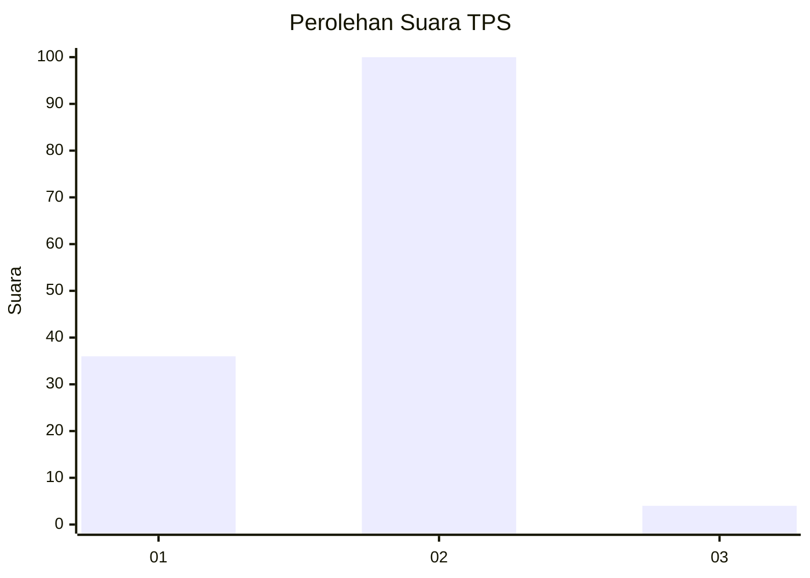
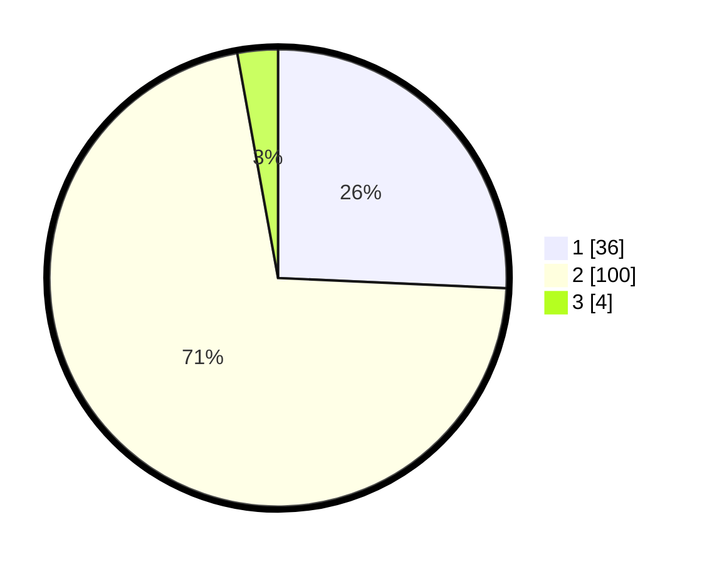

# Hasil

## Grafik

## Tabel

| No. | Nama Paslon    | Suara | Suara (raw) | Persentase |
|:--- |:-------------- | -----:| -----------:| ----------:|
| 1   | ANIES MUHAIMIN | 36    | [36][p-1]   | 25,71      |
| 2   | PRABOWO GIBRAN | 100   | [100][p-2]  | 71,43      |
| 3   | GANJAR MAHFUD  | 4     | [4][p-3]    | 2,86       |

[p-1]: https://github.com/gigit-pemilu/pemilu-2024/blob/main/pilpres/hitung-suara/sub/12-sumatera-utara/sub/21-padang-lawas/sub/10-barumun-selatan/sub/2008-tanjung-baringin-simarulak/sub/002-tps/sub/paslon-1.txt
[p-2]: https://github.com/gigit-pemilu/pemilu-2024/blob/main/pilpres/hitung-suara/sub/12-sumatera-utara/sub/21-padang-lawas/sub/10-barumun-selatan/sub/2008-tanjung-baringin-simarulak/sub/002-tps/sub/paslon-2.txt
[p-3]: https://github.com/gigit-pemilu/pemilu-2024/blob/main/pilpres/hitung-suara/sub/12-sumatera-utara/sub/21-padang-lawas/sub/10-barumun-selatan/sub/2008-tanjung-baringin-simarulak/sub/002-tps/sub/paslon-3.txt

## Foto C Plano

https://sirekap-obj-formc.kpu.go.id/4872/pemilu/ppwp/12/21/10/20/08/1221102008002-20240216-180340--e68c6174-c105-4eeb-ba6b-d4175d2ba846.jpg

https://sirekap-obj-formc.kpu.go.id/4872/pemilu/ppwp/12/21/10/20/08/1221102008002-20240214-215631--02489380-bf1d-4d90-a74e-e7665b54f7f1.jpg

https://sirekap-obj-formc.kpu.go.id/4872/pemilu/ppwp/12/21/10/20/08/1221102008002-20240214-215819--f010c261-649b-4283-a6f9-e93003d6c9fd.jpg

## Metadata

| Key        | Value               |
| ---------- | ------------------- |
| Time Stamp | 2024-02-16 21:01:00 |

