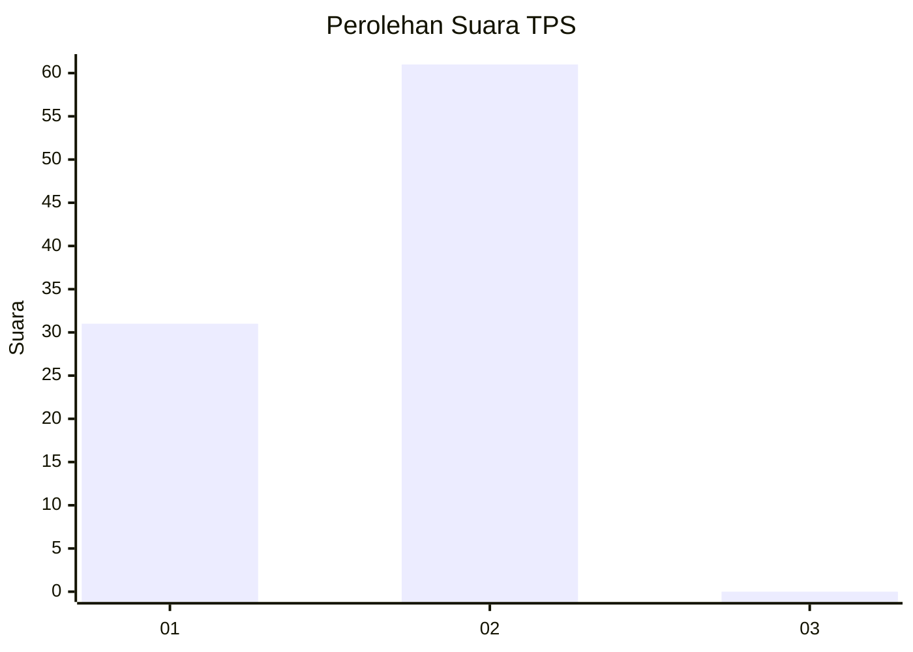
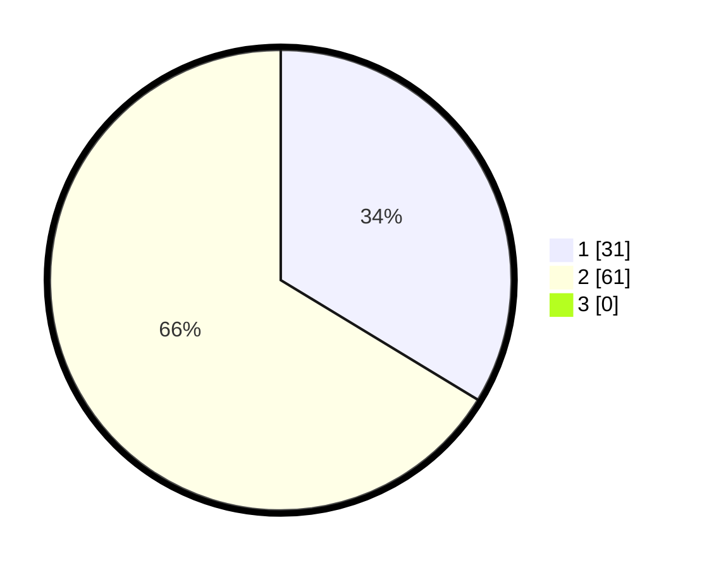

# Hasil

## Grafik

## Tabel

| No. | Nama Paslon    | Suara | Suara (raw) | Persentase |
|:--- |:-------------- | -----:| -----------:| ----------:|
| 1   | ANIES MUHAIMIN | 31    | [31][p-1]   | 33,70      |
| 2   | PRABOWO GIBRAN | 61    | [61][p-2]   | 66,30      |
| 3   | GANJAR MAHFUD  | 0     | [0][p-3]    | 0,00       |

[p-1]: https://github.com/gigit-pemilu/pemilu-2024-12-sumatera-utara/blob/main/pilpres/hitung-suara/sub/12-sumatera-utara/sub/21-padang-lawas/sub/11-aek-nabara-barumun/sub/2007-sidokan/sub/001-tps/sub/paslon-1.txt
[p-2]: https://github.com/gigit-pemilu/pemilu-2024-12-sumatera-utara/blob/main/pilpres/hitung-suara/sub/12-sumatera-utara/sub/21-padang-lawas/sub/11-aek-nabara-barumun/sub/2007-sidokan/sub/001-tps/sub/paslon-2.txt
[p-3]: https://github.com/gigit-pemilu/pemilu-2024-12-sumatera-utara/blob/main/pilpres/hitung-suara/sub/12-sumatera-utara/sub/21-padang-lawas/sub/11-aek-nabara-barumun/sub/2007-sidokan/sub/001-tps/sub/paslon-3.txt

## Foto C Plano

https://sirekap-obj-formc.kpu.go.id/2eaf/pemilu/ppwp/12/21/11/20/07/1221112007001-20240215-025537--a24ce308-3231-46bf-bc2f-758189df75d2.jpg

https://sirekap-obj-formc.kpu.go.id/2eaf/pemilu/ppwp/12/21/11/20/07/1221112007001-20240215-080355--02aba0f4-f90a-44c7-9e50-420f505c892f.jpg

https://sirekap-obj-formc.kpu.go.id/2eaf/pemilu/ppwp/12/21/11/20/07/1221112007001-20240219-221233--c9f3f2e7-3f6c-42b9-9759-04cf21a63f21.jpg

## Metadata

| Key        | Value               |
| ---------- | ------------------- |
| Time Stamp | 2024-02-19 23:00:00 |

