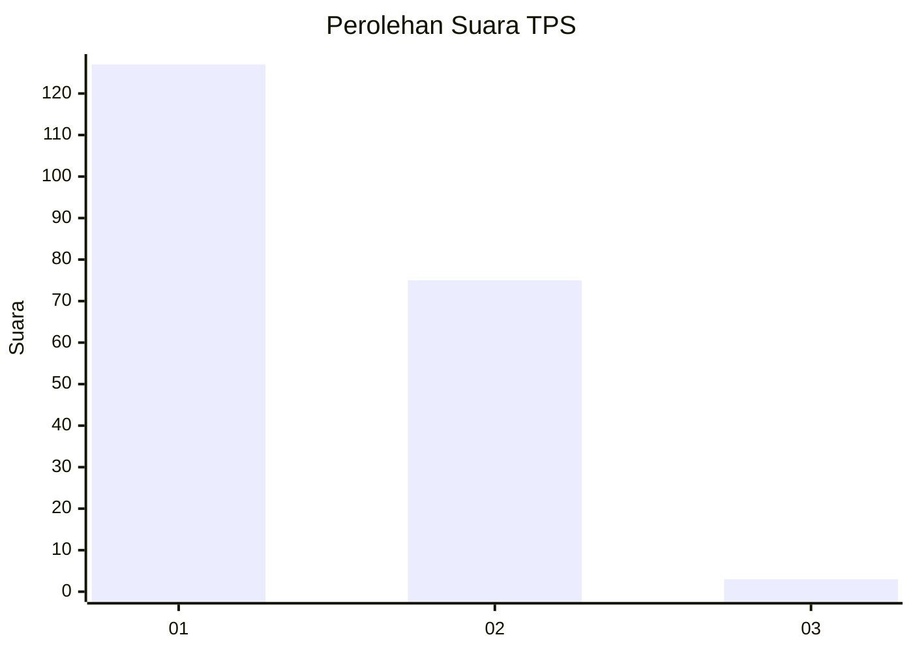
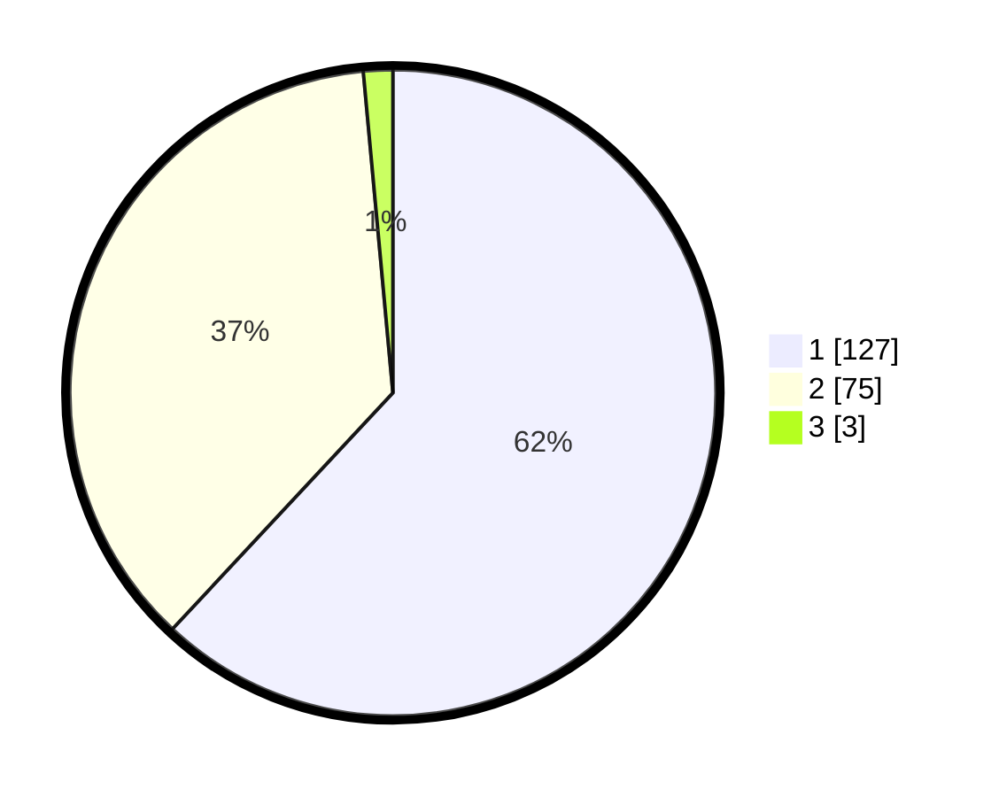

# Hasil

## Grafik

## Tabel

| No. | Nama Paslon    | Suara | Suara (raw) | Persentase |
|:--- |:-------------- | -----:| -----------:| ----------:|
| 1   | ANIES MUHAIMIN | 127   | [127][p-1]  | 61,95      |
| 2   | PRABOWO GIBRAN | 75    | [75][p-2]   | 36,59      |
| 3   | GANJAR MAHFUD  | 3     | [3][p-3]    | 1,46       |

[p-1]: https://github.com/gigit-pemilu/pemilu-2024/blob/main/pilpres/hitung-suara/sub/12-sumatera-utara/sub/21-padang-lawas/sub/13-barumun-baru/sub/2001-hasahatan-julu/sub/006-tps/sub/paslon-1.txt
[p-2]: https://github.com/gigit-pemilu/pemilu-2024/blob/main/pilpres/hitung-suara/sub/12-sumatera-utara/sub/21-padang-lawas/sub/13-barumun-baru/sub/2001-hasahatan-julu/sub/006-tps/sub/paslon-2.txt
[p-3]: https://github.com/gigit-pemilu/pemilu-2024/blob/main/pilpres/hitung-suara/sub/12-sumatera-utara/sub/21-padang-lawas/sub/13-barumun-baru/sub/2001-hasahatan-julu/sub/006-tps/sub/paslon-3.txt

## Foto C Plano

https://sirekap-obj-formc.kpu.go.id/0904/pemilu/ppwp/12/21/13/20/01/1221132001006-20240215-044147--aedfad83-8300-4114-a182-291a8bb5ef9f.jpg

https://sirekap-obj-formc.kpu.go.id/0904/pemilu/ppwp/12/21/13/20/01/1221132001006-20240215-044254--a9f5a393-1fcd-4db4-82b2-6cb64c6d95fe.jpg

https://sirekap-obj-formc.kpu.go.id/0904/pemilu/ppwp/12/21/13/20/01/1221132001006-20240215-044334--73bdd428-b641-4321-93fa-6d5a69089288.jpg

## Metadata

| Key        | Value               |
| ---------- | ------------------- |
| Time Stamp | 2024-02-16 01:00:27 |

