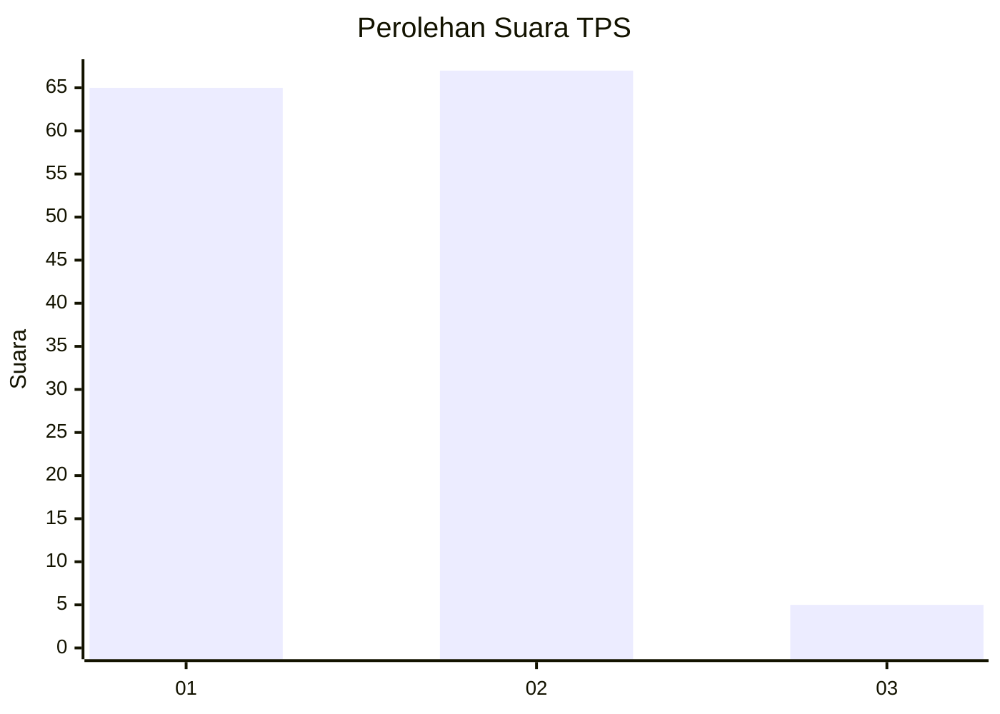
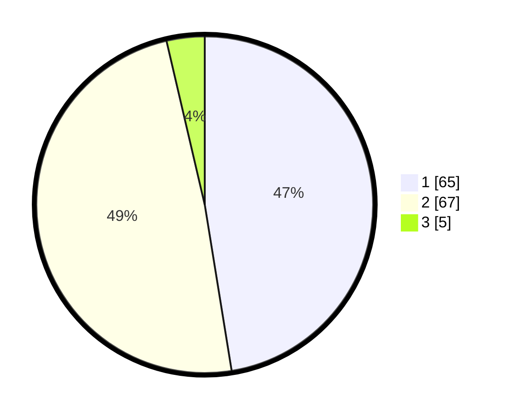

# Hasil

## Grafik

## Tabel

| No. | Nama Paslon    | Suara | Suara (raw) | Persentase |
|:--- |:-------------- | -----:| -----------:| ----------:|
| 1   | ANIES MUHAIMIN | 65    | [65][p-1]   | 47,45      |
| 2   | PRABOWO GIBRAN | 67    | [67][p-2]   | 48,91      |
| 3   | GANJAR MAHFUD  | 5     | [5][p-3]    | 3,65       |

[p-1]: https://github.com/gigit-pemilu/pemilu-2024/blob/main/pilpres/hitung-suara/sub/12-sumatera-utara/sub/22-labuhanbatu-selatan/sub/01-kotapinang/sub/1001-kotapinang/sub/006-tps/sub/paslon-1.txt
[p-2]: https://github.com/gigit-pemilu/pemilu-2024/blob/main/pilpres/hitung-suara/sub/12-sumatera-utara/sub/22-labuhanbatu-selatan/sub/01-kotapinang/sub/1001-kotapinang/sub/006-tps/sub/paslon-2.txt
[p-3]: https://github.com/gigit-pemilu/pemilu-2024/blob/main/pilpres/hitung-suara/sub/12-sumatera-utara/sub/22-labuhanbatu-selatan/sub/01-kotapinang/sub/1001-kotapinang/sub/006-tps/sub/paslon-3.txt

## Foto C Plano

https://sirekap-obj-formc.kpu.go.id/f88e/pemilu/ppwp/12/22/01/10/01/1222011001006-20240215-001456--75a7c4ba-5a6f-4c57-b0de-a63170c61484.jpg

https://sirekap-obj-formc.kpu.go.id/f88e/pemilu/ppwp/12/22/01/10/01/1222011001006-20240215-001459--7bc91da0-5494-411b-ae39-694251f7a080.jpg

https://sirekap-obj-formc.kpu.go.id/f88e/pemilu/ppwp/12/22/01/10/01/1222011001006-20240215-001503--b4fbd644-d06f-4b0a-8d0a-440ae181274a.jpg

## Metadata

| Key        | Value               |
| ---------- | ------------------- |
| Time Stamp | 2024-02-15 15:00:29 |

