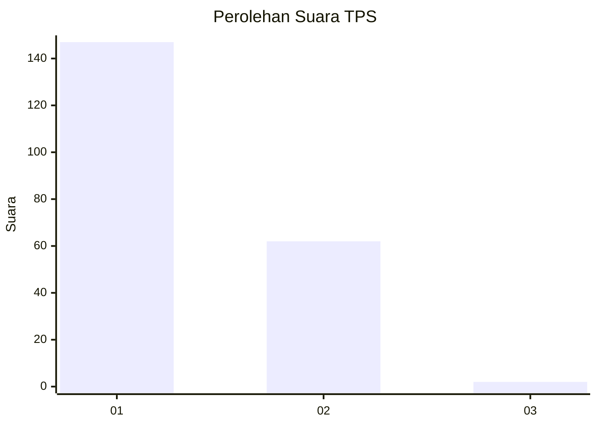
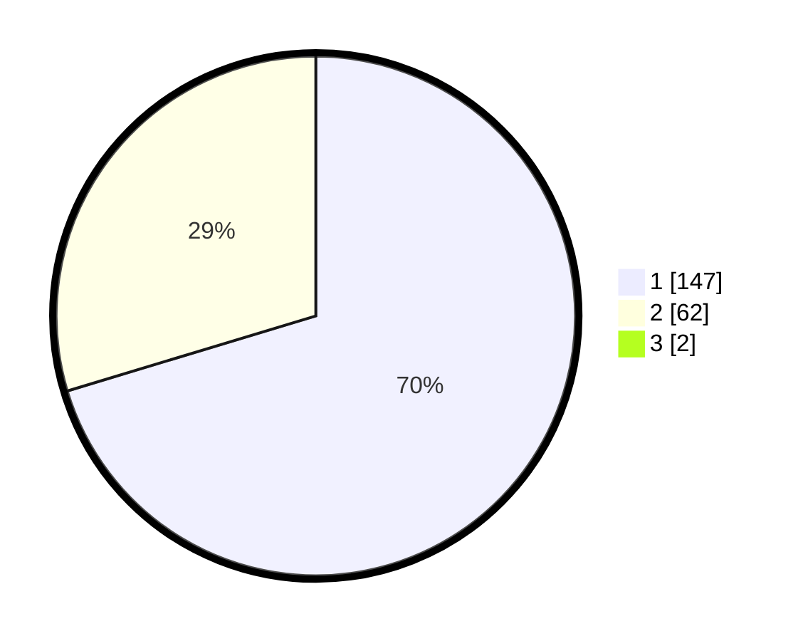

# Hasil

## Grafik

## Tabel

| No. | Nama Paslon    | Suara | Suara (raw) | Persentase |
|:--- |:-------------- | -----:| -----------:| ----------:|
| 1   | ANIES MUHAIMIN | 147   | [147][p-1]  | 69,67      |
| 2   | PRABOWO GIBRAN | 62    | [62][p-2]   | 29,38      |
| 3   | GANJAR MAHFUD  | 2     | [2][p-3]    | 0,95       |

[p-1]: https://github.com/gigit-pemilu/pemilu-2024-12-sumatera-utara/blob/main/pilpres/hitung-suara/sub/12-sumatera-utara/sub/22-labuhanbatu-selatan/sub/01-kotapinang/sub/1001-kotapinang/sub/010-tps/sub/paslon-1.txt
[p-2]: https://github.com/gigit-pemilu/pemilu-2024-12-sumatera-utara/blob/main/pilpres/hitung-suara/sub/12-sumatera-utara/sub/22-labuhanbatu-selatan/sub/01-kotapinang/sub/1001-kotapinang/sub/010-tps/sub/paslon-2.txt
[p-3]: https://github.com/gigit-pemilu/pemilu-2024-12-sumatera-utara/blob/main/pilpres/hitung-suara/sub/12-sumatera-utara/sub/22-labuhanbatu-selatan/sub/01-kotapinang/sub/1001-kotapinang/sub/010-tps/sub/paslon-3.txt

## Foto C Plano

https://sirekap-obj-formc.kpu.go.id/ab2b/pemilu/ppwp/12/22/01/10/01/1222011001010-20240215-080400--9eeb501f-3fe7-4cd3-af1d-2b14fa950904.jpg

https://sirekap-obj-formc.kpu.go.id/ab2b/pemilu/ppwp/12/22/01/10/01/1222011001010-20240215-080642--4f52f081-6827-466a-8981-d094533661c6.jpg

https://sirekap-obj-formc.kpu.go.id/ab2b/pemilu/ppwp/12/22/01/10/01/1222011001010-20240215-080818--707bf093-191b-4b13-8198-2b7b14d59aa9.jpg

## Metadata

| Key        | Value               |
| ---------- | ------------------- |
| Time Stamp | 2024-02-15 15:00:29 |

