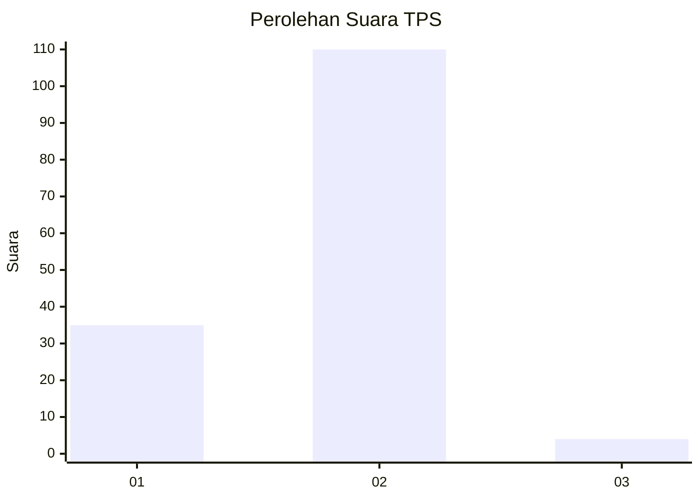
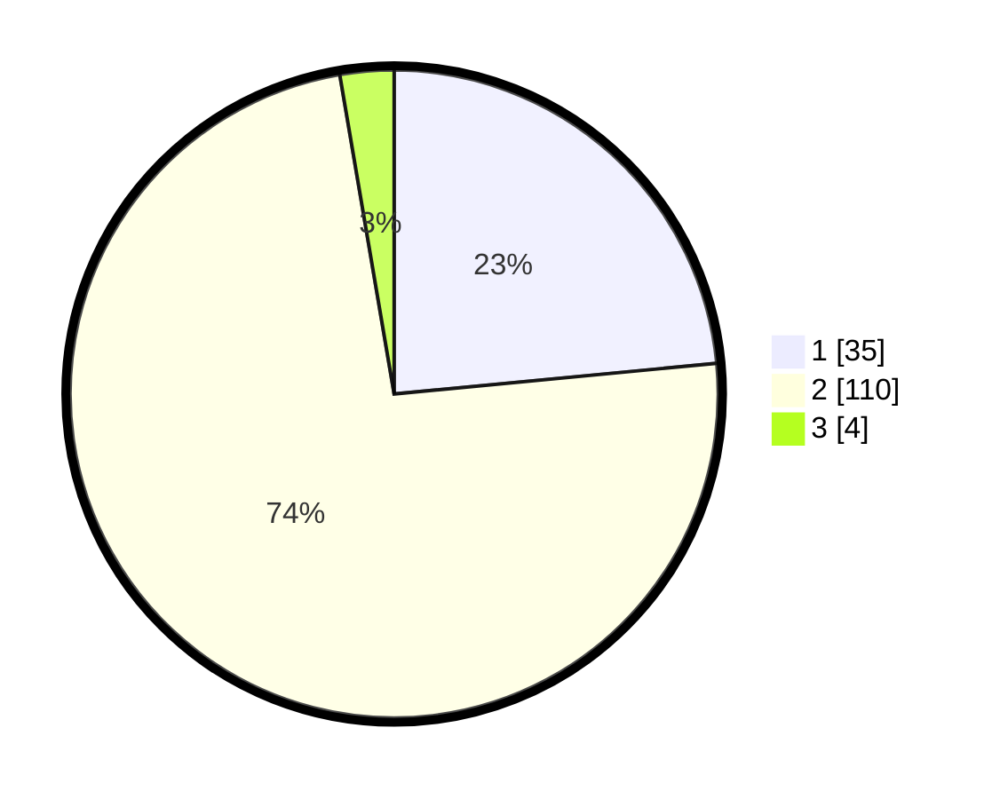

# Hasil

## Grafik

## Tabel

| No. | Nama Paslon    | Suara | Suara (raw) | Persentase |
|:--- |:-------------- | -----:| -----------:| ----------:|
| 1   | ANIES MUHAIMIN | 35    | [35][p-1]   | 23,49      |
| 2   | PRABOWO GIBRAN | 110   | [110][p-2]  | 73,83      |
| 3   | GANJAR MAHFUD  | 4     | [4][p-3]    | 2,68       |

[p-1]: https://github.com/gigit-pemilu/pemilu-2024/blob/main/pilpres/hitung-suara/sub/12-sumatera-utara/sub/22-labuhanbatu-selatan/sub/01-kotapinang/sub/2010-perk-sei-rumbia/sub/009-tps/sub/paslon-1.txt
[p-2]: https://github.com/gigit-pemilu/pemilu-2024/blob/main/pilpres/hitung-suara/sub/12-sumatera-utara/sub/22-labuhanbatu-selatan/sub/01-kotapinang/sub/2010-perk-sei-rumbia/sub/009-tps/sub/paslon-2.txt
[p-3]: https://github.com/gigit-pemilu/pemilu-2024/blob/main/pilpres/hitung-suara/sub/12-sumatera-utara/sub/22-labuhanbatu-selatan/sub/01-kotapinang/sub/2010-perk-sei-rumbia/sub/009-tps/sub/paslon-3.txt

## Foto C Plano

https://sirekap-obj-formc.kpu.go.id/22d8/pemilu/ppwp/12/22/01/20/10/1222012010009-20240215-001119--06dbcf47-19b2-47b8-a583-cedb91f96097.jpg

https://sirekap-obj-formc.kpu.go.id/22d8/pemilu/ppwp/12/22/01/20/10/1222012010009-20240215-001219--bb613db9-7d88-4121-ad4a-2ae2fca612c5.jpg

https://sirekap-obj-formc.kpu.go.id/22d8/pemilu/ppwp/12/22/01/20/10/1222012010009-20240215-001320--41a2558c-6684-42a0-b0be-59b0b8ccf880.jpg

## Metadata

| Key        | Value               |
| ---------- | ------------------- |
| Time Stamp | 2024-02-15 19:00:26 |

