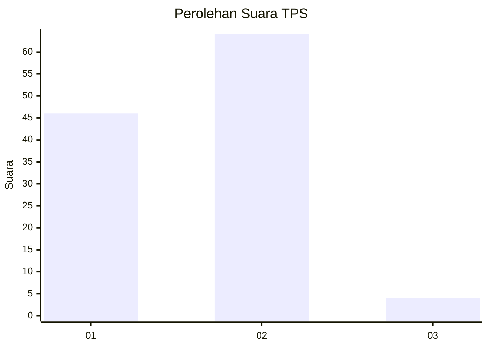
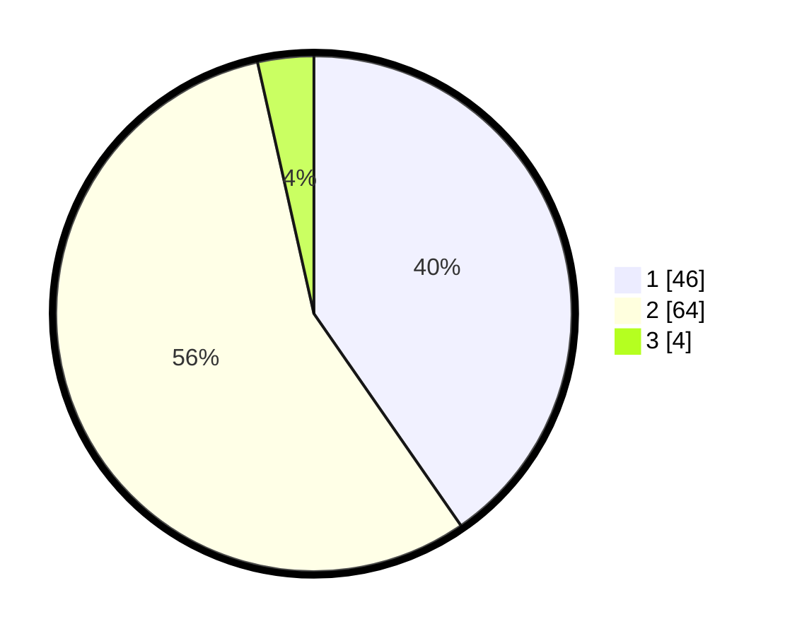

# Hasil

## Grafik

## Tabel

| No. | Nama Paslon    | Suara | Suara (raw) | Persentase |
|:--- |:-------------- | -----:| -----------:| ----------:|
| 1   | ANIES MUHAIMIN | 46    | [46][p-1]   | 40,35      |
| 2   | PRABOWO GIBRAN | 64    | [64][p-2]   | 56,14      |
| 3   | GANJAR MAHFUD  | 4     | [4][p-3]    | 3,51       |

[p-1]: https://github.com/gigit-pemilu/pemilu-2024/blob/main/pilpres/hitung-suara/sub/12-sumatera-utara/sub/22-labuhanbatu-selatan/sub/02-kampung-rakyat/sub/2007-teluk-panji/sub/007-tps/sub/paslon-1.txt
[p-2]: https://github.com/gigit-pemilu/pemilu-2024/blob/main/pilpres/hitung-suara/sub/12-sumatera-utara/sub/22-labuhanbatu-selatan/sub/02-kampung-rakyat/sub/2007-teluk-panji/sub/007-tps/sub/paslon-2.txt
[p-3]: https://github.com/gigit-pemilu/pemilu-2024/blob/main/pilpres/hitung-suara/sub/12-sumatera-utara/sub/22-labuhanbatu-selatan/sub/02-kampung-rakyat/sub/2007-teluk-panji/sub/007-tps/sub/paslon-3.txt

## Foto C Plano

https://sirekap-obj-formc.kpu.go.id/db42/pemilu/ppwp/12/22/02/20/07/1222022007007-20240215-065104--84b29dc6-f5fa-41ee-8b16-a6c928d87d80.jpg

https://sirekap-obj-formc.kpu.go.id/db42/pemilu/ppwp/12/22/02/20/07/1222022007007-20240215-021051--211e4343-4807-4e48-b09f-518aaf2b00eb.jpg

https://sirekap-obj-formc.kpu.go.id/db42/pemilu/ppwp/12/22/02/20/07/1222022007007-20240215-021440--77099146-9e52-4c14-ab02-eee8e32e946d.jpg

## Metadata

| Key        | Value               |
| ---------- | ------------------- |
| Time Stamp | 2024-02-15 15:30:25 |

