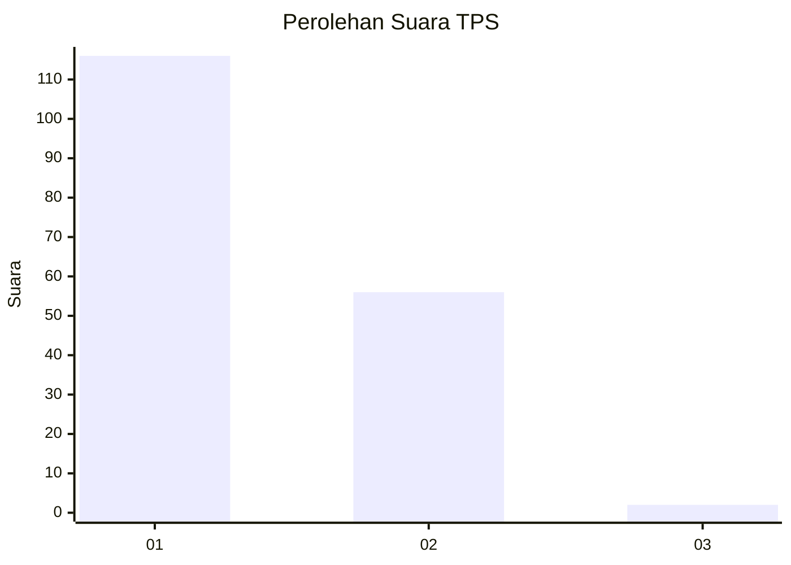
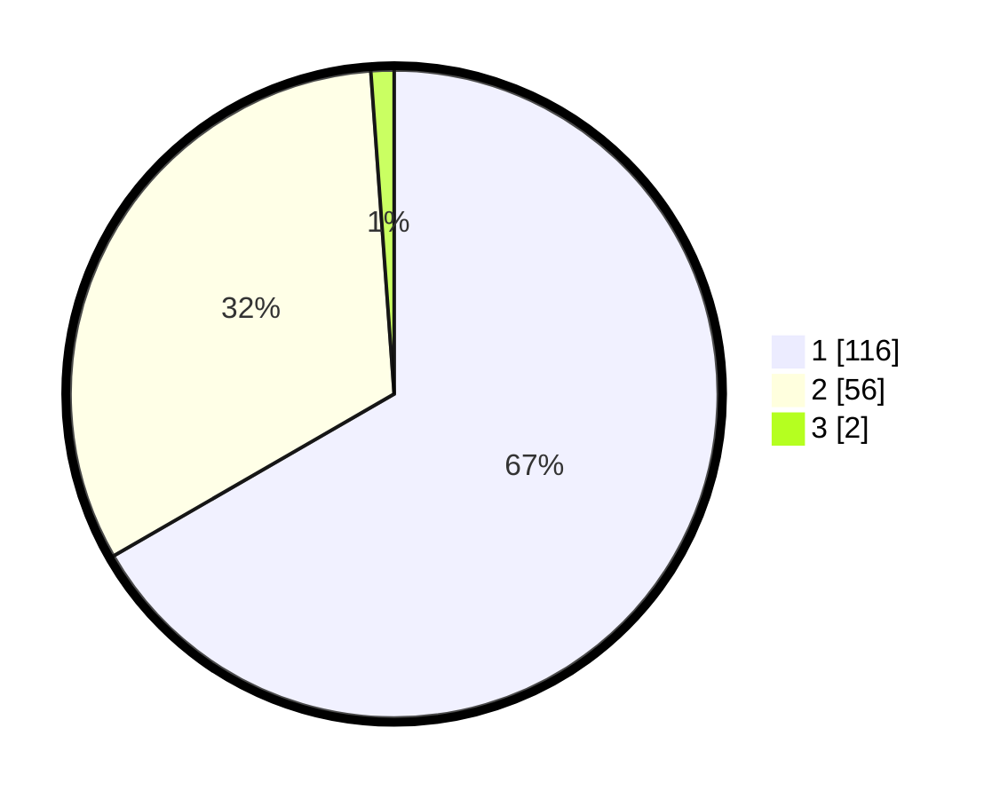

# Hasil

## Grafik

## Tabel

| No. | Nama Paslon    | Suara | Suara (raw) | Persentase |
|:--- |:-------------- | -----:| -----------:| ----------:|
| 1   | ANIES MUHAIMIN | 116   | [116][p-1]  | 66,67      |
| 2   | PRABOWO GIBRAN | 56    | [56][p-2]   | 32,18      |
| 3   | GANJAR MAHFUD  | 2     | [2][p-3]    | 1,15       |

[p-1]: https://github.com/gigit-pemilu/pemilu-2024/blob/main/pilpres/hitung-suara/sub/12-sumatera-utara/sub/22-labuhanbatu-selatan/sub/02-kampung-rakyat/sub/2011-tanjung-mulia/sub/002-tps/sub/paslon-1.txt
[p-2]: https://github.com/gigit-pemilu/pemilu-2024/blob/main/pilpres/hitung-suara/sub/12-sumatera-utara/sub/22-labuhanbatu-selatan/sub/02-kampung-rakyat/sub/2011-tanjung-mulia/sub/002-tps/sub/paslon-2.txt
[p-3]: https://github.com/gigit-pemilu/pemilu-2024/blob/main/pilpres/hitung-suara/sub/12-sumatera-utara/sub/22-labuhanbatu-selatan/sub/02-kampung-rakyat/sub/2011-tanjung-mulia/sub/002-tps/sub/paslon-3.txt

## Foto C Plano

https://sirekap-obj-formc.kpu.go.id/39d6/pemilu/ppwp/12/22/02/20/11/1222022011002-20240215-012853--fb3d116a-b7c6-433c-9c80-c7ebcbd2e804.jpg

https://sirekap-obj-formc.kpu.go.id/39d6/pemilu/ppwp/12/22/02/20/11/1222022011002-20240215-012302--dca6d6fc-a0a3-432b-96d3-69064e0dc1e2.jpg

https://sirekap-obj-formc.kpu.go.id/39d6/pemilu/ppwp/12/22/02/20/11/1222022011002-20240215-012727--6b8f0bd7-f563-4d33-80fa-8595ecc13267.jpg

## Metadata

| Key        | Value               |
| ---------- | ------------------- |
| Time Stamp | 2024-02-15 16:00:26 |

