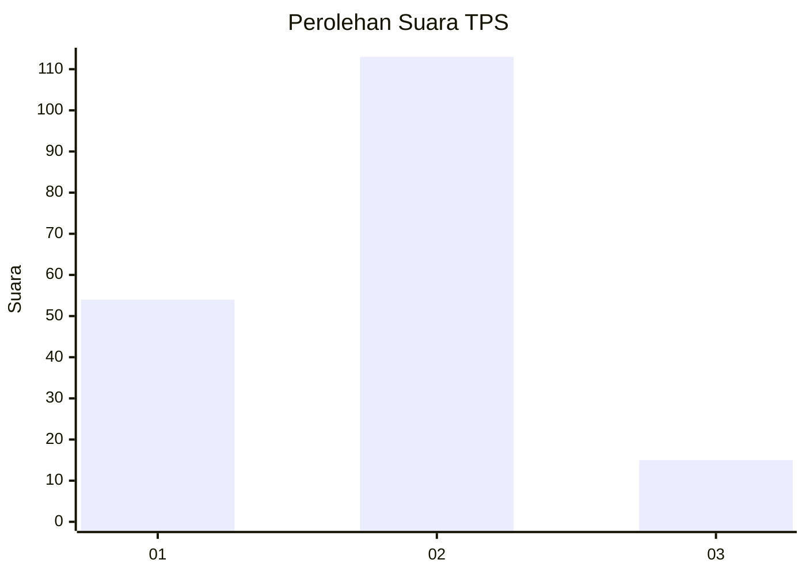
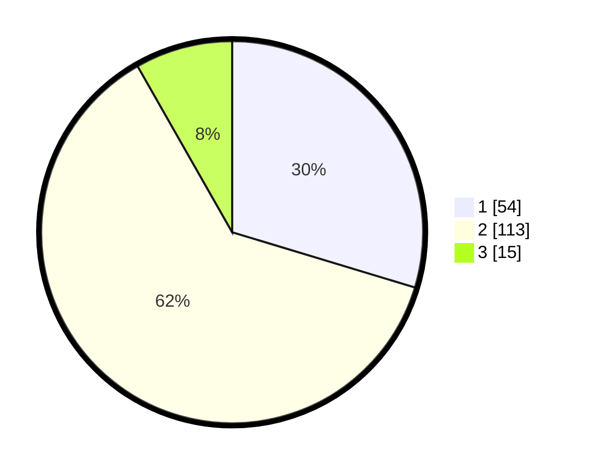

# Hasil

## Grafik

## Tabel

| No. | Nama Paslon    | Suara | Suara (raw) | Persentase |
|:--- |:-------------- | -----:| -----------:| ----------:|
| 1   | ANIES MUHAIMIN | 54    | [54][p-1]   | 29,67      |
| 2   | PRABOWO GIBRAN | 113   | [113][p-2]  | 62,09      |
| 3   | GANJAR MAHFUD  | 15    | [15][p-3]   | 8,24       |

[p-1]: https://github.com/gigit-pemilu/pemilu-2024/blob/main/pilpres/hitung-suara/sub/12-sumatera-utara/sub/22-labuhanbatu-selatan/sub/03-torgamba/sub/2001-bangai/sub/007-tps/sub/paslon-1.txt
[p-2]: https://github.com/gigit-pemilu/pemilu-2024/blob/main/pilpres/hitung-suara/sub/12-sumatera-utara/sub/22-labuhanbatu-selatan/sub/03-torgamba/sub/2001-bangai/sub/007-tps/sub/paslon-2.txt
[p-3]: https://github.com/gigit-pemilu/pemilu-2024/blob/main/pilpres/hitung-suara/sub/12-sumatera-utara/sub/22-labuhanbatu-selatan/sub/03-torgamba/sub/2001-bangai/sub/007-tps/sub/paslon-3.txt

## Foto C Plano

https://sirekap-obj-formc.kpu.go.id/a6dc/pemilu/ppwp/12/22/03/20/01/1222032001007-20240214-224527--3c2d727f-ff5d-4bdc-8b3e-ae5b5bfbd478.jpg

https://sirekap-obj-formc.kpu.go.id/a6dc/pemilu/ppwp/12/22/03/20/01/1222032001007-20240214-203903--ca77e6a1-86d5-4657-befd-ffef68f7b19b.jpg

https://sirekap-obj-formc.kpu.go.id/a6dc/pemilu/ppwp/12/22/03/20/01/1222032001007-20240214-224900--926bb9a8-db7a-4774-bf7c-1fd6dd91372b.jpg

## Metadata

| Key        | Value               |
| ---------- | ------------------- |
| Time Stamp | 2024-02-15 15:00:29 |

