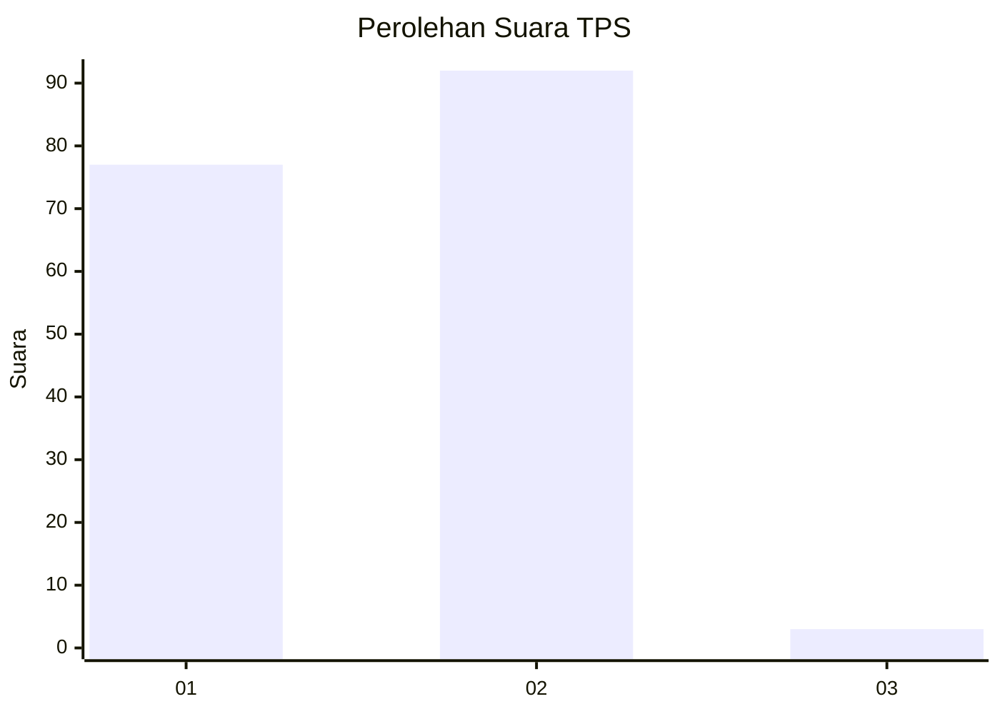
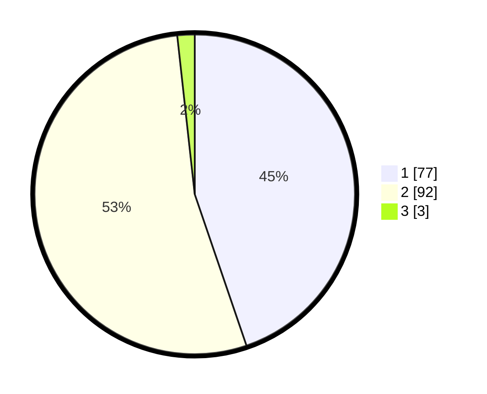

# Hasil

## Grafik

## Tabel

| No. | Nama Paslon    | Suara | Suara (raw) | Persentase |
|:--- |:-------------- | -----:| -----------:| ----------:|
| 1   | ANIES MUHAIMIN | 77    | [77][p-1]   | 44,77      |
| 2   | PRABOWO GIBRAN | 92    | [92][p-2]   | 53,49      |
| 3   | GANJAR MAHFUD  | 3     | [3][p-3]    | 1,74       |

[p-1]: https://github.com/gigit-pemilu/pemilu-2024-12-sumatera-utara/blob/main/pilpres/hitung-suara/sub/12-sumatera-utara/sub/22-labuhanbatu-selatan/sub/03-torgamba/sub/2004-pangarungan/sub/001-tps/sub/paslon-1.txt
[p-2]: https://github.com/gigit-pemilu/pemilu-2024-12-sumatera-utara/blob/main/pilpres/hitung-suara/sub/12-sumatera-utara/sub/22-labuhanbatu-selatan/sub/03-torgamba/sub/2004-pangarungan/sub/001-tps/sub/paslon-2.txt
[p-3]: https://github.com/gigit-pemilu/pemilu-2024-12-sumatera-utara/blob/main/pilpres/hitung-suara/sub/12-sumatera-utara/sub/22-labuhanbatu-selatan/sub/03-torgamba/sub/2004-pangarungan/sub/001-tps/sub/paslon-3.txt

## Foto C Plano

https://sirekap-obj-formc.kpu.go.id/a59f/pemilu/ppwp/12/22/03/20/04/1222032004001-20240215-024539--64633052-c61c-4879-af96-74f82ca1ba76.jpg

https://sirekap-obj-formc.kpu.go.id/a59f/pemilu/ppwp/12/22/03/20/04/1222032004001-20240220-185123--d04a3e65-2aec-4a49-8127-e726937273f3.jpg

https://sirekap-obj-formc.kpu.go.id/a59f/pemilu/ppwp/12/22/03/20/04/1222032004001-20240220-185200--b28e0b56-b0a6-4492-a4fb-61d3c608ef07.jpg

## Metadata

| Key        | Value               |
| ---------- | ------------------- |
| Time Stamp | 2024-02-21 17:00:00 |

