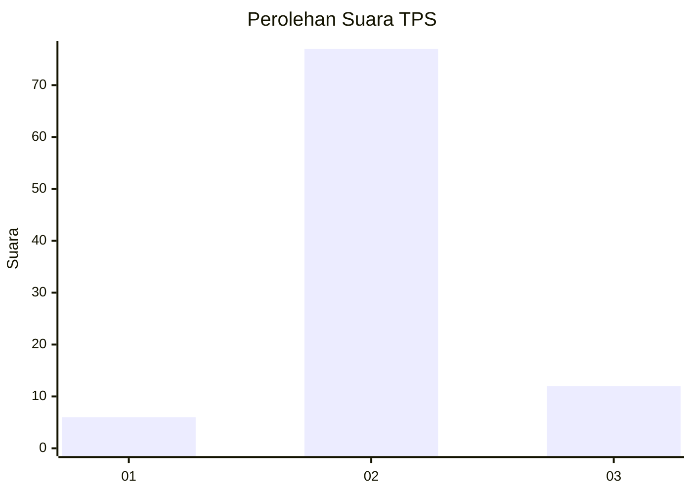
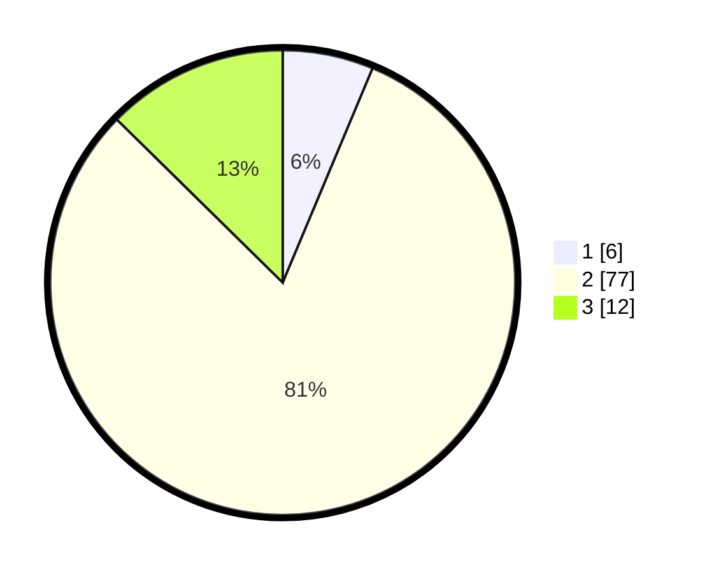

# Hasil

## Grafik

## Tabel

| No. | Nama Paslon    | Suara | Suara (raw) | Persentase |
|:--- |:-------------- | -----:| -----------:| ----------:|
| 1   | ANIES MUHAIMIN | 6     | [6][p-1]    | 6,32       |
| 2   | PRABOWO GIBRAN | 77    | [77][p-2]   | 81,05      |
| 3   | GANJAR MAHFUD  | 12    | [12][p-3]   | 12,63      |

[p-1]: https://github.com/gigit-pemilu/pemilu-2024/blob/main/pilpres/hitung-suara/sub/12-sumatera-utara/sub/22-labuhanbatu-selatan/sub/03-torgamba/sub/2006-aek-batu/sub/064-tps/sub/paslon-1.txt
[p-2]: https://github.com/gigit-pemilu/pemilu-2024/blob/main/pilpres/hitung-suara/sub/12-sumatera-utara/sub/22-labuhanbatu-selatan/sub/03-torgamba/sub/2006-aek-batu/sub/064-tps/sub/paslon-2.txt
[p-3]: https://github.com/gigit-pemilu/pemilu-2024/blob/main/pilpres/hitung-suara/sub/12-sumatera-utara/sub/22-labuhanbatu-selatan/sub/03-torgamba/sub/2006-aek-batu/sub/064-tps/sub/paslon-3.txt

## Foto C Plano

https://sirekap-obj-formc.kpu.go.id/ac5c/pemilu/ppwp/12/22/03/20/06/1222032006064-20240216-142802--8f950846-d4c6-4a0f-b975-bd8368e1c37b.jpg

https://sirekap-obj-formc.kpu.go.id/ac5c/pemilu/ppwp/12/22/03/20/06/1222032006064-20240216-142808--c9b9207b-e7f8-4918-b073-168315162dca.jpg

https://sirekap-obj-formc.kpu.go.id/ac5c/pemilu/ppwp/12/22/03/20/06/1222032006064-20240216-142813--f5250b15-409f-4369-827a-5513f0082785.jpg

## Metadata

| Key        | Value               |
| ---------- | ------------------- |
| Time Stamp | 2024-02-17 14:45:18 |

