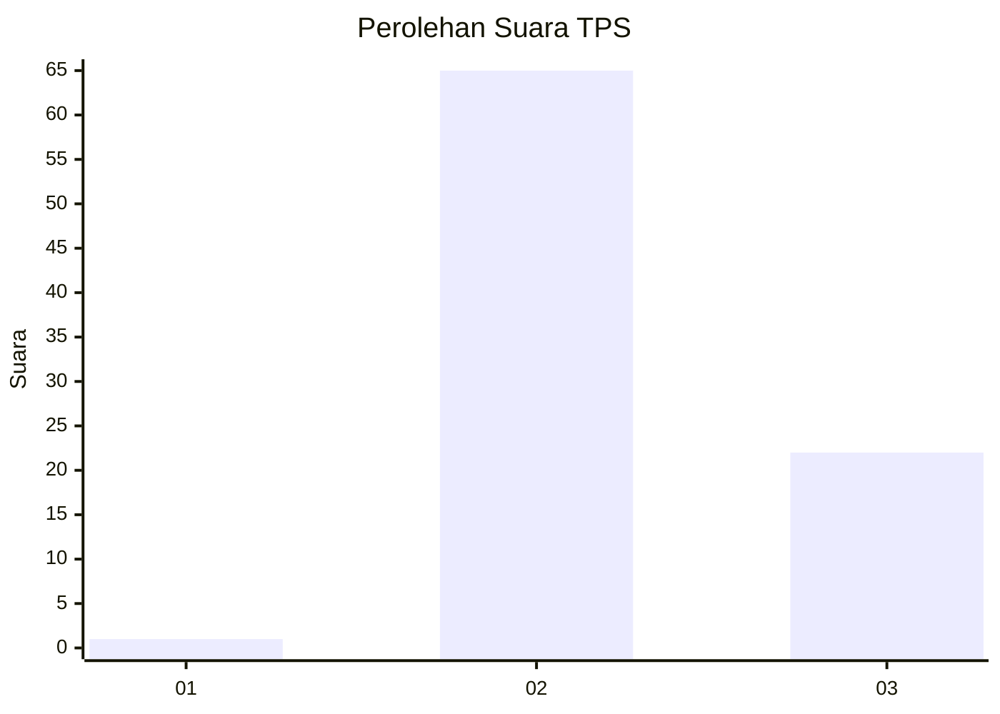
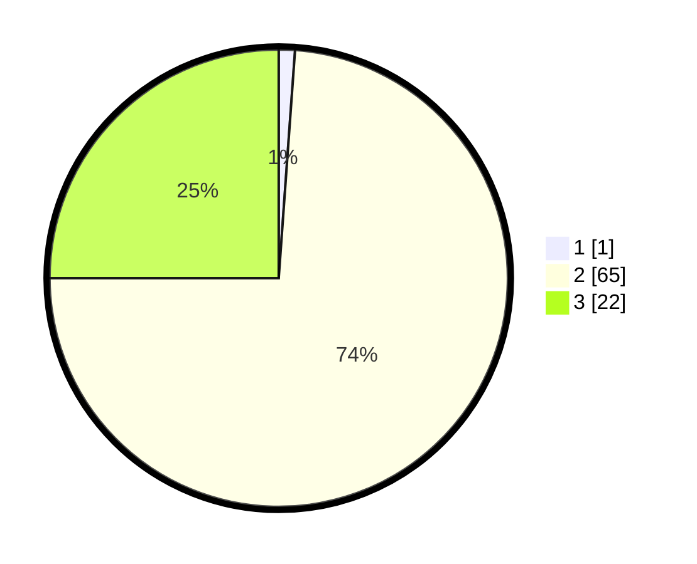

# Hasil

## Grafik

## Tabel

| No. | Nama Paslon    | Suara | Suara (raw) | Persentase |
|:--- |:-------------- | -----:| -----------:| ----------:|
| 1   | ANIES MUHAIMIN | 1     | [1][p-1]    | 1,14       |
| 2   | PRABOWO GIBRAN | 65    | [65][p-2]   | 73,86      |
| 3   | GANJAR MAHFUD  | 22    | [22][p-3]   | 25,00      |

[p-1]: https://github.com/gigit-pemilu/pemilu-2024-12-sumatera-utara/blob/main/pilpres/hitung-suara/sub/12-sumatera-utara/sub/22-labuhanbatu-selatan/sub/03-torgamba/sub/2010-asam-jawa/sub/004-tps/sub/paslon-1.txt
[p-2]: https://github.com/gigit-pemilu/pemilu-2024-12-sumatera-utara/blob/main/pilpres/hitung-suara/sub/12-sumatera-utara/sub/22-labuhanbatu-selatan/sub/03-torgamba/sub/2010-asam-jawa/sub/004-tps/sub/paslon-2.txt
[p-3]: https://github.com/gigit-pemilu/pemilu-2024-12-sumatera-utara/blob/main/pilpres/hitung-suara/sub/12-sumatera-utara/sub/22-labuhanbatu-selatan/sub/03-torgamba/sub/2010-asam-jawa/sub/004-tps/sub/paslon-3.txt

## Foto C Plano

https://sirekap-obj-formc.kpu.go.id/129d/pemilu/ppwp/12/22/03/20/10/1222032010004-20240215-124003--a3feae64-42cc-4537-bed5-697bce1ae693.jpg

https://sirekap-obj-formc.kpu.go.id/129d/pemilu/ppwp/12/22/03/20/10/1222032010004-20240215-124021--39dd333e-1bb0-4652-ab51-faa50bd29c47.jpg

https://sirekap-obj-formc.kpu.go.id/129d/pemilu/ppwp/12/22/03/20/10/1222032010004-20240215-124028--885f8a3b-85d8-42e1-9cbc-bbe355930741.jpg

## Metadata

| Key        | Value               |
| ---------- | ------------------- |
| Time Stamp | 2024-02-16 11:00:29 |

