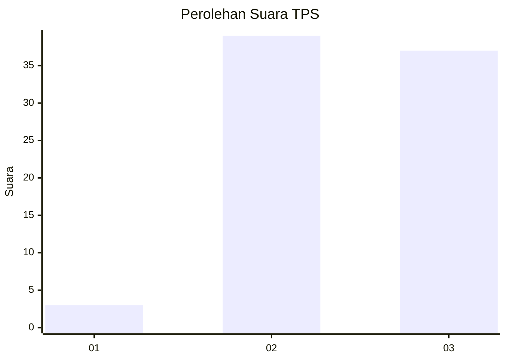
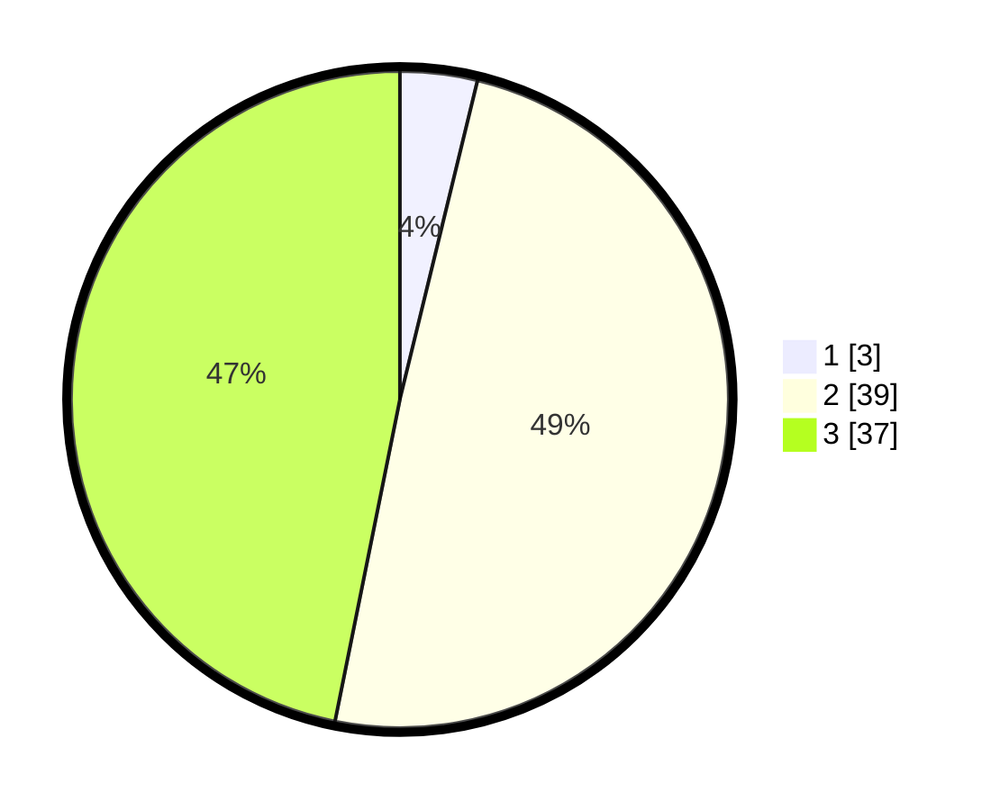

# Hasil

## Grafik

## Tabel

| No. | Nama Paslon    | Suara | Suara (raw) | Persentase |
|:--- |:-------------- | -----:| -----------:| ----------:|
| 1   | ANIES MUHAIMIN | 3     | [3][p-1]    | 3,80       |
| 2   | PRABOWO GIBRAN | 39    | [39][p-2]   | 49,37      |
| 3   | GANJAR MAHFUD  | 37    | [37][p-3]   | 46,84      |

[p-1]: https://github.com/gigit-pemilu/pemilu-2024/blob/main/pilpres/hitung-suara/sub/12-sumatera-utara/sub/22-labuhanbatu-selatan/sub/03-torgamba/sub/2011-torganda/sub/016-tps/sub/paslon-1.txt
[p-2]: https://github.com/gigit-pemilu/pemilu-2024/blob/main/pilpres/hitung-suara/sub/12-sumatera-utara/sub/22-labuhanbatu-selatan/sub/03-torgamba/sub/2011-torganda/sub/016-tps/sub/paslon-2.txt
[p-3]: https://github.com/gigit-pemilu/pemilu-2024/blob/main/pilpres/hitung-suara/sub/12-sumatera-utara/sub/22-labuhanbatu-selatan/sub/03-torgamba/sub/2011-torganda/sub/016-tps/sub/paslon-3.txt

## Foto C Plano

https://sirekap-obj-formc.kpu.go.id/40ed/pemilu/ppwp/12/22/03/20/11/1222032011016-20240215-153042--573dfe05-5211-4e4e-af3f-4198a726a578.jpg

https://sirekap-obj-formc.kpu.go.id/40ed/pemilu/ppwp/12/22/03/20/11/1222032011016-20240215-153226--076c92a0-b7bf-407b-b85f-f7d107910a0b.jpg

https://sirekap-obj-formc.kpu.go.id/40ed/pemilu/ppwp/12/22/03/20/11/1222032011016-20240215-153432--26bb3db2-7d7c-4e1c-b265-b8c666544725.jpg

## Metadata

| Key        | Value               |
| ---------- | ------------------- |
| Time Stamp | 2024-02-16 11:00:29 |

