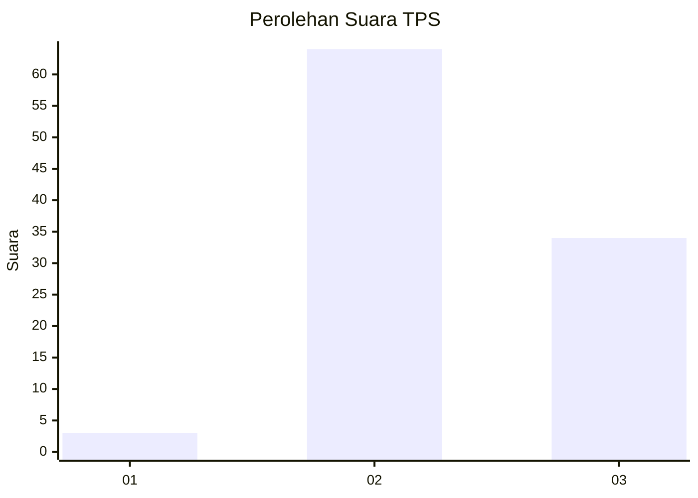
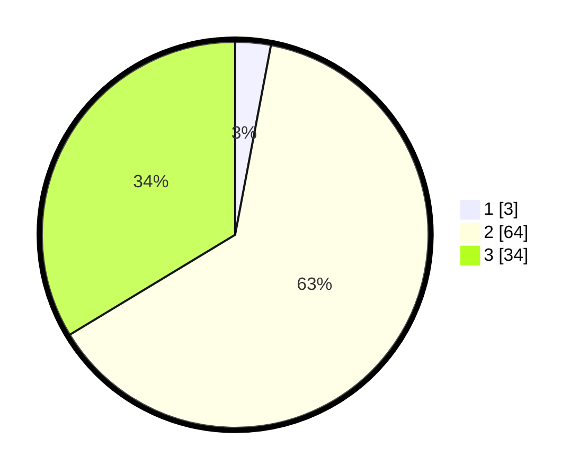

# Hasil

## Grafik

## Tabel

| No. | Nama Paslon    | Suara | Suara (raw) | Persentase |
|:--- |:-------------- | -----:| -----------:| ----------:|
| 1   | ANIES MUHAIMIN | 3     | [3][p-1]    | 2,97       |
| 2   | PRABOWO GIBRAN | 64    | [64][p-2]   | 63,37      |
| 3   | GANJAR MAHFUD  | 34    | [34][p-3]   | 33,66      |

[p-1]: https://github.com/gigit-pemilu/pemilu-2024-12-sumatera-utara/blob/main/pilpres/hitung-suara/sub/12-sumatera-utara/sub/22-labuhanbatu-selatan/sub/03-torgamba/sub/2011-torganda/sub/018-tps/sub/paslon-1.txt
[p-2]: https://github.com/gigit-pemilu/pemilu-2024-12-sumatera-utara/blob/main/pilpres/hitung-suara/sub/12-sumatera-utara/sub/22-labuhanbatu-selatan/sub/03-torgamba/sub/2011-torganda/sub/018-tps/sub/paslon-2.txt
[p-3]: https://github.com/gigit-pemilu/pemilu-2024-12-sumatera-utara/blob/main/pilpres/hitung-suara/sub/12-sumatera-utara/sub/22-labuhanbatu-selatan/sub/03-torgamba/sub/2011-torganda/sub/018-tps/sub/paslon-3.txt

## Foto C Plano

https://sirekap-obj-formc.kpu.go.id/d1b6/pemilu/ppwp/12/22/03/20/11/1222032011018-20240215-170208--7719e6f8-ff4d-48c0-bccc-d277acd5e71f.jpg

https://sirekap-obj-formc.kpu.go.id/d1b6/pemilu/ppwp/12/22/03/20/11/1222032011018-20240215-170528--0e1bfbc3-a1b9-4821-8b33-b9e502109c9a.jpg

https://sirekap-obj-formc.kpu.go.id/d1b6/pemilu/ppwp/12/22/03/20/11/1222032011018-20240215-170734--048b3379-20c7-4680-b749-5db279b73991.jpg

## Metadata

| Key        | Value               |
| ---------- | ------------------- |
| Time Stamp | 2024-02-16 10:00:28 |

