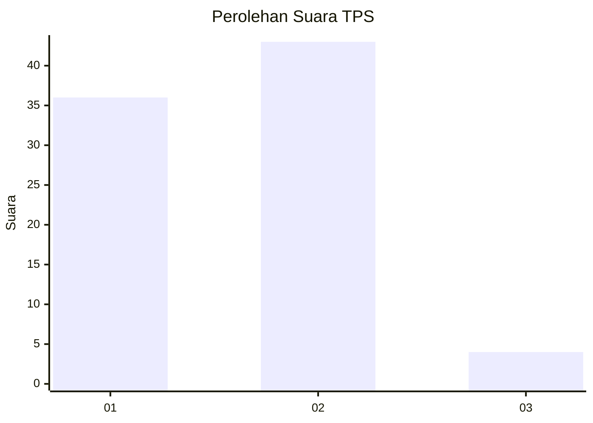
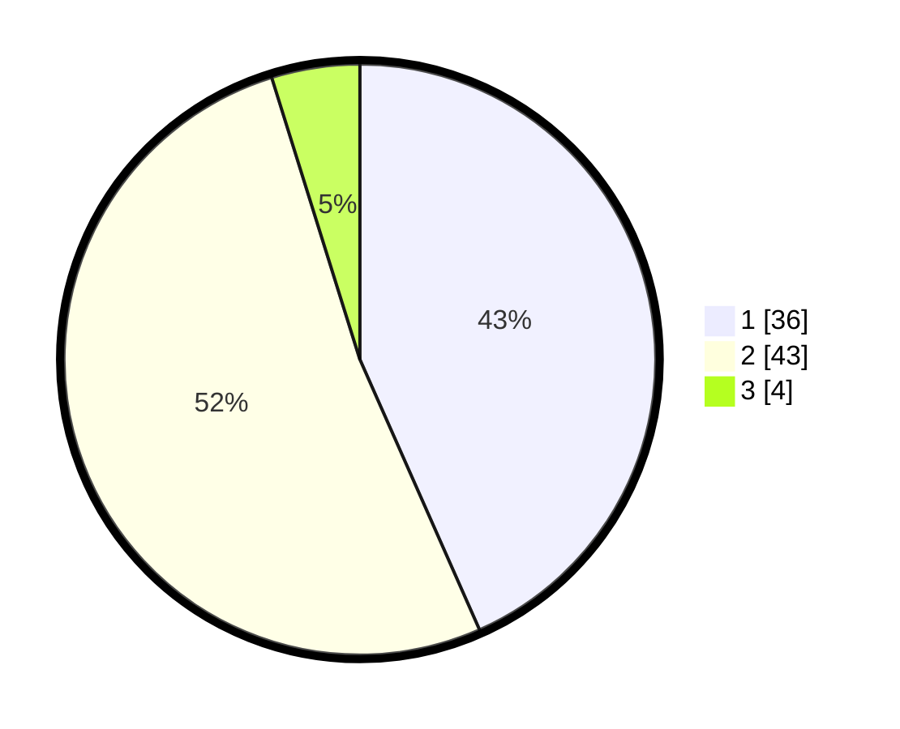

# Hasil

## Grafik

## Tabel

| No. | Nama Paslon    | Suara | Suara (raw) | Persentase |
|:--- |:-------------- | -----:| -----------:| ----------:|
| 1   | ANIES MUHAIMIN | 36    | [36][p-1]   | 43,37      |
| 2   | PRABOWO GIBRAN | 43    | [43][p-2]   | 51,81      |
| 3   | GANJAR MAHFUD  | 4     | [4][p-3]    | 4,82       |

[p-1]: https://github.com/gigit-pemilu/pemilu-2024/blob/main/pilpres/hitung-suara/sub/12-sumatera-utara/sub/22-labuhanbatu-selatan/sub/04-sungai-kanan/sub/1001-langga-payung/sub/024-tps/sub/paslon-1.txt
[p-2]: https://github.com/gigit-pemilu/pemilu-2024/blob/main/pilpres/hitung-suara/sub/12-sumatera-utara/sub/22-labuhanbatu-selatan/sub/04-sungai-kanan/sub/1001-langga-payung/sub/024-tps/sub/paslon-2.txt
[p-3]: https://github.com/gigit-pemilu/pemilu-2024/blob/main/pilpres/hitung-suara/sub/12-sumatera-utara/sub/22-labuhanbatu-selatan/sub/04-sungai-kanan/sub/1001-langga-payung/sub/024-tps/sub/paslon-3.txt

## Foto C Plano

https://sirekap-obj-formc.kpu.go.id/aa0b/pemilu/ppwp/12/22/04/10/01/1222041001024-20240215-065950--3ed9a8c7-7746-4fa4-82e2-bd1ef3ab579b.jpg

https://sirekap-obj-formc.kpu.go.id/aa0b/pemilu/ppwp/12/22/04/10/01/1222041001024-20240215-070205--ae928d35-d295-4a21-95c6-8e5a5af50b8c.jpg

https://sirekap-obj-formc.kpu.go.id/aa0b/pemilu/ppwp/12/22/04/10/01/1222041001024-20240215-070842--a21372b5-844f-42b6-8f11-1ef1790e241d.jpg

## Metadata

| Key        | Value               |
| ---------- | ------------------- |
| Time Stamp | 2024-02-15 16:30:25 |

