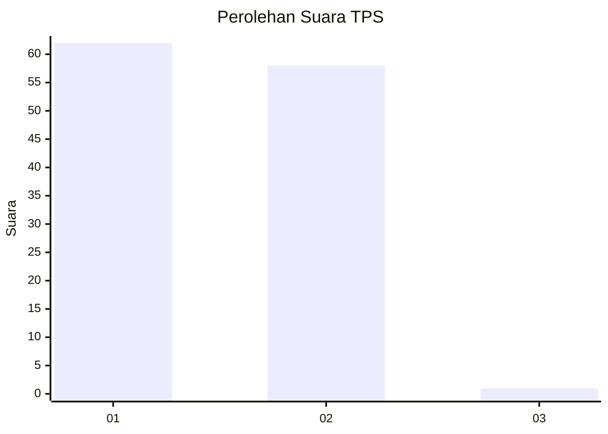
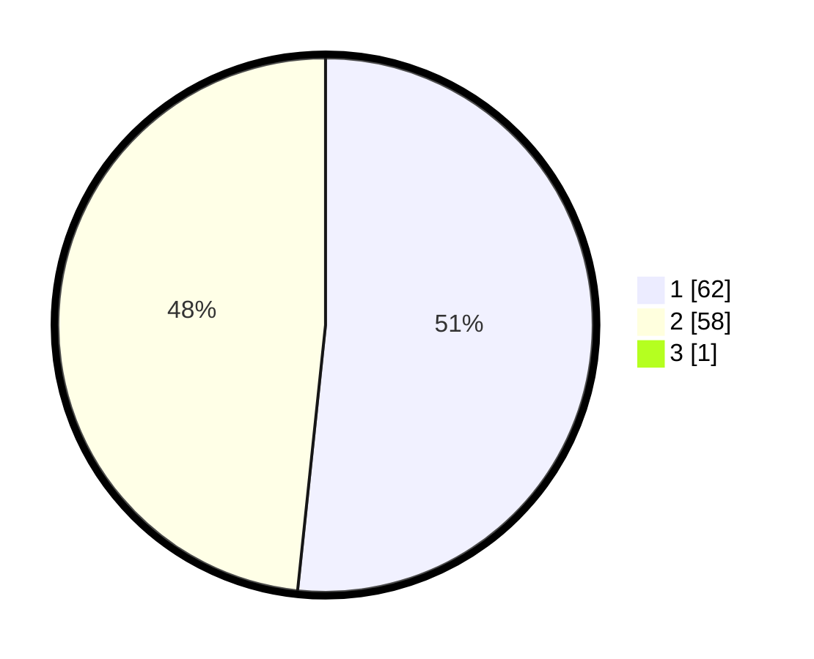

# Hasil

## Grafik

## Tabel

| No. | Nama Paslon    | Suara | Suara (raw) | Persentase |
|:--- |:-------------- | -----:| -----------:| ----------:|
| 1   | ANIES MUHAIMIN | 62    | [62][p-1]   | 51,24      |
| 2   | PRABOWO GIBRAN | 58    | [58][p-2]   | 47,93      |
| 3   | GANJAR MAHFUD  | 1     | [1][p-3]    | 0,83       |

[p-1]: https://github.com/gigit-pemilu/pemilu-2024-12-sumatera-utara/blob/main/pilpres/hitung-suara/sub/12-sumatera-utara/sub/22-labuhanbatu-selatan/sub/04-sungai-kanan/sub/2008-sampean/sub/011-tps/sub/paslon-1.txt
[p-2]: https://github.com/gigit-pemilu/pemilu-2024-12-sumatera-utara/blob/main/pilpres/hitung-suara/sub/12-sumatera-utara/sub/22-labuhanbatu-selatan/sub/04-sungai-kanan/sub/2008-sampean/sub/011-tps/sub/paslon-2.txt
[p-3]: https://github.com/gigit-pemilu/pemilu-2024-12-sumatera-utara/blob/main/pilpres/hitung-suara/sub/12-sumatera-utara/sub/22-labuhanbatu-selatan/sub/04-sungai-kanan/sub/2008-sampean/sub/011-tps/sub/paslon-3.txt

## Foto C Plano

https://sirekap-obj-formc.kpu.go.id/65c9/pemilu/ppwp/12/22/04/20/08/1222042008011-20240214-205554--b66c1fe3-0370-4983-8c91-74a93c70e67a.jpg

https://sirekap-obj-formc.kpu.go.id/65c9/pemilu/ppwp/12/22/04/20/08/1222042008011-20240214-220410--861d2684-123e-4ad7-8344-d3b7a15b220f.jpg

https://sirekap-obj-formc.kpu.go.id/65c9/pemilu/ppwp/12/22/04/20/08/1222042008011-20240214-204354--49b85b2e-c5a8-43a0-9281-7d8427c50e6f.jpg

## Metadata

| Key        | Value               |
| ---------- | ------------------- |
| Time Stamp | 2024-02-15 15:00:29 |

