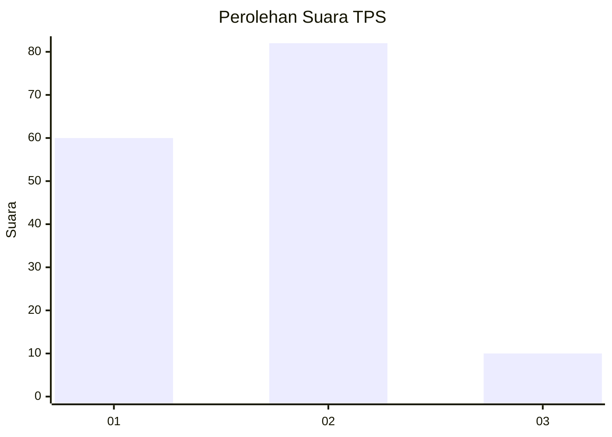
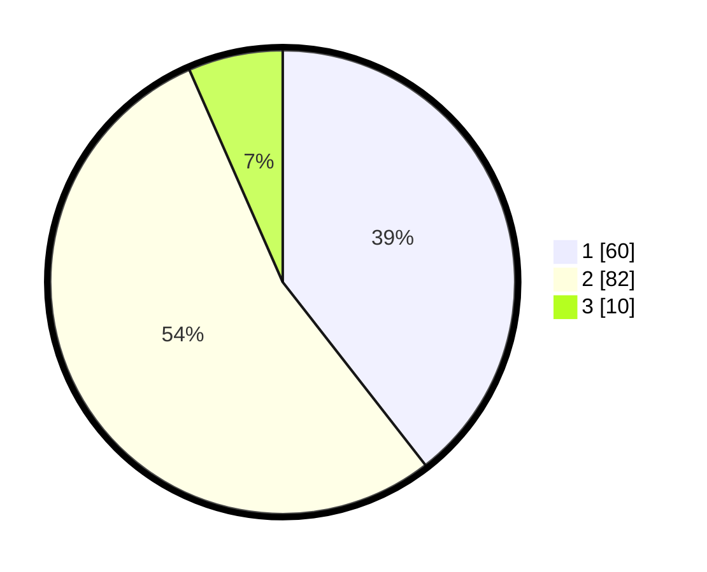

# Hasil

## Grafik

## Tabel

| No. | Nama Paslon    | Suara | Suara (raw) | Persentase |
|:--- |:-------------- | -----:| -----------:| ----------:|
| 1   | ANIES MUHAIMIN | 60    | [60][p-1]   | 39,47      |
| 2   | PRABOWO GIBRAN | 82    | [82][p-2]   | 53,95      |
| 3   | GANJAR MAHFUD  | 10    | [10][p-3]   | 6,58       |

[p-1]: https://github.com/gigit-pemilu/pemilu-2024/blob/main/pilpres/hitung-suara/sub/12-sumatera-utara/sub/22-labuhanbatu-selatan/sub/05-silangkitang/sub/2001-mandalasena/sub/007-tps/sub/paslon-1.txt
[p-2]: https://github.com/gigit-pemilu/pemilu-2024/blob/main/pilpres/hitung-suara/sub/12-sumatera-utara/sub/22-labuhanbatu-selatan/sub/05-silangkitang/sub/2001-mandalasena/sub/007-tps/sub/paslon-2.txt
[p-3]: https://github.com/gigit-pemilu/pemilu-2024/blob/main/pilpres/hitung-suara/sub/12-sumatera-utara/sub/22-labuhanbatu-selatan/sub/05-silangkitang/sub/2001-mandalasena/sub/007-tps/sub/paslon-3.txt

## Foto C Plano

https://sirekap-obj-formc.kpu.go.id/9678/pemilu/ppwp/12/22/05/20/01/1222052001007-20240214-221443--6286bf22-6d47-441a-974c-a72fe71cf9c6.jpg

https://sirekap-obj-formc.kpu.go.id/9678/pemilu/ppwp/12/22/05/20/01/1222052001007-20240214-221508--4d5a385b-cfac-4dc6-96f2-dc2628a2c3f7.jpg

https://sirekap-obj-formc.kpu.go.id/9678/pemilu/ppwp/12/22/05/20/01/1222052001007-20240214-221524--1261ea59-a378-4f7e-ad07-3bad43e40d8d.jpg

## Metadata

| Key        | Value               |
| ---------- | ------------------- |
| Time Stamp | 2024-02-15 15:00:29 |

