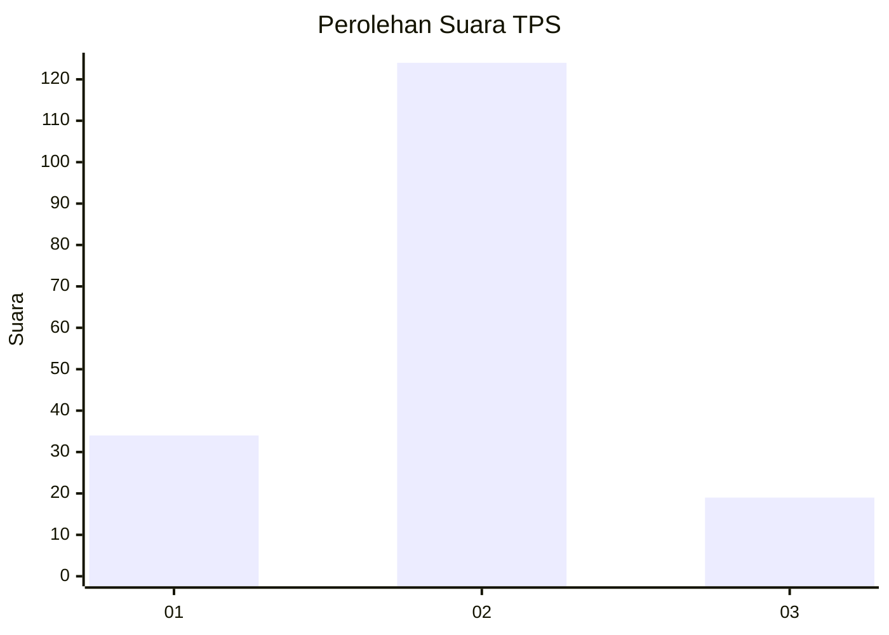
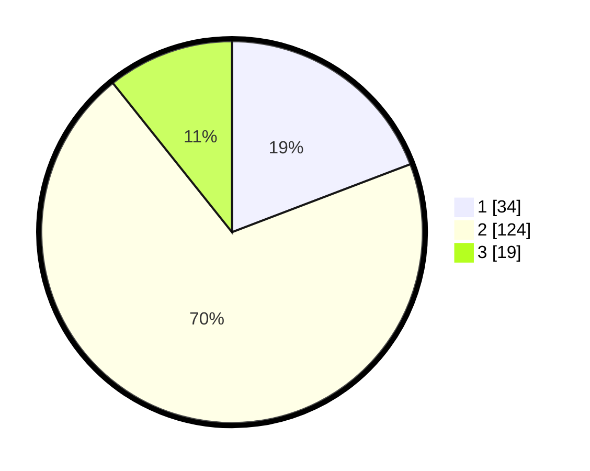

# Hasil

## Grafik

## Tabel

| No. | Nama Paslon    | Suara | Suara (raw) | Persentase |
|:--- |:-------------- | -----:| -----------:| ----------:|
| 1   | ANIES MUHAIMIN | 34    | [34][p-1]   | 19,21      |
| 2   | PRABOWO GIBRAN | 124   | [124][p-2]  | 70,06      |
| 3   | GANJAR MAHFUD  | 19    | [19][p-3]   | 10,73      |

[p-1]: https://github.com/gigit-pemilu/pemilu-2024/blob/main/pilpres/hitung-suara/sub/12-sumatera-utara/sub/23-labuhanbatu-utara/sub/01-kualuh-hulu/sub/1001-aek-kanopan/sub/001-tps/sub/paslon-1.txt
[p-2]: https://github.com/gigit-pemilu/pemilu-2024/blob/main/pilpres/hitung-suara/sub/12-sumatera-utara/sub/23-labuhanbatu-utara/sub/01-kualuh-hulu/sub/1001-aek-kanopan/sub/001-tps/sub/paslon-2.txt
[p-3]: https://github.com/gigit-pemilu/pemilu-2024/blob/main/pilpres/hitung-suara/sub/12-sumatera-utara/sub/23-labuhanbatu-utara/sub/01-kualuh-hulu/sub/1001-aek-kanopan/sub/001-tps/sub/paslon-3.txt

## Foto C Plano

https://sirekap-obj-formc.kpu.go.id/b444/pemilu/ppwp/12/23/01/10/01/1223011001001-20240214-230131--79889710-4632-418b-b7c0-fd86e22b48ab.jpg

https://sirekap-obj-formc.kpu.go.id/b444/pemilu/ppwp/12/23/01/10/01/1223011001001-20240214-230417--8661c58f-d271-44a2-90dc-adb2cd32d80a.jpg

https://sirekap-obj-formc.kpu.go.id/b444/pemilu/ppwp/12/23/01/10/01/1223011001001-20240214-230447--c0160787-d3bc-46fa-b0a9-0029697ae373.jpg

## Metadata

| Key        | Value               |
| ---------- | ------------------- |
| Time Stamp | 2024-02-16 02:30:27 |

