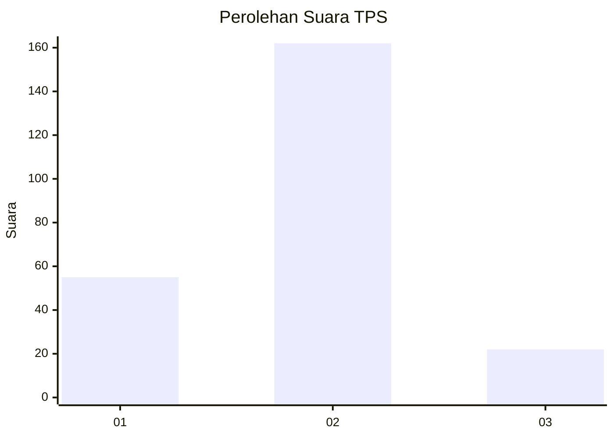

# Hasil

## Grafik

## Tabel

| No. | Nama Paslon    | Suara | Suara (raw) | Persentase |
|:--- |:-------------- | -----:| -----------:| ----------:|
| 1   | ANIES MUHAIMIN | 55    | [55][p-1]   | 23,01      |
| 2   | PRABOWO GIBRAN | 162   | [162][p-2]  | 67,78      |
| 3   | GANJAR MAHFUD  | 22    | [22][p-3]   | 9,21       |

[p-1]: https://github.com/gigit-pemilu/pemilu-2024-12-sumatera-utara/blob/main/pilpres/hitung-suara/sub/12-sumatera-utara/sub/23-labuhanbatu-utara/sub/01-kualuh-hulu/sub/1001-aek-kanopan/sub/004-tps/sub/paslon-1.txt
[p-2]: https://github.com/gigit-pemilu/pemilu-2024-12-sumatera-utara/blob/main/pilpres/hitung-suara/sub/12-sumatera-utara/sub/23-labuhanbatu-utara/sub/01-kualuh-hulu/sub/1001-aek-kanopan/sub/004-tps/sub/paslon-2.txt
[p-3]: https://github.com/gigit-pemilu/pemilu-2024-12-sumatera-utara/blob/main/pilpres/hitung-suara/sub/12-sumatera-utara/sub/23-labuhanbatu-utara/sub/01-kualuh-hulu/sub/1001-aek-kanopan/sub/004-tps/sub/paslon-3.txt

## Foto C Plano

https://sirekap-obj-formc.kpu.go.id/5612/pemilu/ppwp/12/23/01/10/01/1223011001004-20240215-070630--3da5bc0d-6829-4b7f-959c-169cddccb9ad.jpg

https://sirekap-obj-formc.kpu.go.id/5612/pemilu/ppwp/12/23/01/10/01/1223011001004-20240215-070132--112585e4-1b0b-478f-8d00-c59526579432.jpg

https://sirekap-obj-formc.kpu.go.id/5612/pemilu/ppwp/12/23/01/10/01/1223011001004-20240215-070931--4993b270-91c2-4fcb-a44c-afdafa756402.jpg

## Metadata

| Key        | Value               |
| ---------- | ------------------- |
| Time Stamp | 2024-02-16 02:30:27 |

