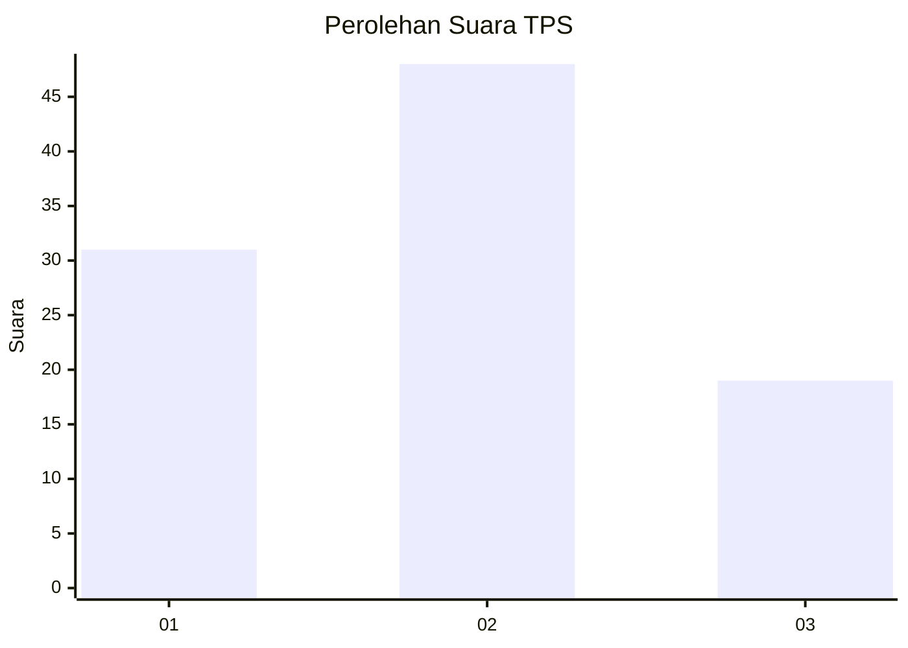
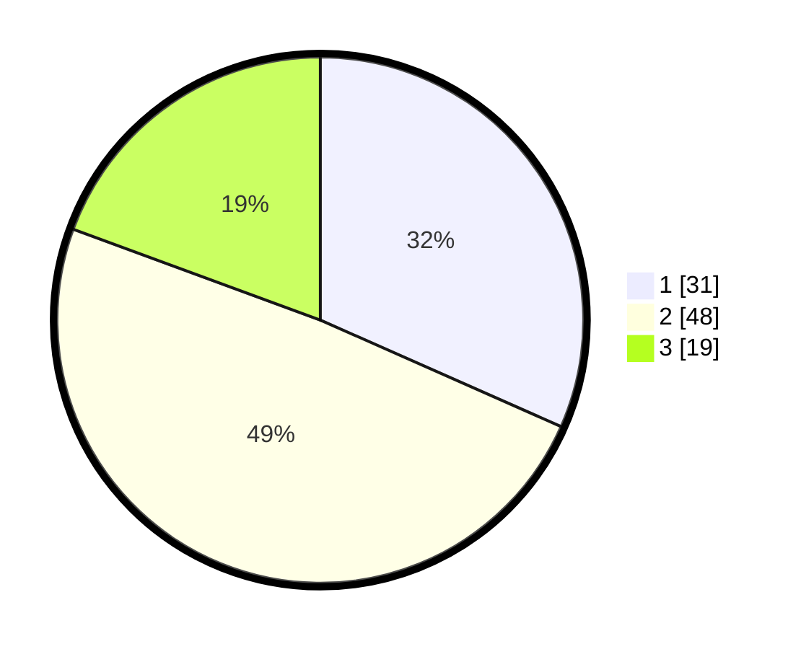

# Hasil

## Grafik

## Tabel

| No. | Nama Paslon    | Suara | Suara (raw) | Persentase |
|:--- |:-------------- | -----:| -----------:| ----------:|
| 1   | ANIES MUHAIMIN | 31    | [31][p-1]   | 31,63      |
| 2   | PRABOWO GIBRAN | 48    | [48][p-2]   | 48,98      |
| 3   | GANJAR MAHFUD  | 19    | [19][p-3]   | 19,39      |

[p-1]: https://github.com/gigit-pemilu/pemilu-2024-12-sumatera-utara/blob/main/pilpres/hitung-suara/sub/12-sumatera-utara/sub/23-labuhanbatu-utara/sub/01-kualuh-hulu/sub/1002-aek-kanopan-timur/sub/010-tps/sub/paslon-1.txt
[p-2]: https://github.com/gigit-pemilu/pemilu-2024-12-sumatera-utara/blob/main/pilpres/hitung-suara/sub/12-sumatera-utara/sub/23-labuhanbatu-utara/sub/01-kualuh-hulu/sub/1002-aek-kanopan-timur/sub/010-tps/sub/paslon-2.txt
[p-3]: https://github.com/gigit-pemilu/pemilu-2024-12-sumatera-utara/blob/main/pilpres/hitung-suara/sub/12-sumatera-utara/sub/23-labuhanbatu-utara/sub/01-kualuh-hulu/sub/1002-aek-kanopan-timur/sub/010-tps/sub/paslon-3.txt

## Foto C Plano

https://sirekap-obj-formc.kpu.go.id/1ade/pemilu/ppwp/12/23/01/10/02/1223011002010-20240215-004646--659f6f97-2f96-4c19-9c8f-8e394a6c8697.jpg

https://sirekap-obj-formc.kpu.go.id/1ade/pemilu/ppwp/12/23/01/10/02/1223011002010-20240215-004810--5d0da84f-9c8f-4f4a-93da-a18dd2058a47.jpg

https://sirekap-obj-formc.kpu.go.id/1ade/pemilu/ppwp/12/23/01/10/02/1223011002010-20240215-004927--3e307f90-cf83-464a-b812-b1fdf258c8dc.jpg

## Metadata

| Key        | Value               |
| ---------- | ------------------- |
| Time Stamp | 2024-02-16 21:01:00 |

