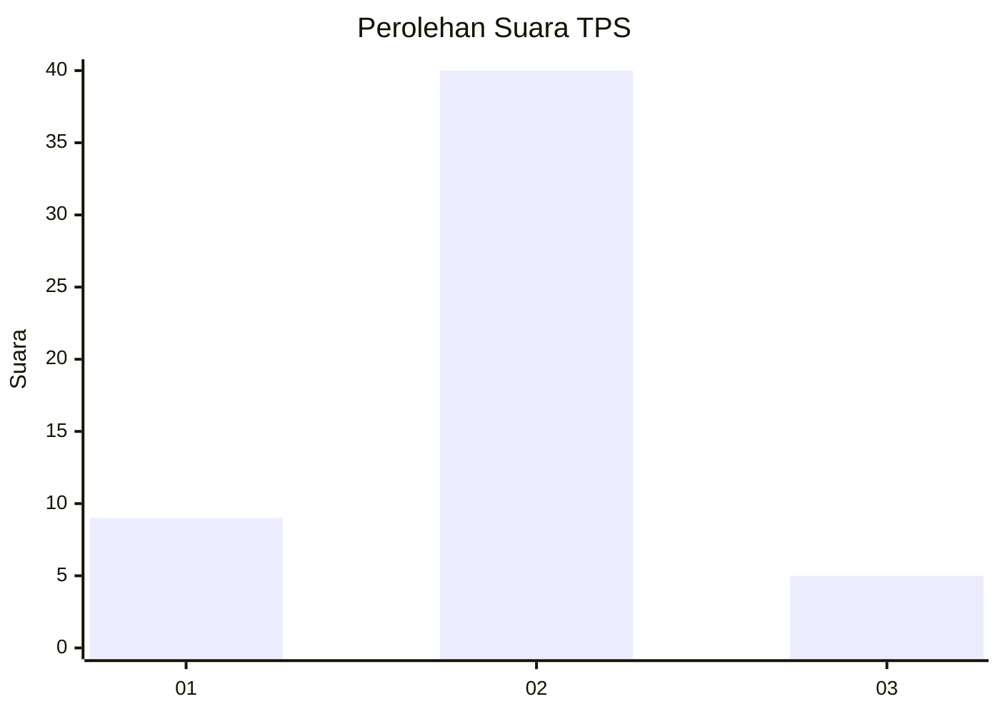
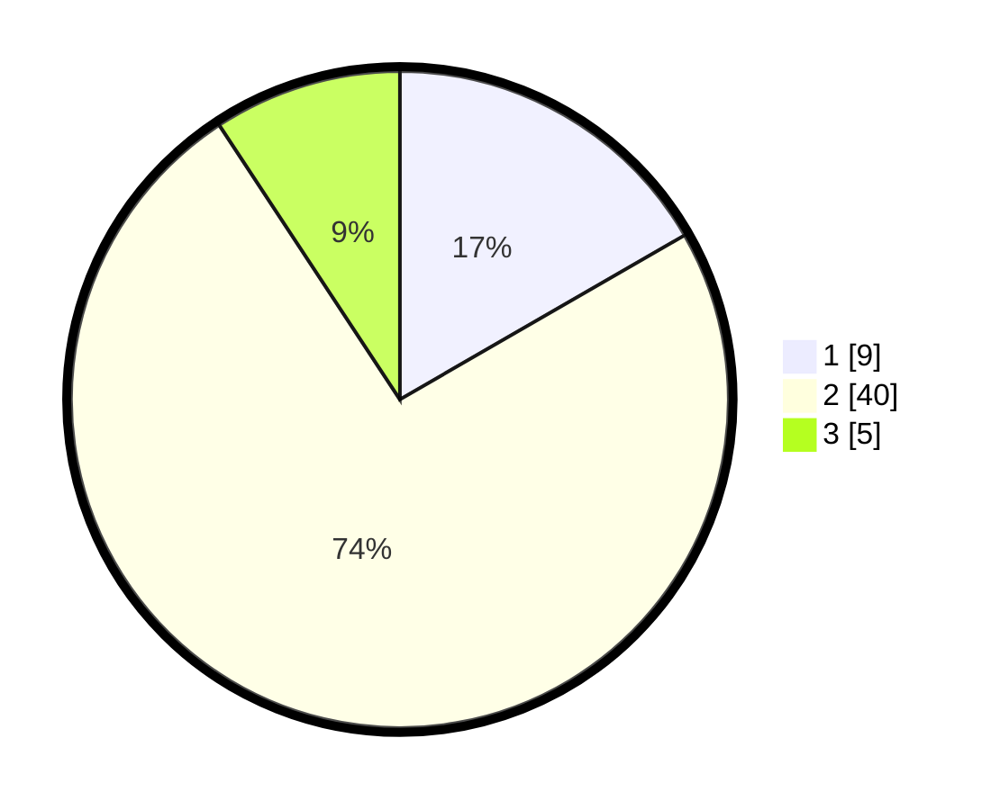

# Hasil

## Grafik

## Tabel

| No. | Nama Paslon    | Suara | Suara (raw) | Persentase |
|:--- |:-------------- | -----:| -----------:| ----------:|
| 1   | ANIES MUHAIMIN | 9     | [9][p-1]    | 16,67      |
| 2   | PRABOWO GIBRAN | 40    | [40][p-2]   | 74,07      |
| 3   | GANJAR MAHFUD  | 5     | [5][p-3]    | 9,26       |

[p-1]: https://github.com/gigit-pemilu/pemilu-2024-12-sumatera-utara/blob/main/pilpres/hitung-suara/sub/12-sumatera-utara/sub/23-labuhanbatu-utara/sub/01-kualuh-hulu/sub/2009-perkebunan-labuhan-haji/sub/003-tps/sub/paslon-1.txt
[p-2]: https://github.com/gigit-pemilu/pemilu-2024-12-sumatera-utara/blob/main/pilpres/hitung-suara/sub/12-sumatera-utara/sub/23-labuhanbatu-utara/sub/01-kualuh-hulu/sub/2009-perkebunan-labuhan-haji/sub/003-tps/sub/paslon-2.txt
[p-3]: https://github.com/gigit-pemilu/pemilu-2024-12-sumatera-utara/blob/main/pilpres/hitung-suara/sub/12-sumatera-utara/sub/23-labuhanbatu-utara/sub/01-kualuh-hulu/sub/2009-perkebunan-labuhan-haji/sub/003-tps/sub/paslon-3.txt

## Foto C Plano

https://sirekap-obj-formc.kpu.go.id/b0ed/pemilu/ppwp/12/23/01/20/09/1223012009003-20240214-141353--7bfe98bc-590d-46fb-91ac-9dcd6f61b47a.jpg

https://sirekap-obj-formc.kpu.go.id/b0ed/pemilu/ppwp/12/23/01/20/09/1223012009003-20240214-141513--595e301f-bee5-47da-b7b3-dd5ba19de8ef.jpg

https://sirekap-obj-formc.kpu.go.id/b0ed/pemilu/ppwp/12/23/01/20/09/1223012009003-20240214-141619--100d1042-d5a3-41a0-b36e-e9babb00e181.jpg

## Metadata

| Key        | Value               |
| ---------- | ------------------- |
| Time Stamp | 2024-02-15 12:00:28 |

