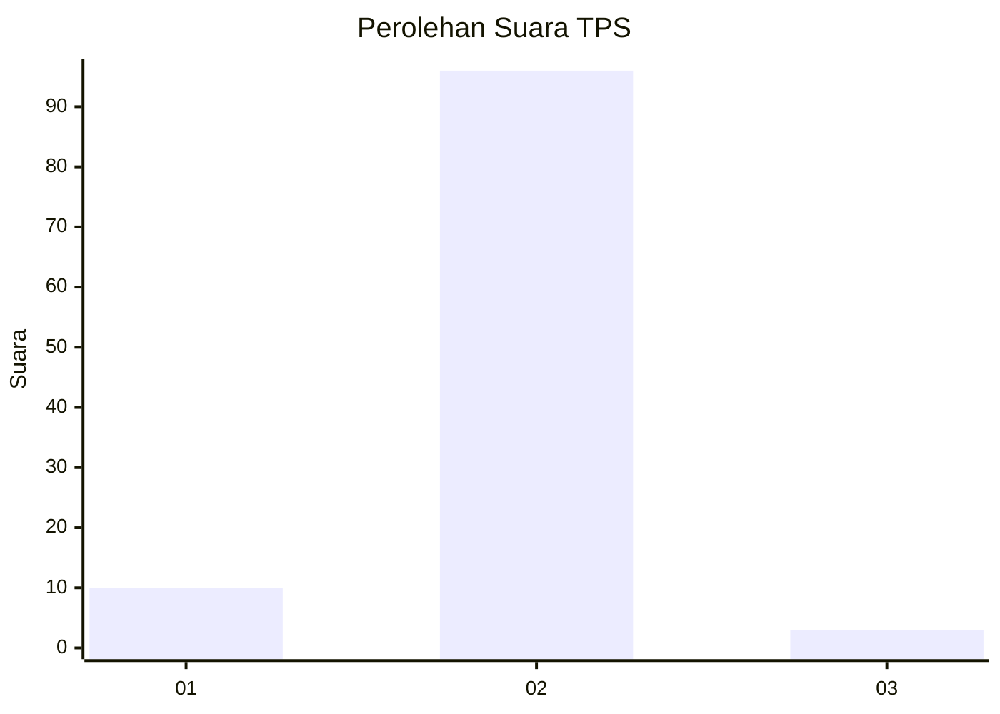
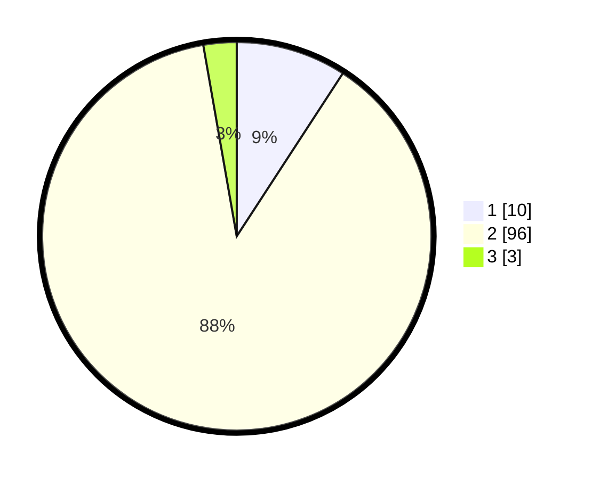

# Hasil

## Grafik

## Tabel

| No. | Nama Paslon    | Suara | Suara (raw) | Persentase |
|:--- |:-------------- | -----:| -----------:| ----------:|
| 1   | ANIES MUHAIMIN | 10    | [10][p-1]   | 9,17       |
| 2   | PRABOWO GIBRAN | 96    | [96][p-2]   | 88,07      |
| 3   | GANJAR MAHFUD  | 3     | [3][p-3]    | 2,75       |

[p-1]: https://github.com/gigit-pemilu/pemilu-2024-12-sumatera-utara/blob/main/pilpres/hitung-suara/sub/12-sumatera-utara/sub/23-labuhanbatu-utara/sub/01-kualuh-hulu/sub/2012-sukarame/sub/020-tps/sub/paslon-1.txt
[p-2]: https://github.com/gigit-pemilu/pemilu-2024-12-sumatera-utara/blob/main/pilpres/hitung-suara/sub/12-sumatera-utara/sub/23-labuhanbatu-utara/sub/01-kualuh-hulu/sub/2012-sukarame/sub/020-tps/sub/paslon-2.txt
[p-3]: https://github.com/gigit-pemilu/pemilu-2024-12-sumatera-utara/blob/main/pilpres/hitung-suara/sub/12-sumatera-utara/sub/23-labuhanbatu-utara/sub/01-kualuh-hulu/sub/2012-sukarame/sub/020-tps/sub/paslon-3.txt

## Foto C Plano

https://sirekap-obj-formc.kpu.go.id/403b/pemilu/ppwp/12/23/01/20/12/1223012012020-20240215-003443--6d4e9c24-884e-4b6f-9a39-a2e2c0d7e462.jpg

https://sirekap-obj-formc.kpu.go.id/403b/pemilu/ppwp/12/23/01/20/12/1223012012020-20240215-003611--290aafd3-161f-4a61-a0ee-c67444d3c12b.jpg

https://sirekap-obj-formc.kpu.go.id/403b/pemilu/ppwp/12/23/01/20/12/1223012012020-20240215-003818--cee519eb-df53-4b16-8274-49c2c5a3b191.jpg

## Metadata

| Key        | Value               |
| ---------- | ------------------- |
| Time Stamp | 2024-02-16 03:00:26 |

