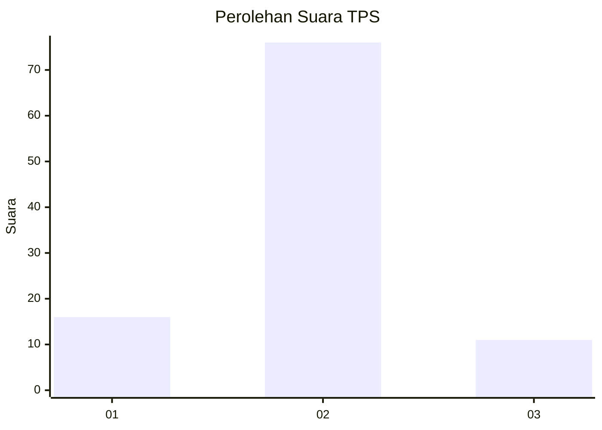
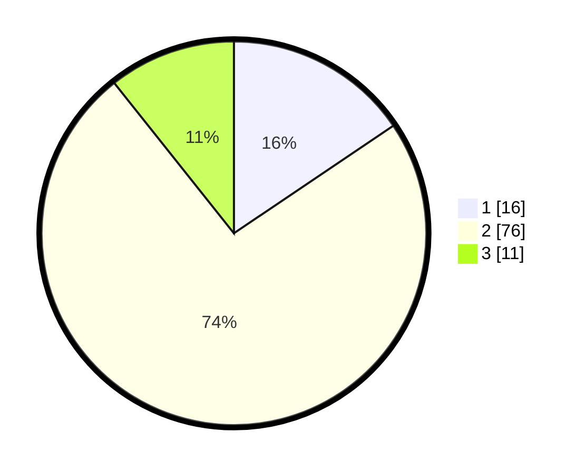

# Hasil

## Grafik

## Tabel

| No. | Nama Paslon    | Suara | Suara (raw) | Persentase |
|:--- |:-------------- | -----:| -----------:| ----------:|
| 1   | ANIES MUHAIMIN | 16    | [16][p-1]   | 15,53      |
| 2   | PRABOWO GIBRAN | 76    | [76][p-2]   | 73,79      |
| 3   | GANJAR MAHFUD  | 11    | [11][p-3]   | 10,68      |

[p-1]: https://github.com/gigit-pemilu/pemilu-2024/blob/main/pilpres/hitung-suara/sub/12-sumatera-utara/sub/23-labuhanbatu-utara/sub/01-kualuh-hulu/sub/2012-sukarame/sub/028-tps/sub/paslon-1.txt
[p-2]: https://github.com/gigit-pemilu/pemilu-2024/blob/main/pilpres/hitung-suara/sub/12-sumatera-utara/sub/23-labuhanbatu-utara/sub/01-kualuh-hulu/sub/2012-sukarame/sub/028-tps/sub/paslon-2.txt
[p-3]: https://github.com/gigit-pemilu/pemilu-2024/blob/main/pilpres/hitung-suara/sub/12-sumatera-utara/sub/23-labuhanbatu-utara/sub/01-kualuh-hulu/sub/2012-sukarame/sub/028-tps/sub/paslon-3.txt

## Foto C Plano

https://sirekap-obj-formc.kpu.go.id/0338/pemilu/ppwp/12/23/01/20/12/1223012012028-20240215-002804--7b423eb3-0ad7-4c8a-b730-7d6d308a03fe.jpg

https://sirekap-obj-formc.kpu.go.id/0338/pemilu/ppwp/12/23/01/20/12/1223012012028-20240215-020129--3b5bf61f-06c3-4b6a-9d36-be2a005f2c98.jpg

https://sirekap-obj-formc.kpu.go.id/0338/pemilu/ppwp/12/23/01/20/12/1223012012028-20240215-003312--611a0a7c-8429-407b-b171-da0e5effc77f.jpg

## Metadata

| Key        | Value               |
| ---------- | ------------------- |
| Time Stamp | 2024-02-15 19:30:26 |

