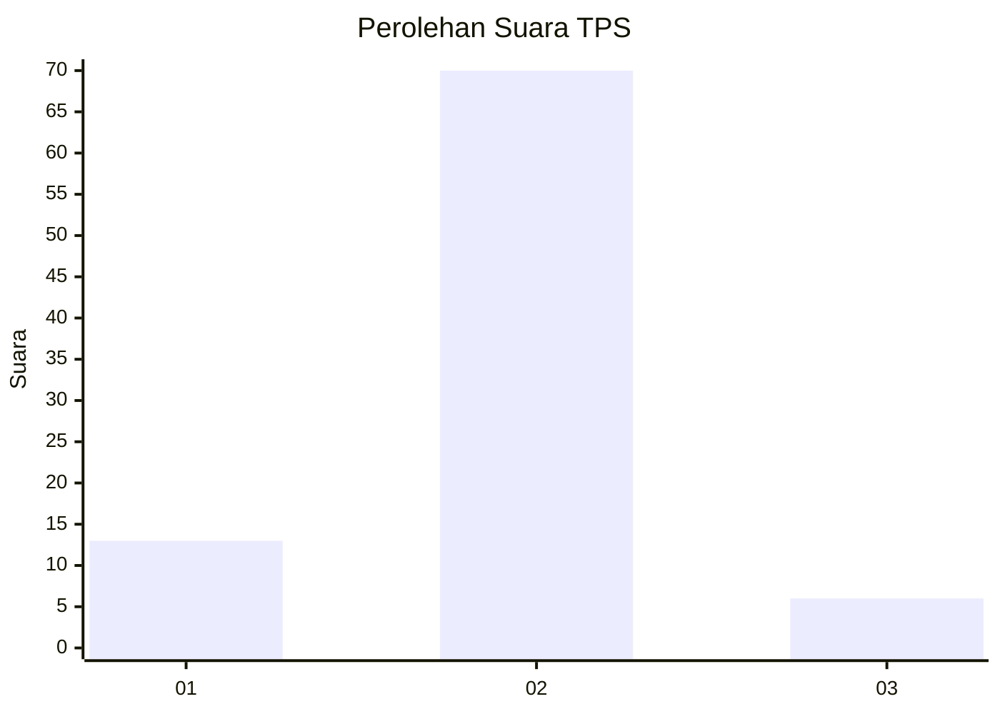
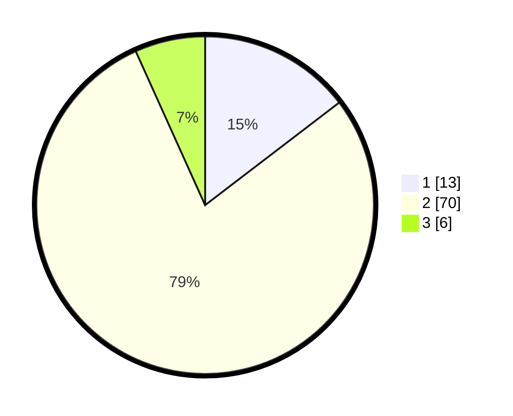

# Hasil

## Grafik

## Tabel

| No. | Nama Paslon    | Suara | Suara (raw) | Persentase |
|:--- |:-------------- | -----:| -----------:| ----------:|
| 1   | ANIES MUHAIMIN | 13    | [13][p-1]   | 14,61      |
| 2   | PRABOWO GIBRAN | 70    | [70][p-2]   | 78,65      |
| 3   | GANJAR MAHFUD  | 6     | [6][p-3]    | 6,74       |

[p-1]: https://github.com/gigit-pemilu/pemilu-2024-12-sumatera-utara/blob/main/pilpres/hitung-suara/sub/12-sumatera-utara/sub/23-labuhanbatu-utara/sub/01-kualuh-hulu/sub/2012-sukarame/sub/029-tps/sub/paslon-1.txt
[p-2]: https://github.com/gigit-pemilu/pemilu-2024-12-sumatera-utara/blob/main/pilpres/hitung-suara/sub/12-sumatera-utara/sub/23-labuhanbatu-utara/sub/01-kualuh-hulu/sub/2012-sukarame/sub/029-tps/sub/paslon-2.txt
[p-3]: https://github.com/gigit-pemilu/pemilu-2024-12-sumatera-utara/blob/main/pilpres/hitung-suara/sub/12-sumatera-utara/sub/23-labuhanbatu-utara/sub/01-kualuh-hulu/sub/2012-sukarame/sub/029-tps/sub/paslon-3.txt

## Foto C Plano

https://sirekap-obj-formc.kpu.go.id/fb4e/pemilu/ppwp/12/23/01/20/12/1223012012029-20240214-224120--eb4db4e0-8d6e-4ad1-8243-ef74fd856c06.jpg

https://sirekap-obj-formc.kpu.go.id/fb4e/pemilu/ppwp/12/23/01/20/12/1223012012029-20240214-224053--1db86a6e-72be-4e5c-97d2-b517c1b7f34d.jpg

https://sirekap-obj-formc.kpu.go.id/fb4e/pemilu/ppwp/12/23/01/20/12/1223012012029-20240214-224227--f690a6dd-bc91-4337-a8f6-d60e78e28a77.jpg

## Metadata

| Key        | Value               |
| ---------- | ------------------- |
| Time Stamp | 2024-02-16 03:30:26 |

