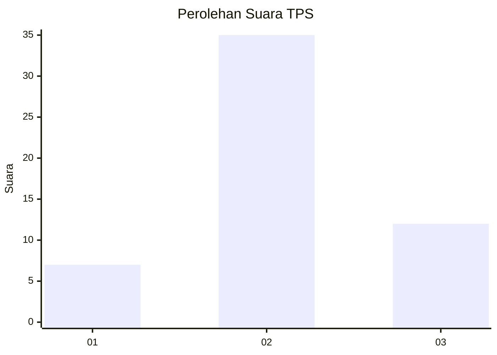
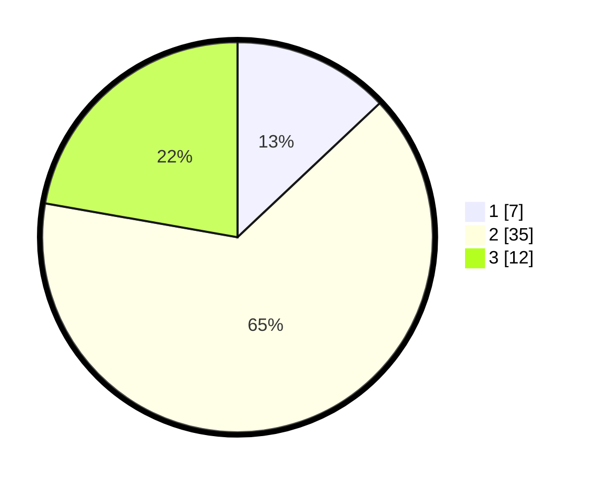

# Hasil

## Grafik

## Tabel

| No. | Nama Paslon    | Suara | Suara (raw) | Persentase |
|:--- |:-------------- | -----:| -----------:| ----------:|
| 1   | ANIES MUHAIMIN | 7     | [7][p-1]    | 12,96      |
| 2   | PRABOWO GIBRAN | 35    | [35][p-2]   | 64,81      |
| 3   | GANJAR MAHFUD  | 12    | [12][p-3]   | 22,22      |

[p-1]: https://github.com/gigit-pemilu/pemilu-2024/blob/main/pilpres/hitung-suara/sub/12-sumatera-utara/sub/23-labuhanbatu-utara/sub/01-kualuh-hulu/sub/2013-sukarame-baru/sub/001-tps/sub/paslon-1.txt
[p-2]: https://github.com/gigit-pemilu/pemilu-2024/blob/main/pilpres/hitung-suara/sub/12-sumatera-utara/sub/23-labuhanbatu-utara/sub/01-kualuh-hulu/sub/2013-sukarame-baru/sub/001-tps/sub/paslon-2.txt
[p-3]: https://github.com/gigit-pemilu/pemilu-2024/blob/main/pilpres/hitung-suara/sub/12-sumatera-utara/sub/23-labuhanbatu-utara/sub/01-kualuh-hulu/sub/2013-sukarame-baru/sub/001-tps/sub/paslon-3.txt

## Foto C Plano

https://sirekap-obj-formc.kpu.go.id/0423/pemilu/ppwp/12/23/01/20/13/1223012013001-20240214-141419--0f3d4ce8-85c2-4b8e-9527-dbc06e8d73d7.jpg

https://sirekap-obj-formc.kpu.go.id/0423/pemilu/ppwp/12/23/01/20/13/1223012013001-20240214-141804--e0ce78ff-acfd-4068-b54e-e7084e1a0a20.jpg

https://sirekap-obj-formc.kpu.go.id/0423/pemilu/ppwp/12/23/01/20/13/1223012013001-20240214-141940--2cbc3a2e-aec4-4407-8554-f1f91771e101.jpg

## Metadata

| Key        | Value               |
| ---------- | ------------------- |
| Time Stamp | 2024-02-16 03:30:26 |

