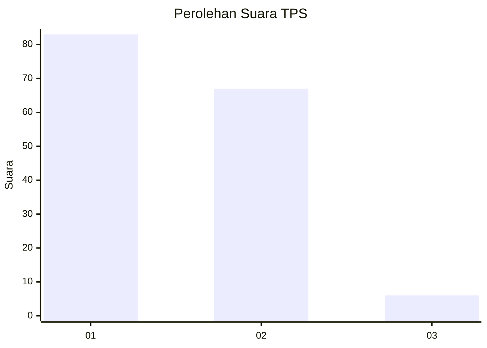
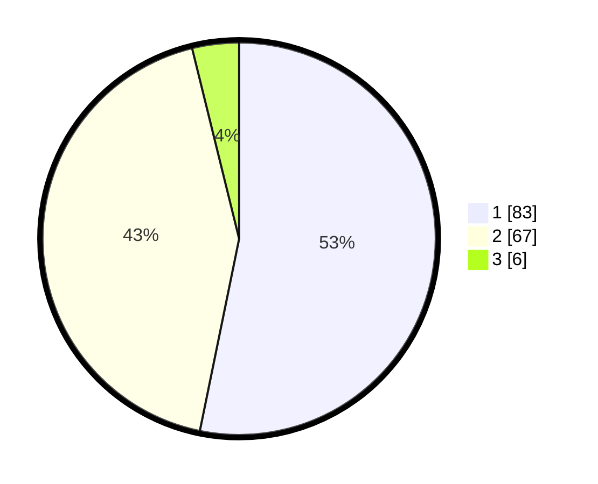

# Hasil

## Grafik

## Tabel

| No. | Nama Paslon    | Suara | Suara (raw) | Persentase |
|:--- |:-------------- | -----:| -----------:| ----------:|
| 1   | ANIES MUHAIMIN | 83    | [83][p-1]   | 53,21      |
| 2   | PRABOWO GIBRAN | 67    | [67][p-2]   | 42,95      |
| 3   | GANJAR MAHFUD  | 6     | [6][p-3]    | 3,85       |

[p-1]: https://github.com/gigit-pemilu/pemilu-2024/blob/main/pilpres/hitung-suara/sub/12-sumatera-utara/sub/23-labuhanbatu-utara/sub/02-kualuh-leidong/sub/1001-tanjung-leidong/sub/004-tps/sub/paslon-1.txt
[p-2]: https://github.com/gigit-pemilu/pemilu-2024/blob/main/pilpres/hitung-suara/sub/12-sumatera-utara/sub/23-labuhanbatu-utara/sub/02-kualuh-leidong/sub/1001-tanjung-leidong/sub/004-tps/sub/paslon-2.txt
[p-3]: https://github.com/gigit-pemilu/pemilu-2024/blob/main/pilpres/hitung-suara/sub/12-sumatera-utara/sub/23-labuhanbatu-utara/sub/02-kualuh-leidong/sub/1001-tanjung-leidong/sub/004-tps/sub/paslon-3.txt

## Foto C Plano

https://sirekap-obj-formc.kpu.go.id/0034/pemilu/ppwp/12/23/02/10/01/1223021001004-20240215-004959--4e24c6ac-f5c9-4187-b153-8151ea8ee9d9.jpg

https://sirekap-obj-formc.kpu.go.id/0034/pemilu/ppwp/12/23/02/10/01/1223021001004-20240215-005207--ff8b3f84-ae62-44c6-95e9-6d36c560ac1b.jpg

https://sirekap-obj-formc.kpu.go.id/0034/pemilu/ppwp/12/23/02/10/01/1223021001004-20240215-005606--3ae79dd2-e3e2-44f1-8969-33d8cebfe572.jpg

## Metadata

| Key        | Value               |
| ---------- | ------------------- |
| Time Stamp | 2024-02-15 15:00:29 |

