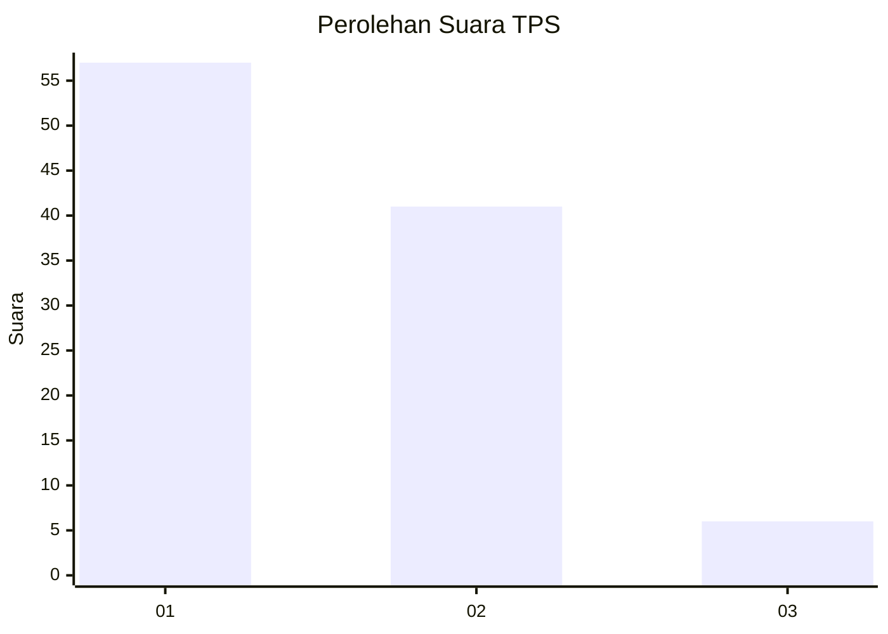
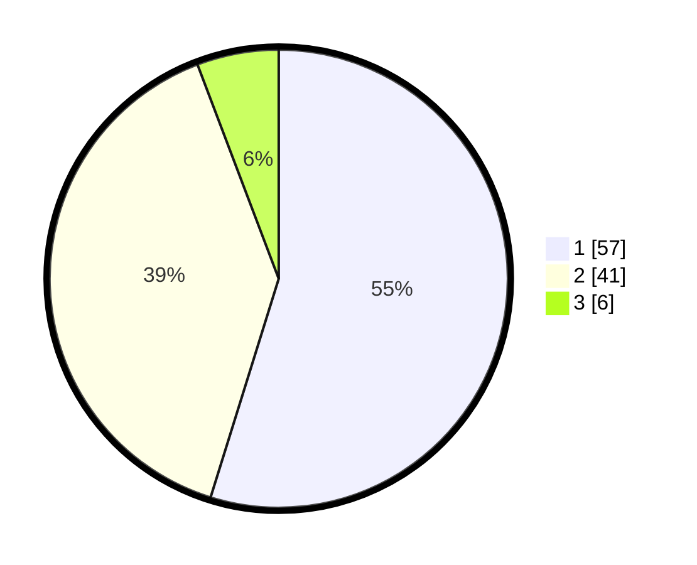

# Hasil

## Grafik

## Tabel

| No. | Nama Paslon    | Suara | Suara (raw) | Persentase |
|:--- |:-------------- | -----:| -----------:| ----------:|
| 1   | ANIES MUHAIMIN | 57    | [57][p-1]   | 54,81      |
| 2   | PRABOWO GIBRAN | 41    | [41][p-2]   | 39,42      |
| 3   | GANJAR MAHFUD  | 6     | [6][p-3]    | 5,77       |

[p-1]: https://github.com/gigit-pemilu/pemilu-2024-12-sumatera-utara/blob/main/pilpres/hitung-suara/sub/12-sumatera-utara/sub/23-labuhanbatu-utara/sub/02-kualuh-leidong/sub/1001-tanjung-leidong/sub/024-tps/sub/paslon-1.txt
[p-2]: https://github.com/gigit-pemilu/pemilu-2024-12-sumatera-utara/blob/main/pilpres/hitung-suara/sub/12-sumatera-utara/sub/23-labuhanbatu-utara/sub/02-kualuh-leidong/sub/1001-tanjung-leidong/sub/024-tps/sub/paslon-2.txt
[p-3]: https://github.com/gigit-pemilu/pemilu-2024-12-sumatera-utara/blob/main/pilpres/hitung-suara/sub/12-sumatera-utara/sub/23-labuhanbatu-utara/sub/02-kualuh-leidong/sub/1001-tanjung-leidong/sub/024-tps/sub/paslon-3.txt

## Foto C Plano

https://sirekap-obj-formc.kpu.go.id/3e99/pemilu/ppwp/12/23/02/10/01/1223021001024-20240215-012425--c764c7b8-cdcb-4451-ac6b-b479aee46c35.jpg

https://sirekap-obj-formc.kpu.go.id/3e99/pemilu/ppwp/12/23/02/10/01/1223021001024-20240215-012737--b70b7b5d-c160-4c7b-b296-b740a173168f.jpg

https://sirekap-obj-formc.kpu.go.id/3e99/pemilu/ppwp/12/23/02/10/01/1223021001024-20240215-012753--b1954447-66bd-4df2-8934-e8b62c17f4a9.jpg

## Metadata

| Key        | Value               |
| ---------- | ------------------- |
| Time Stamp | 2024-02-15 15:00:29 |

