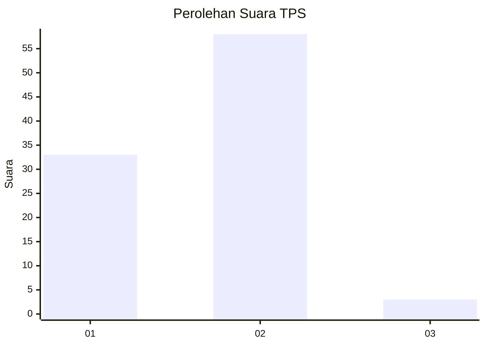
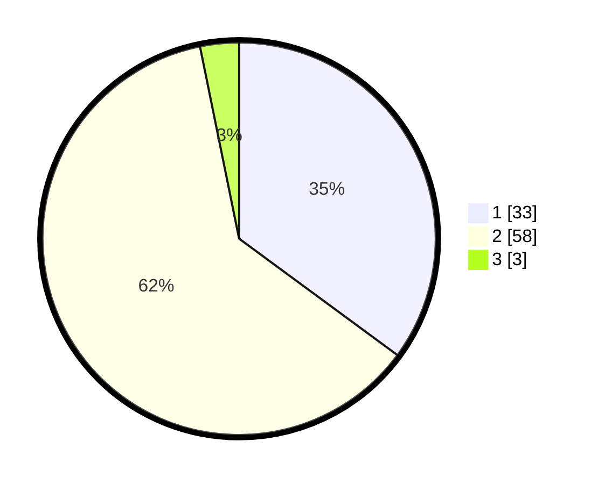

# Hasil

## Grafik

## Tabel

| No. | Nama Paslon    | Suara | Suara (raw) | Persentase |
|:--- |:-------------- | -----:| -----------:| ----------:|
| 1   | ANIES MUHAIMIN | 33    | [33][p-1]   | 35,11      |
| 2   | PRABOWO GIBRAN | 58    | [58][p-2]   | 61,70      |
| 3   | GANJAR MAHFUD  | 3     | [3][p-3]    | 3,19       |

[p-1]: https://github.com/gigit-pemilu/pemilu-2024-12-sumatera-utara/blob/main/pilpres/hitung-suara/sub/12-sumatera-utara/sub/23-labuhanbatu-utara/sub/03-kualuh-hilir/sub/2006-teluk-binjai/sub/001-tps/sub/paslon-1.txt
[p-2]: https://github.com/gigit-pemilu/pemilu-2024-12-sumatera-utara/blob/main/pilpres/hitung-suara/sub/12-sumatera-utara/sub/23-labuhanbatu-utara/sub/03-kualuh-hilir/sub/2006-teluk-binjai/sub/001-tps/sub/paslon-2.txt
[p-3]: https://github.com/gigit-pemilu/pemilu-2024-12-sumatera-utara/blob/main/pilpres/hitung-suara/sub/12-sumatera-utara/sub/23-labuhanbatu-utara/sub/03-kualuh-hilir/sub/2006-teluk-binjai/sub/001-tps/sub/paslon-3.txt

## Foto C Plano

https://sirekap-obj-formc.kpu.go.id/f2e8/pemilu/ppwp/12/23/03/20/06/1223032006001-20240215-013257--b59a5ce7-700f-4306-8cb2-1870917754f2.jpg

https://sirekap-obj-formc.kpu.go.id/f2e8/pemilu/ppwp/12/23/03/20/06/1223032006001-20240216-145140--dec1618c-7682-4a91-8e24-227bbcc7a855.jpg

https://sirekap-obj-formc.kpu.go.id/f2e8/pemilu/ppwp/12/23/03/20/06/1223032006001-20240216-145139--ab020e89-6367-4a86-a61c-7016b8a2c47a.jpg

## Metadata

| Key        | Value               |
| ---------- | ------------------- |
| Time Stamp | 2024-02-16 16:25:10 |

