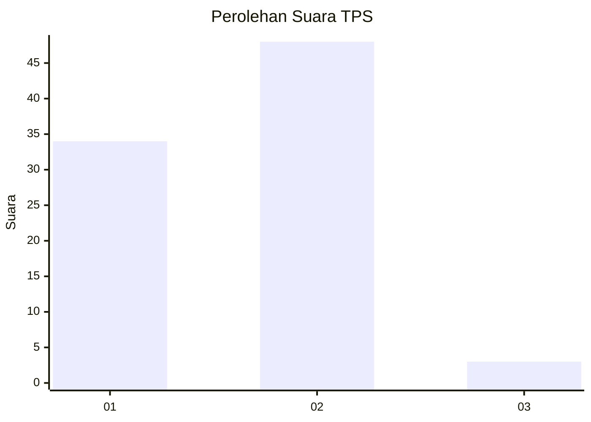
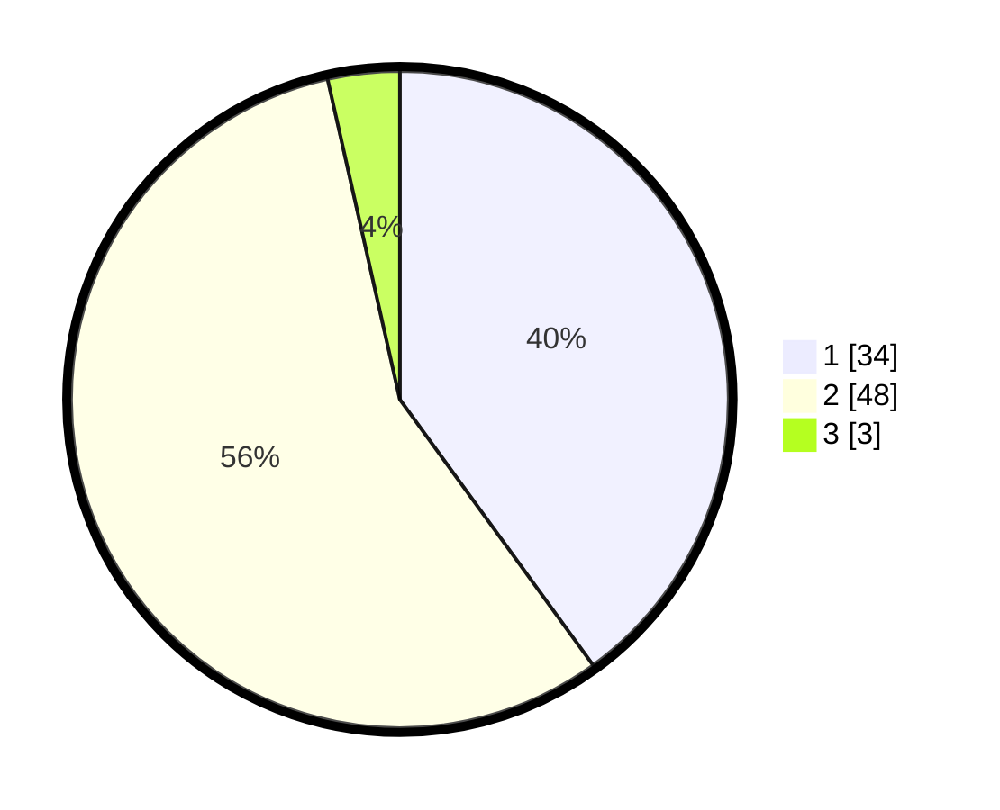

# Hasil

## Grafik

## Tabel

| No. | Nama Paslon    | Suara | Suara (raw) | Persentase |
|:--- |:-------------- | -----:| -----------:| ----------:|
| 1   | ANIES MUHAIMIN | 34    | [34][p-1]   | 40,00      |
| 2   | PRABOWO GIBRAN | 48    | [48][p-2]   | 56,47      |
| 3   | GANJAR MAHFUD  | 3     | [3][p-3]    | 3,53       |

[p-1]: https://github.com/gigit-pemilu/pemilu-2024/blob/main/pilpres/hitung-suara/sub/12-sumatera-utara/sub/23-labuhanbatu-utara/sub/04-aek-kuo/sub/2001-aek-korsik/sub/001-tps/sub/paslon-1.txt
[p-2]: https://github.com/gigit-pemilu/pemilu-2024/blob/main/pilpres/hitung-suara/sub/12-sumatera-utara/sub/23-labuhanbatu-utara/sub/04-aek-kuo/sub/2001-aek-korsik/sub/001-tps/sub/paslon-2.txt
[p-3]: https://github.com/gigit-pemilu/pemilu-2024/blob/main/pilpres/hitung-suara/sub/12-sumatera-utara/sub/23-labuhanbatu-utara/sub/04-aek-kuo/sub/2001-aek-korsik/sub/001-tps/sub/paslon-3.txt

## Foto C Plano

https://sirekap-obj-formc.kpu.go.id/7562/pemilu/ppwp/12/23/04/20/01/1223042001001-20240215-081108--382fe5b0-3949-43f2-8d2e-13cf237dcb2e.jpg

https://sirekap-obj-formc.kpu.go.id/7562/pemilu/ppwp/12/23/04/20/01/1223042001001-20240215-081316--a7b9ecc3-64d7-44d7-a408-f79d3222eeca.jpg

https://sirekap-obj-formc.kpu.go.id/7562/pemilu/ppwp/12/23/04/20/01/1223042001001-20240215-081437--abec01d8-c8b6-4ca2-a353-2f1fedc4cf7d.jpg

## Metadata

| Key        | Value               |
| ---------- | ------------------- |
| Time Stamp | 2024-02-16 03:00:26 |

