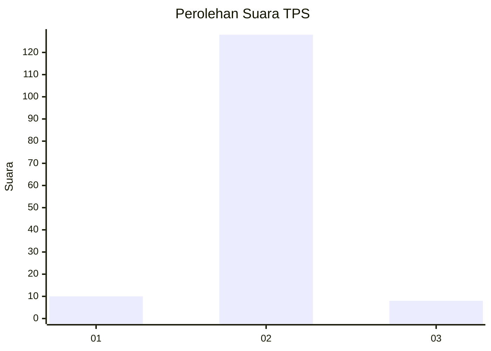
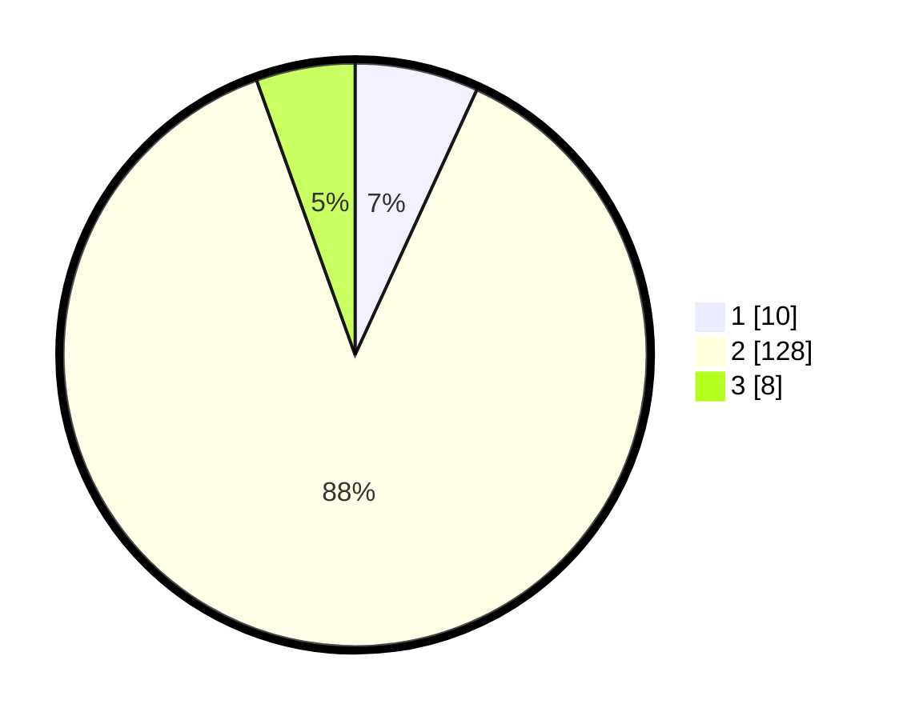

# Hasil

## Grafik

## Tabel

| No. | Nama Paslon    | Suara | Suara (raw) | Persentase |
|:--- |:-------------- | -----:| -----------:| ----------:|
| 1   | ANIES MUHAIMIN | 10    | [10][p-1]   | 6,85       |
| 2   | PRABOWO GIBRAN | 128   | [128][p-2]  | 87,67      |
| 3   | GANJAR MAHFUD  | 8     | [8][p-3]    | 5,48       |

[p-1]: https://github.com/gigit-pemilu/pemilu-2024-12-sumatera-utara/blob/main/pilpres/hitung-suara/sub/12-sumatera-utara/sub/23-labuhanbatu-utara/sub/04-aek-kuo/sub/2001-aek-korsik/sub/013-tps/sub/paslon-1.txt
[p-2]: https://github.com/gigit-pemilu/pemilu-2024-12-sumatera-utara/blob/main/pilpres/hitung-suara/sub/12-sumatera-utara/sub/23-labuhanbatu-utara/sub/04-aek-kuo/sub/2001-aek-korsik/sub/013-tps/sub/paslon-2.txt
[p-3]: https://github.com/gigit-pemilu/pemilu-2024-12-sumatera-utara/blob/main/pilpres/hitung-suara/sub/12-sumatera-utara/sub/23-labuhanbatu-utara/sub/04-aek-kuo/sub/2001-aek-korsik/sub/013-tps/sub/paslon-3.txt

## Foto C Plano

https://sirekap-obj-formc.kpu.go.id/46af/pemilu/ppwp/12/23/04/20/01/1223042001013-20240214-155311--570fc069-afe3-4b63-b747-3cb7f5243dfb.jpg

https://sirekap-obj-formc.kpu.go.id/46af/pemilu/ppwp/12/23/04/20/01/1223042001013-20240214-155514--e5cc1135-4f38-4d03-92c1-ba6e5e247a0e.jpg

https://sirekap-obj-formc.kpu.go.id/46af/pemilu/ppwp/12/23/04/20/01/1223042001013-20240214-160120--dfab8448-1876-460a-9749-efe30d8d7fd3.jpg

## Metadata

| Key        | Value               |
| ---------- | ------------------- |
| Time Stamp | 2024-02-15 00:41:44 |

