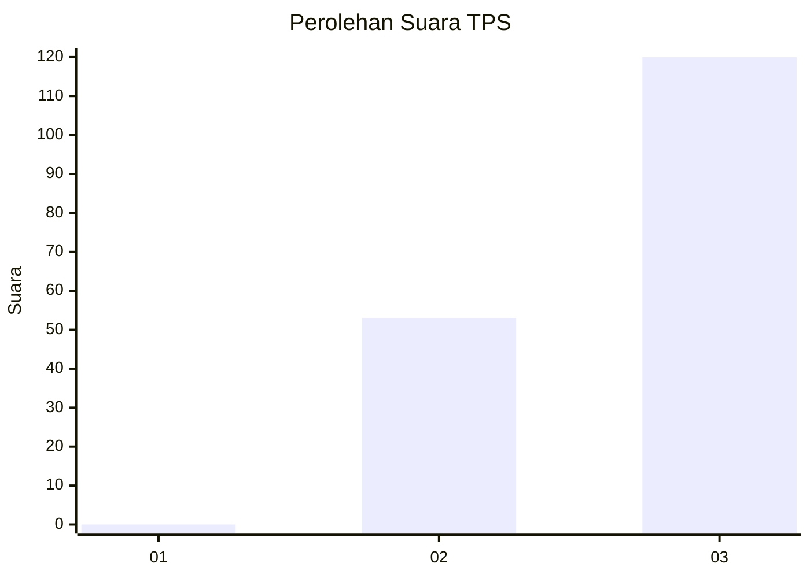
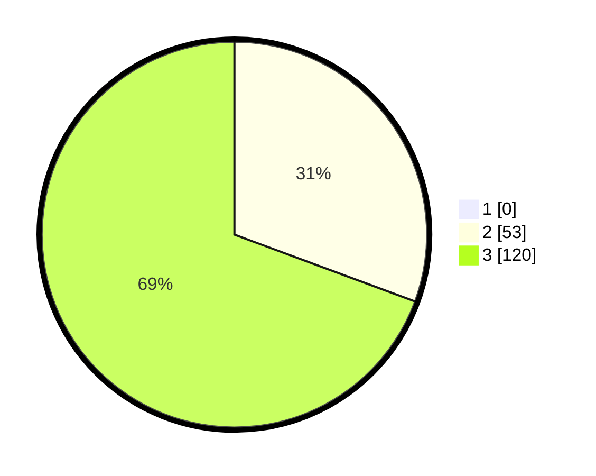

# Hasil

## Grafik

## Tabel

| No. | Nama Paslon    | Suara | Suara (raw) | Persentase |
|:--- |:-------------- | -----:| -----------:| ----------:|
| 1   | ANIES MUHAIMIN | 0     | [0][p-1]    | 0,00       |
| 2   | PRABOWO GIBRAN | 53    | [53][p-2]   | 30,64      |
| 3   | GANJAR MAHFUD  | 120   | [120][p-3]  | 69,36      |

[p-1]: https://github.com/gigit-pemilu/pemilu-2024/blob/main/pilpres/hitung-suara/sub/12-sumatera-utara/sub/23-labuhanbatu-utara/sub/04-aek-kuo/sub/2001-aek-korsik/sub/021-tps/sub/paslon-1.txt
[p-2]: https://github.com/gigit-pemilu/pemilu-2024/blob/main/pilpres/hitung-suara/sub/12-sumatera-utara/sub/23-labuhanbatu-utara/sub/04-aek-kuo/sub/2001-aek-korsik/sub/021-tps/sub/paslon-2.txt
[p-3]: https://github.com/gigit-pemilu/pemilu-2024/blob/main/pilpres/hitung-suara/sub/12-sumatera-utara/sub/23-labuhanbatu-utara/sub/04-aek-kuo/sub/2001-aek-korsik/sub/021-tps/sub/paslon-3.txt

## Foto C Plano

https://sirekap-obj-formc.kpu.go.id/3e9e/pemilu/ppwp/12/23/04/20/01/1223042001021-20240215-001926--463e28be-a6f4-4059-bd96-61d4c2cf3c62.jpg

https://sirekap-obj-formc.kpu.go.id/3e9e/pemilu/ppwp/12/23/04/20/01/1223042001021-20240215-002118--f9872781-c05d-4103-9deb-739a2aede9cd.jpg

https://sirekap-obj-formc.kpu.go.id/3e9e/pemilu/ppwp/12/23/04/20/01/1223042001021-20240215-031454--97bcb774-8a22-41e0-985f-6545d859d398.jpg

## Metadata

| Key        | Value               |
| ---------- | ------------------- |
| Time Stamp | 2024-02-16 03:00:26 |

