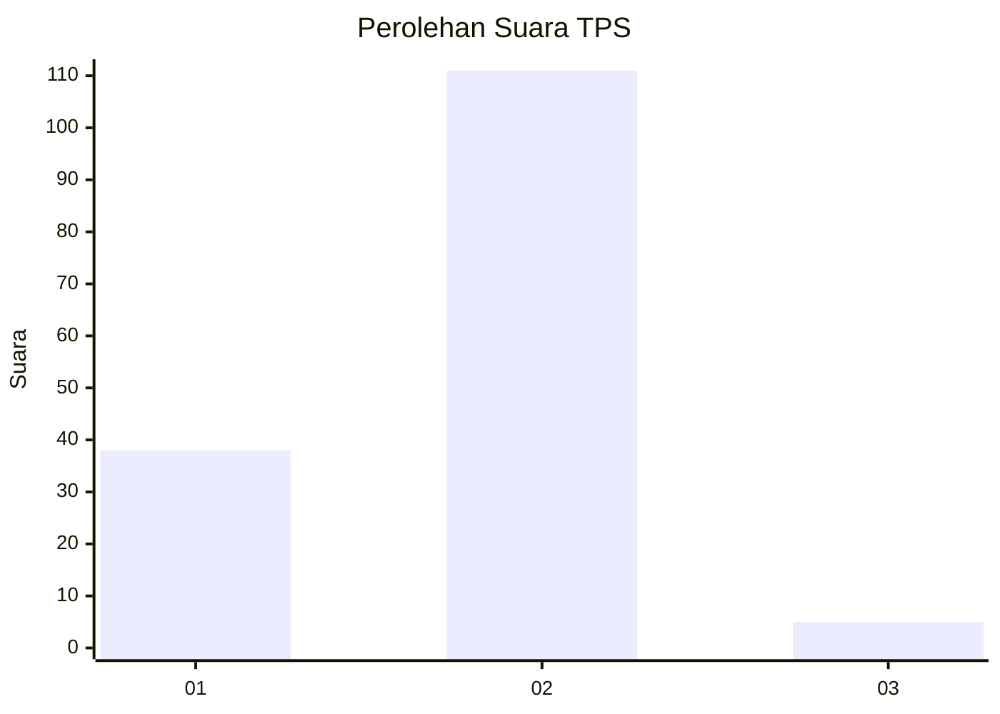
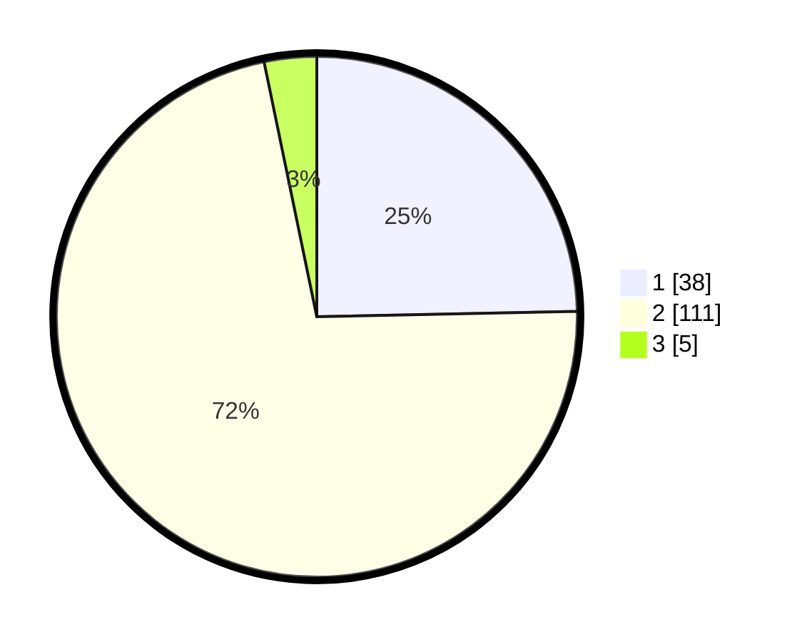

# Hasil

## Grafik

## Tabel

| No. | Nama Paslon    | Suara | Suara (raw) | Persentase |
|:--- |:-------------- | -----:| -----------:| ----------:|
| 1   | ANIES MUHAIMIN | 38    | [38][p-1]   | 24,68      |
| 2   | PRABOWO GIBRAN | 111   | [111][p-2]  | 72,08      |
| 3   | GANJAR MAHFUD  | 5     | [5][p-3]    | 3,25       |

[p-1]: https://github.com/gigit-pemilu/pemilu-2024/blob/main/pilpres/hitung-suara/sub/12-sumatera-utara/sub/23-labuhanbatu-utara/sub/04-aek-kuo/sub/2003-perk-padang-halaban/sub/005-tps/sub/paslon-1.txt
[p-2]: https://github.com/gigit-pemilu/pemilu-2024/blob/main/pilpres/hitung-suara/sub/12-sumatera-utara/sub/23-labuhanbatu-utara/sub/04-aek-kuo/sub/2003-perk-padang-halaban/sub/005-tps/sub/paslon-2.txt
[p-3]: https://github.com/gigit-pemilu/pemilu-2024/blob/main/pilpres/hitung-suara/sub/12-sumatera-utara/sub/23-labuhanbatu-utara/sub/04-aek-kuo/sub/2003-perk-padang-halaban/sub/005-tps/sub/paslon-3.txt

## Foto C Plano

https://sirekap-obj-formc.kpu.go.id/3bc1/pemilu/ppwp/12/23/04/20/03/1223042003005-20240214-223942--faad08f0-e849-4edb-abf8-ab52e1ea4a30.jpg

https://sirekap-obj-formc.kpu.go.id/3bc1/pemilu/ppwp/12/23/04/20/03/1223042003005-20240214-223951--ea612e4e-095c-4adb-85e4-93fd8702a6cf.jpg

https://sirekap-obj-formc.kpu.go.id/3bc1/pemilu/ppwp/12/23/04/20/03/1223042003005-20240214-224001--41b3a76a-d24e-4ac1-a08f-4c66538f75a1.jpg

## Metadata

| Key        | Value               |
| ---------- | ------------------- |
| Time Stamp | 2024-02-15 17:00:25 |

