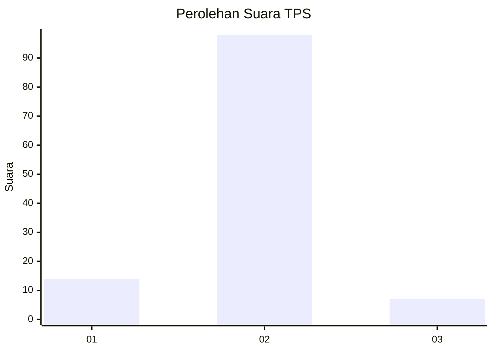
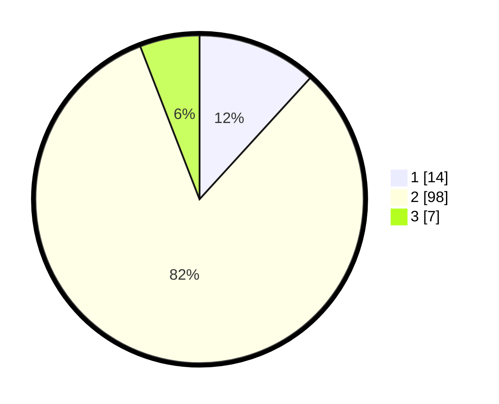

# Hasil

## Grafik

## Tabel

| No. | Nama Paslon    | Suara | Suara (raw) | Persentase |
|:--- |:-------------- | -----:| -----------:| ----------:|
| 1   | ANIES MUHAIMIN | 14    | [14][p-1]   | 11,76      |
| 2   | PRABOWO GIBRAN | 98    | [98][p-2]   | 82,35      |
| 3   | GANJAR MAHFUD  | 7     | [7][p-3]    | 5,88       |

[p-1]: https://github.com/gigit-pemilu/pemilu-2024/blob/main/pilpres/hitung-suara/sub/12-sumatera-utara/sub/23-labuhanbatu-utara/sub/05-marbau/sub/2002-perkebunan-pernantian/sub/005-tps/sub/paslon-1.txt
[p-2]: https://github.com/gigit-pemilu/pemilu-2024/blob/main/pilpres/hitung-suara/sub/12-sumatera-utara/sub/23-labuhanbatu-utara/sub/05-marbau/sub/2002-perkebunan-pernantian/sub/005-tps/sub/paslon-2.txt
[p-3]: https://github.com/gigit-pemilu/pemilu-2024/blob/main/pilpres/hitung-suara/sub/12-sumatera-utara/sub/23-labuhanbatu-utara/sub/05-marbau/sub/2002-perkebunan-pernantian/sub/005-tps/sub/paslon-3.txt

## Foto C Plano

https://sirekap-obj-formc.kpu.go.id/914d/pemilu/ppwp/12/23/05/20/02/1223052002005-20240215-014648--1aafc8df-e1ee-42a0-a300-512bc963d510.jpg

https://sirekap-obj-formc.kpu.go.id/914d/pemilu/ppwp/12/23/05/20/02/1223052002005-20240215-014910--3f196b7c-47d7-46c0-9a2f-aa24b81da49d.jpg

https://sirekap-obj-formc.kpu.go.id/914d/pemilu/ppwp/12/23/05/20/02/1223052002005-20240215-015055--550ed168-92b8-4f5c-9c88-5b3d08778f03.jpg

## Metadata

| Key        | Value               |
| ---------- | ------------------- |
| Time Stamp | 2024-02-16 02:30:27 |

