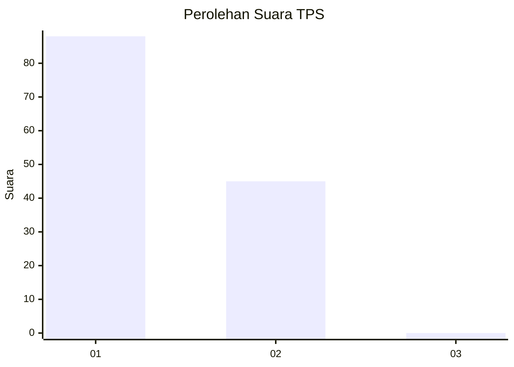
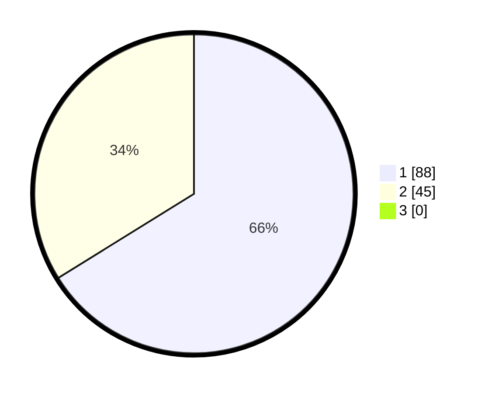

# Hasil

## Grafik

## Tabel

| No. | Nama Paslon    | Suara | Suara (raw) | Persentase |
|:--- |:-------------- | -----:| -----------:| ----------:|
| 1   | ANIES MUHAIMIN | 88    | [88][p-1]   | 66,17      |
| 2   | PRABOWO GIBRAN | 45    | [45][p-2]   | 33,83      |
| 3   | GANJAR MAHFUD  | 0     | [0][p-3]    | 0,00       |

[p-1]: https://github.com/gigit-pemilu/pemilu-2024-12-sumatera-utara/blob/main/pilpres/hitung-suara/sub/12-sumatera-utara/sub/23-labuhanbatu-utara/sub/05-marbau/sub/2012-babussalam/sub/004-tps/sub/paslon-1.txt
[p-2]: https://github.com/gigit-pemilu/pemilu-2024-12-sumatera-utara/blob/main/pilpres/hitung-suara/sub/12-sumatera-utara/sub/23-labuhanbatu-utara/sub/05-marbau/sub/2012-babussalam/sub/004-tps/sub/paslon-2.txt
[p-3]: https://github.com/gigit-pemilu/pemilu-2024-12-sumatera-utara/blob/main/pilpres/hitung-suara/sub/12-sumatera-utara/sub/23-labuhanbatu-utara/sub/05-marbau/sub/2012-babussalam/sub/004-tps/sub/paslon-3.txt

## Foto C Plano

https://sirekap-obj-formc.kpu.go.id/9da7/pemilu/ppwp/12/23/05/20/12/1223052012004-20240215-065936--3360c293-1e57-4de6-bc57-feaa86117ff7.jpg

https://sirekap-obj-formc.kpu.go.id/9da7/pemilu/ppwp/12/23/05/20/12/1223052012004-20240215-102708--1a905bde-56af-4bf3-9e40-bf52472ab492.jpg

https://sirekap-obj-formc.kpu.go.id/9da7/pemilu/ppwp/12/23/05/20/12/1223052012004-20240215-065822--05b367dd-f395-44eb-8932-1f639e5a146d.jpg

## Metadata

| Key        | Value               |
| ---------- | ------------------- |
| Time Stamp | 2024-02-16 02:30:27 |

