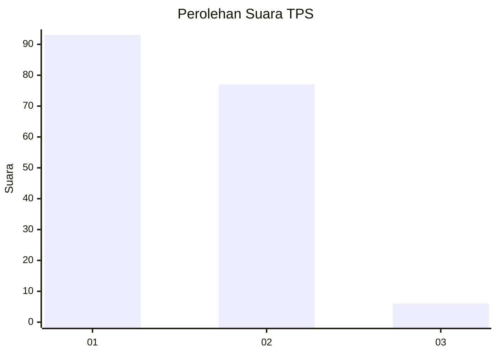
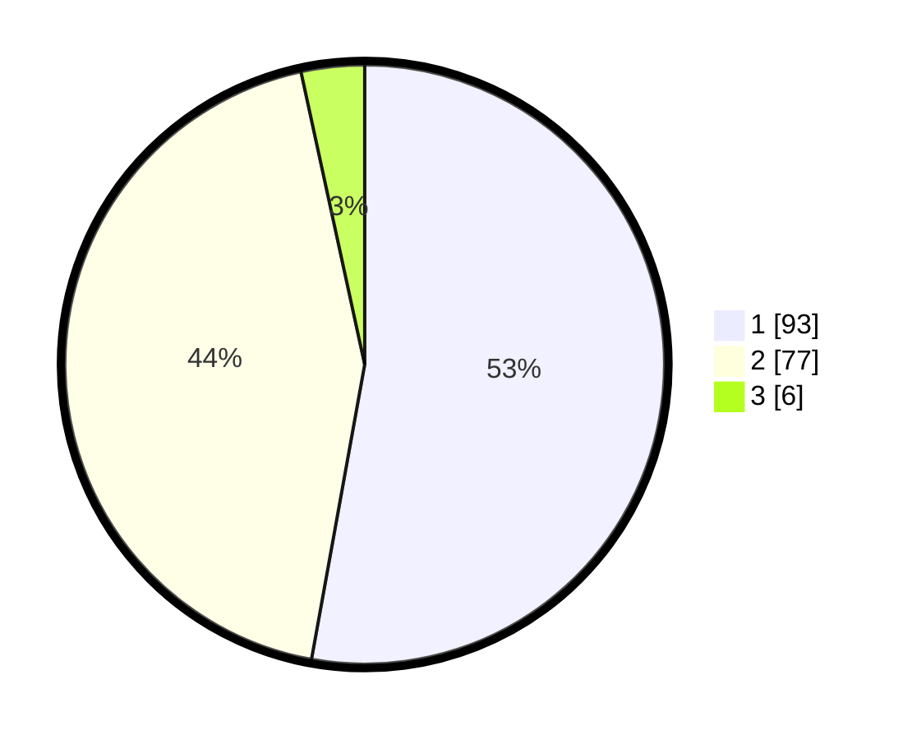

# Hasil

## Grafik

## Tabel

| No. | Nama Paslon    | Suara | Suara (raw) | Persentase |
|:--- |:-------------- | -----:| -----------:| ----------:|
| 1   | ANIES MUHAIMIN | 93    | [93][p-1]   | 52,84      |
| 2   | PRABOWO GIBRAN | 77    | [77][p-2]   | 43,75      |
| 3   | GANJAR MAHFUD  | 6     | [6][p-3]    | 3,41       |

[p-1]: https://github.com/gigit-pemilu/pemilu-2024-12-sumatera-utara/blob/main/pilpres/hitung-suara/sub/12-sumatera-utara/sub/23-labuhanbatu-utara/sub/06-na-ix-x/sub/1001-aek-kota-batu/sub/006-tps/sub/paslon-1.txt
[p-2]: https://github.com/gigit-pemilu/pemilu-2024-12-sumatera-utara/blob/main/pilpres/hitung-suara/sub/12-sumatera-utara/sub/23-labuhanbatu-utara/sub/06-na-ix-x/sub/1001-aek-kota-batu/sub/006-tps/sub/paslon-2.txt
[p-3]: https://github.com/gigit-pemilu/pemilu-2024-12-sumatera-utara/blob/main/pilpres/hitung-suara/sub/12-sumatera-utara/sub/23-labuhanbatu-utara/sub/06-na-ix-x/sub/1001-aek-kota-batu/sub/006-tps/sub/paslon-3.txt

## Foto C Plano

https://sirekap-obj-formc.kpu.go.id/87ed/pemilu/ppwp/12/23/06/10/01/1223061001006-20240215-094621--fd224798-aad3-4baf-baf8-49351d9914e2.jpg

https://sirekap-obj-formc.kpu.go.id/87ed/pemilu/ppwp/12/23/06/10/01/1223061001006-20240215-094745--ed83fa06-4080-4a3c-b0e0-6de5b64cbbc5.jpg

https://sirekap-obj-formc.kpu.go.id/87ed/pemilu/ppwp/12/23/06/10/01/1223061001006-20240215-095445--108a703f-e95a-46e7-8ed3-ce826d9f342a.jpg

## Metadata

| Key        | Value               |
| ---------- | ------------------- |
| Time Stamp | 2024-02-16 03:30:26 |

